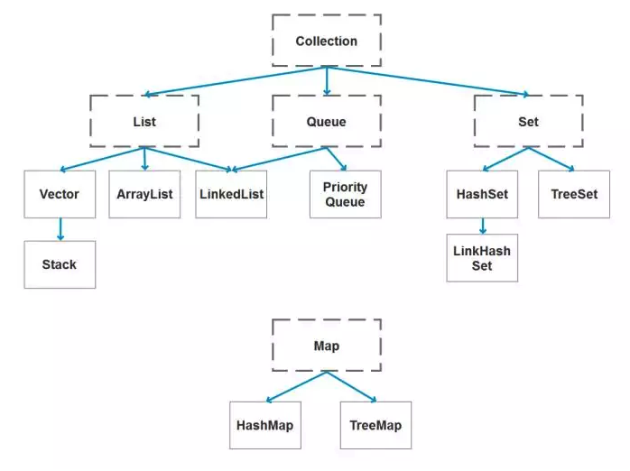
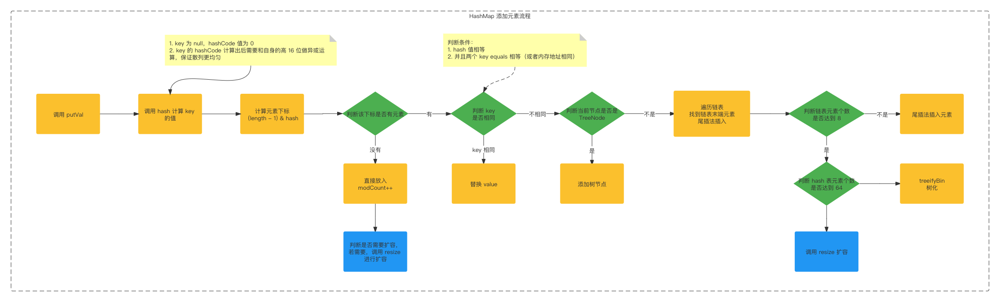

# 二、Java 数据结构

# 一、概述

## 📌 Java 容器都有哪些？

常用容器：



## 📌 哪些集合类是线程安全的？

- vector，向量：线程安全的数组
- Stack，栈：一个线程安全的容器，继承了 vector，线程安全，特点是先进后出
- HashTable：一个线程安全的 map（其线程安全性是通过 synchronized 来实现的）

# 二、List

## 📌 ArrayList 底层的数据结构

- ArrayList 底层是一个 Object 类型的数组
- ArrayList 每次扩容是原来的一半

## 📌 ArrayList 和 LinkedList 的区别是什么？

- 两者都是线程不安全的容器
- ArrayList 底层使用数组，LinkedList 底层是双向循环链表

```java
//存储ArrayList元素的数组缓冲区
private transient Object[] elementData;
```

```kotlin
private static class Node<E> {
    E item;
    Node<E> next;
    Node<E> prev;

    Node(Node<E> prev, E element, Node<E> next) {
        this.item = element;
        this.next = next;
        this.prev = prev;
    }
}
```

- ArrayList 支持随机访问，linkedList 不支持随机访问
- 存储结构上来讲，ArrayList 要求有连续的整块的内存区域，LinkedList 不需要
- 使用下标访问元素，ArrayList 时间复杂度是 O(1)，LinkedList 是 O(n)
- 添加或删除元素时，ArrayList 时间复杂度为 O(n)，LinkedList 是 O(1)

```typescript
public boolean add(E e) {
    linkLast(e);
    return true;
}
void linkLast(E e) {
    final Node<E> l = last;
    final Node<E> newNode = new Node<>(l, e, null);
    last = newNode;
    if (l == null)
        first = newNode;
    else
        l.next = newNode;
    size++;
    modCount++;
}
```

## 📌 ArrayList 的扩容机制

[ArrayList 的扩容机制](https://github.com/Snailclimb/JavaGuide/blob/master/docs/java/collection/ArrayList-Grow.md)

# 三、Set

## 📌 HashSet 底层数据结构

- HashSet 底层是利用 HashMap 来存储的
- HashSet 在调用 add 方法添加元素时，实际调用的是 Map 的 put 方法，被添加的元素作为 key，value 是一个 Object 的常量

## 📌 说一下 HashSet 的实现原理？

- HashSet 底层由 HashMap 实现
- HashSet 的值存放于 HashMap 的 key 上
- HashSet 无序，允许 null 值存入，非线程安全

# 四、Map

## 📌 说一下 HashMap 的实现原理

### 数据结构

- 1.8 中：Entry 数组 + Entry 链表 + 红黑树
- 1.7 中：Entry 数组 + Entry 链表

### 元素插入

元素插入流程如下



1. 调用 put 方法，在 put 中调用 hash 方法计算 key 的 hash 值，计算出 hash 值后与该 hash 值的高 16 位进行异或运算，保证散列足够均匀
2. 调用 putVal 方法进行元素的添加，在 putVal 中，先计算元素下标：index = (n - 1) & hash
3. 根据下标先检查该下标的位置是否为空，若为空，则直接添加元素；若不为空，则说明发生了 hash 冲突
4. 若发生 hash 冲突，先判断 key 是否相同，判断的条件有两个：一是 key 的 hashCode 是否相同，二是 key 的 equals 方法是否相同，这样就说明了为什么自己定义的类必须重写 hashCode 和 equals 方法；如果 key 相同，则直接替换 value
5. Key 不相同，遍历该位置节点，如果是树节点，则直接添加元素
6. 该位置节点不是树节点，则进行遍历，找到尾节点，使用尾插法将元素插入到链表尾部；遍历的过程中会判断链表的元素个数是否达到 8，如果达到 8，并且 hash 表的元素个数超过了 64，那么开始进行树化；如果链表节点个数达到了 8，但是 hash 表的元素个数少于 64，那么直接进行扩容

## 📌 HashMap 的长度为什么是 2 的幂次方

## 📌 HashMap 多线程操作导致死循环问题

[HashMap 多线程操作导致死循环问题](https://coolshell.cn/articles/9606.html)

## 📌 如何决定使用 HashMap 还是 TreeMap？

如果只是对元素进行插入，删除，定位元素这类操作，HashMap 是最好的选择；如果需要给元素排序，就是用 TreeMap

## 📌 说一下快速失败机制和安全失败机制

### 快速失败

### 安全失败

参考：

- [集合的快速失败和安全失败](https://segmentfault.com/a/1190000039897519)

## 📌 为什么说 hashMap 线程不安全

#### JDK 1.8

- 两个线程同时进行 put 时，可能会导致数据丢失；因为两个线程同时 put，key 可能相同，线程 1 可能会覆盖线程 2 的值
- 当 put 和 get 同时进行时，hash 表扩容，可能会导致 get 获取到空值；因为扩容时，put 线程会新建一个空的 hash 表，get 线程获取元素，可能拿到的是 null 值

#### JDK 1.7

- 并发扩容时，可能会形成循环链表，get 元素时，会出现死循环；因为 1.7 中链表元素迁移使用的是头插法，并发扩容时，可能会出现循环链表

# 五、Queue

## 📌 在 Queue 中 poll()和 remove()有什么区别？

poll()和 remove()都是取出并删除队首的元素，区别是队列为空时，poll()返回 null，而 remove 抛出异常

## 📌 怎么确保一个集合不能被修改？

Collections 包下的 unmodifiableMap 方法，装饰传入的 map，当调用任何修改方法时，会抛出 UnsupportedOperationException 异常

```go
Map<String, Object> map = new HashMap<>();
map.put("name", "lizza");
map.put("age", 18);
System.out.println(map);
map = Collections.unmodifiableMap(map);
map.put("name", "john");
System.out.println(map);
```

## 📌  Java 中的延时队列

- 参考：[6 种 延时队列的实现方案 - 思否](https://segmentfault.com/a/1190000022718540)
- 参考：[你真的知道怎么实现一个延迟队列吗  - 知乎](https://zhuanlan.zhihu.com/p/266156267)

# 六、Java 中的其他数据结构

## 📌  Java 中 Stack 是如何实现的

## 参考资料

###### 【1】[Java 最常见的 208 道面试题及答案](https://mp.weixin.qq.com/s?__biz=MzIwMTY0NDU3Nw==&mid=2651938314&idx=1&sn=f0578deb60a719b5ec71c6a0fcea4420&chksm=8d0f3144ba78b8522d85329f6575eea356b4da9732dd7c7fb4dc5189ee0d551c6b159bc2e706&scene=21#wechat_redirect)
