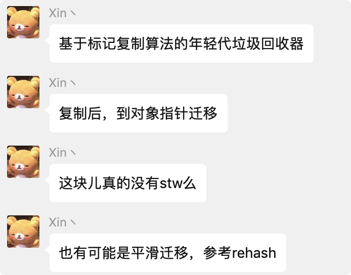

# 七、Java JVM

# JVM 基础

## ☞ Java 对象创建的过程


### 1. 类加载检查

虚拟机遇到 new 指令时，会先检查该类型是否已经在元空间中加载过，若没有则执行类加载过程

### 2. 分配内存

类加载完成后，创建对象所需要的空间则可以确定了，在内存中划出一块空间给新对象实例使用；分配内存有两种方式：<strong>指针碰撞</strong>和<strong>空闲列表</strong>；具体选择哪一种需要根据堆内存是否规整；堆内存是否规整由 jvm 使用的垃圾收集器确定，即所使用的垃圾收集器是否带有整理压缩的能力

##### <strong>指针碰撞</strong>

其实这种方式理解起来比较简单的，假设 Java 堆中的内存是绝对完整的，它会把使用过的内存和未使用过的内存划分开来。此时一边就是使用过的内存，一边就是未使用过的内存；那么他如何去给一个新的对象去划分空闲内存中的某块区域呢？其实很简单，就是借助一个指针（这里是不是呼应上了所谓的指针碰撞）；<strong>当我们分配内存的时候就是把指针在空闲的内存区域中移动一个与要被创建对象大小相等的距离。这就是指针碰撞的方式</strong>。

> 适用场景：内存规整，不碎片化

##### <strong>空闲列表</strong>

这个其实理解起来更为简单。它无非就是指在 Java 堆中的内存并非是规整的（使用的内存和未使用过的内存没有划分开来），比较杂乱无章，此时虚拟机就得需要列表记录内存中哪些是已经使用的哪些是没有使用的，然后<strong>在给对象分配内存空间的时候在该列表中找一个足够的内存分给对象实例；并更新维护的列表。这种就叫做空闲列表（Free List）</strong>。

> 适用场景：堆内存碎片化

<strong>Tip:</strong>说到分配内存的两种方式，就顺便提一句，

- 当使用的是 `Serial、ParNew` 等压缩整理过程的收集器的时候，系统采用的是指针碰撞的方式。
- 而当使用的是 `CMS` 这种基于清除的算法收集器，理论上就只能采用空闲列表。

##### <strong>分配内存如何保证线程安全的</strong>

上面我们将给新的对象分配内存的方式以及分配内存前的逻辑大致理完了。你是不是觉得很简单。其实就是这么简单。但是其实我们忽略了一个很重要的问题。我们回想起本篇文中第一段话：Java 程序在运行过程中无时无刻不在创建对象，那么它是如何在并发环境下保证线程安全的呢？接下来我们简单的捋一下其实保证线程安全还是两种方式：

1. 将分配内存空间的动作进行同步处理（虚拟机底层的实现逻辑就是 `CAS` + `失败重试`）来保证分配内存空间的原子性。
2. 还有一种就是将分配内存的动作按照线程划分在不同的空间中进行，也就是每个线程在 Java 堆中有有属于自己的一小块内存，这种方式叫做 `本地线程分配缓冲 Thread Local Allocation Buffer TLAB`，当本地线程缓冲使用完了，再分配缓存区时才需要同步锁定。至于虚拟机是否使用 TLAB 可通过参数 `-XX: +/-UseTLAB` 来控制。

参考：[全网最硬核 JVM TLAB 分析（单篇版不包含额外加菜）](https://segmentfault.com/a/1190000039676470)

### 3. 对象初始化零值

实例创建完成后，jvm 会对字段进行初始化零值操作

### 4. 设置对象头

初始化零值操作完成后，给对象设置对象头信息，包含：hashcode，类型数据，锁，GC 分代年龄等


参考：

- [JAVA 对象头分析及 Synchronized 锁 - hongdada - 博客园](https://www.cnblogs.com/hongdada/p/14087177.html)
- [JVM--10-1---美团面试 7 问----解析 Object 0 = new Object();_高高 for 循环的博客-CSDN 博客](https://blog.csdn.net/weixin_48052161/article/details/121574833)

### 5. 执行初始化方法

执行 init 方法，对字段进行初始化操作

## ☞ 说一下栈上分配

是 java 虚拟机提供的一项优化技术，它的基本思想是，对于那些线程私有对象(指不可能被其他线程访问的对象)可以将它们打散分配在栈上，而不是分配在堆上

#### 为什么需要栈上分配

分配在栈上可以结束后自行销毁，不需要垃圾回收器介入，从而提高系统的性能。

#### 栈上分配的局限性是啥

栈空间小，对于大对象无法实现栈上分配。

#### 栈上分配的必要条件

栈上分配依赖于逃逸分析和标量替换。

#### 逃逸分析

栈上分配的一个技术基础是进行逃逸分析。目的是判断对象的作用域是否有可能逃逸出逃逸体。

虚拟机会进行逃逸分析，判断线程内私有对象是否有可能被其他线程访问，导致逃逸，然后虚拟机就会根据是否可能会逃逸将其分配在栈上，或者堆中。

只有在 server 模式下，才能开启逃逸分析。 如下示例:


参数: -XX:+DoEscapeAnalysis 是开启逃逸分析。 -XX:+EliminateAllocations 是开启标杆替换，允许将对象打散分配到栈上，默认就是打开的。

参考：

- [JVM 对象分配之栈上分配 & TLAB 分配 - 掘金](https://juejin.cn/post/6844903930351058958)

## ☞ 说一下 TLAB

TLAB，全称 Thread Local Allocation Buffer,即：线程本地分配缓存。这是一块线程专用的内存分配区域。TLAB 占用的是 eden 区的空间。在 TLAB 启用的情况下（默认开启），JVM 会为每一个线程分配一块 TLAB 区域。

参考：[全网最硬核 JVM TLAB 分析（单篇版不包含额外加菜）](https://segmentfault.com/a/1190000039676470)

#### 为什么需要 TLAB？

这是为了加速对象的分配。由于对象一般分配在堆上，而堆是线程共用的，因此可能会有多个线程在堆上申请空间，而每一次的对象分配都必须线程同步，会使分配的效率下降。考虑到对象分配几乎是 Java 中最常用的操作，因此 JVM 使用了 TLAB 这样的线程专有区域来避免多线程冲突，提高对象分配的效率

## ☞ 对象内存分配的两种方式

| 分配方式 | 适用场景   | 运行原理                                                                                                                                   | 垃圾收集器     |
| -------- | ---------- | ------------------------------------------------------------------------------------------------------------------------------------------ | -------------- |
| 指针碰撞 | 内存规整   | 堆内存被划分为两块，一块是被使用过的，一块是未被使用的，指针位于分界处，给新对象分配内存时，只需要移动指针即可                             | Parnew，Serial |
| 空闲列表 | 内存不规整 | 堆内存不是连续的空间，jvm 维护一个列表来记录哪些空间被使用，哪些空间未被使用；当需要分配空间时，在空闲列表中查找足够大小的内存空间进行分配 | CMS            |

## ☞ 对象的访问定位的两种方式

| 方式     | 描述                                                                                                    | 优势                                                                       |
| -------- | ------------------------------------------------------------------------------------------------------- | -------------------------------------------------------------------------- |
| 句柄     | 堆中有一块区域专门用于存储对象句柄，Java 虚拟机栈中存储的是这些句柄的位置信息，句柄指向真正的对象实例； | 移动对象时，只需要更新句柄中的实例数据指针，而栈中的引用本身不需要发生变化 |
| 直接指针 | Java 虚拟机栈中的引用数据类型存储的是对象在堆中的直接地址                                               | 速度快，减少了一次指针访问操作                                             |

需要说明的是，HotSpot 采用第二种方式，即直接指针方式来访问对象，只需要一次寻址操作，所以在性能上比句柄访问方式快一倍。但像上面所说，它需要额外的策略来存储对象在方法区中类信息的地址。

<strong>直接指针访问：</strong>


<strong>句柄访问：</strong>


参考：[JVM 系列(4)一看就懂的对象内存布局 - 彭旭锐 - 博客园](https://www.cnblogs.com/pengxurui/p/16576080.html)

## ☞ JVM 内存分配策略

#### 对象优先在 Eden 分配

大多数情况下，对象在新生代 Eden 区中分配。当 Eden 区没有足够空间进行分配时，虚拟机将发起一次 Minor GC。

#### 大对象直接进入老年代

大对象是指需要大量连续内存空间的 Java 对象，如很长的字符串或数据。

虚拟机提供了一个 -XX:PretenureSizeThreshold 参数，令大于这个设置值的对象直接在老年代分配，这样做的目的是避免在 Eden 区及两个 Survivor 区之间发生大量的内存复制。（还记得吗，新生代采用复制算法回收垃圾）

PretenureSizeThreshold 默认值是 0，意味着任何对象都会现在新生代分配内存。

##### PretenureSizeThreshold 参数的使用场景

##### Case 验证

参考：[-XX:PretenureSizeThreshold 的默认值和作用浅析-阿里云开发者社区](https://developer.aliyun.com/article/801220)

#### 长期存活的对象将进入老年代

JVM 给每个对象定义了一个对象年龄计数器。当新生代发生一次 Minor GC 后，存活下来的对象年龄 +1，当年龄超过一定值时，就将超过该值的所有对象转移到老年代中去。

使用 <strong>-XX:MaxTenuringThreshold</strong> 设置新生代的最大年龄，只要超过该参数的新生代对象都会被转移到老年代中去。

##### <strong>-XX:MaxTenuringThreshold</strong>参数

对象晋升到 old 的年龄，默认是 15，设置的越大，对象就越难进入到 old 区，youngGC 反复 copy 的时间就会增大。

参考：

- [官网文档：java](https://docs.oracle.com/javase/8/docs/technotes/tools/unix/java.html)
- [关于-XX:MaxTenuringThreshold 参数认知的反复横跳 - 豆大侠的菜地](https://doudaxia.club/index.php/archives/135/)

#### 动态对象年龄判定

动态对象年龄判断，主要是被 TargetSurvivorRatio 这个参数来控制。而且算的是年龄从小到大的累加和，而不是某个年龄段对象的大小，累加和如果超过 Survivor 一半，无须等到 `MaxTenuringThreshold` 中要求的年龄，直接进入老年代

参数：-XX:TargetSurvivorRatio，默认值：50%

##### Case：

参考：

- [jvm 误区--动态对象年龄判定 | HeapDump 性能社区](https://heapdump.cn/article/3201179)

#### 空间分配担保

JDK 6 Update 24 之后的规则变为：

只要老年代的<strong>连续空间大于新生代对象总大小</strong>或者<strong>历次晋升的平均大小</strong>，就会进行 Minor GC，否则将进行 Full GC。

通过清除老年代中的废弃数据来扩大老年代空闲空间，以便给新生代作担保。

这个过程就是分配担保。

## ☞ 说一下对象什么情况下会进入老年代

1. 大对象直接在老年代分配，参数：PretenureSizeThreshold 默认值 0
2. 对象动态年龄计算，参数：XX:TargetSurvivorRatio，默认值：50%
3. Minor GC 后，年龄达到设置的年龄，进入老年代，参数：<strong>XX:MaxTenuringThreshold</strong> 默认值，15（parallel (throughput) collector）, 6（the CMS collector）

参考：

- [JVM 的垃圾回收机制真是通俗易懂-Finclip](https://www.finclip.com/news/f/25771.html)

## ☞ 双亲委派模型

双亲委派模型的工作机制是这样的：如果一个类加载器收到了加载类的请求，它会首先从下往上，检查父类加载器是否加载过，如果加载过，则返回；如果没有加载过，则从上往下进行加载


## ☞ 双亲委派模型的特点

### 1、优点

- 避免类被重复加载
- 保证核心类库只能由根类加载器加载，确保了核心类库的安全性
- 即使是相同类名的类，但是由不同类加载器加载，相互之间仍然是不可见的

### 2、缺点

- 父类加载器无法访问子类加载器所加载的类（类比 Spring 父子容器：父容器无法访问子容器的类）

## ☞ 双亲委派源码分析

1. 从下往上检查是否加载过
2. 从上往下尝试加载

```typescript
protected Class<?> loadClass(String name, boolean resolve)
        throws ClassNotFoundException
{
    synchronized (getClassLoadingLock(name)) {
        // 检查该类是否被加载过
        Class<?> c = findLoadedClass(name);
        if (c == null) {
            // 表示该类没有被加载过
            long t0 = System.nanoTime();
            try {
                if (parent != null) {
                    // 由父类加载器进行加载（自顶向下尝试加载）
                    c = parent.loadClass(name, false);
                } else {
                    // 由根类加载器进行加载
                    c = findBootstrapClassOrNull(name);
                }
            } catch (ClassNotFoundException e) {
            }

            if (c == null) {
                long t1 = System.nanoTime();
                // 都没有加载成功，则由自己加载（通常由子类加载器进行重写实现）
                c = findClass(name);
                sun.misc.PerfCounter.getParentDelegationTime().addTime(t1 - t0);
                sun.misc.PerfCounter.getFindClassTime().addElapsedTimeFrom(t1);
                sun.misc.PerfCounter.getFindClasses().increment();
            }
        }
        if (resolve) {
            resolveClass(c);
        }
        return c;
    }
}
```

## ☞ 双亲委派模型的破坏

### 1、第一次被破坏

类加载器和抽象类 java.lang.ClassLoader 在 jdk 1.2 之前就出现了，而双亲委派模式出现于 jdk 1.2，双亲委派模型出现时，为了兼容之前出现的自定义类加载器，所以提供了 findClass 方法，来按照自定义的方式来加载类

```java
/**
 * Finds the class with the specified <a href="#name">binary name</a>.
 * This method should be overridden by class loader implementations that
 * follow the delegation model for loading classes, and will be invoked by
 * the {@link #loadClass <tt>loadClass</tt>} method after checking the
 * parent class loader for the requested class.  The default implementation
 * throws a <tt>ClassNotFoundException</tt>.
 *
 * @param  name
 *         The <a href="#name">binary name</a> of the class
 *
 * @return  The resulting <tt>Class</tt> object
 *
 * @throws  ClassNotFoundException
 *          If the class could not be found
 *
 * @since  1.2
 */
protected Class<?> findClass(String name) throws ClassNotFoundException {
    throw new ClassNotFoundException(name);
}
```

### 2、第二次破坏

第二次被破坏是由于双亲委派机制自身的缺陷导致的：父类加载器加载的类无法访问子类加载器加载的类；典型的场景就是 JNDI 服务，JNDI 的代码位于 rt.jar 下，由启动类加载器加载；但是其实现（比如 JDBC）是由各个厂商进行实现的，代码位于 CLASSPATH 下；为了解决这个问题，jdk 引入了线程上下文类加载器；默认情况下，jvm 启动时会将系统类加载器设置为上下文类加载器；下面的伪代码是如何使用上下文类加载器的过程

```java
// 获取当前上下文类加载器
ClassLoader loader = Thread.currentThread().getContextClassLoader();
try {
    // 设置当前上下文类加载器为自定义类加载器
    Thread.currentThread().setContextClassLoader(targetClassLoader);
    // 执行自定义的一些方法
    method();
} finally {
    // 还原上下文类加载器
    Thread.currentThread().setContextClassLoader(loader);
}
```

但是上述的实现方式有一个明显的缺陷，当 SPI 的服务提供者多于一个时，就需要硬编码判断；在 JDK 6 时，JDK 提供了 java.util.ServiceLoader 类，以 META-INF/services 中的配置信息，辅以责任链模式，这才算是给 SPI 的加 载提供了一种相对合理的解决方案

### 3、第三次破坏

第三次破坏是为了追求程序的动态特性而导致的；比如 OSGi

- 参考：深入理解 Java 虚拟机之破坏双亲委派加载机制

## ☞ 如何自定义类加载器

1. 继承 ClassLoader，重写 findClass 方法
2. 在 findClass 方法最后，调用 ClassLoader 的 defineClass 方法来进行类加载

## ☞ 说一下类加载的执行过程

### 1、加载

- <strong>什么是类加载</strong>

类加载即将 class 文件从磁盘（网络，数据库等）加载到内存（方法区，Java 8 方法区改造成了元空间）中；类加载有别于对象加载，类加载主要是加载类本身的信息，而对象是类的实例，是在堆上进行创建的

- <strong>类加载的过程</strong>

1. 通过类的全限定名来获取此类的二进制文件
2. 将静态存储结构载入方法区
3. 在内存中创建 java.lang.Class 对象，供程序调用

- <strong>类加载的方式</strong>

1. 本地磁盘
2. 数据库
3. 通过 zip，jar 中加载.class 文件
4. 网络下载
5. Java 源文件动态编译成.class 文件（动态代理）

- <strong>类加载的时机</strong>

JVM 会根据判断预先加载类，若加载失败，不会立即报错，只会在使用的时候报错：LinkedError

- 双亲委托机制

JVM 在加载类的时候，会自底向上委托给父类加载器进行尝试加载，如果父类加载器无法加载，会自顶向下返回，让子类加载器进行加载

- 双亲委托机制的三次破坏

1. JDK 1.2 之前，
2. 线程上下文类加载器 -> JDK 1.6 ServiceLoader
3. 为实现 Java 程序的动态性

### 2、连接

- <strong>验证</strong>

验证 class 文件的字节码数据是否符合 Java 虚拟机规范，保证运行期间不会危害虚拟机安全

- <strong>验证内容</strong>

1. 文件格式验证
2. 字节码验证
3. 元数据验证
4. 符号引用验证

- <strong>准备</strong>

为静态变量分配内存，赋初始零值

- <strong>解析</strong>

将符号引用转换为直接引用

### 3. 初始化

- <strong>类初始化的时机</strong>

1. 使用 new 关键字创建类的实例
2. 使用反射获取类的实例
3. 对接口或者类的静态变量进行赋值或者取值
4. 使用接口或者类的静态方法
5. 初始化一个类的子类必然会导致父类的初始化
6. JVM 启动时标记为启动类的的类，比如 main 方法
7. JDK 1.7 之后动态语言支持相关
8. Java 8 接口中定义了 default 方法，如果该接口发生初始化，则父接口必先进行初始化

### 4. 使用

### 5. 卸载

## ☞ Java 中都有哪些引用类型

为了提高 JVM 垃圾回收的效率，引用被细分为强引用，软引用，弱引用，虚引用

#### 1、强引用

程序中最常见的引用类型，无论任何情况下，只要强引用关系还存在，垃圾收集器就永远不会回收被引用的对象

#### 2、软引用

软引用用来描述一些还有用，但非必须的引用；当内存不足时，垃圾收集器会对该类型的引用的对象进行回收

#### 3、弱引用

弱引用也用来描述非必须的引用，但是强度比软引用更弱；弱引用的对象的生命周期只有 1 个 GC 周期

#### 4、虚引用

强度最弱的引用类型；随时可能被垃圾收集器收集

# Java  内存模型

## ☞ 说一下 Happens-Before 规则？

如果操作 A 先行发生于操作 B，那么操作 A 产生的影响能够被操作 B 观察到。 口诀：如果两个操作之间具有 happen-before 关系，那么前一个操作的结果就会对后面的一个操作可见。 常见的 happen-before 规则：

1. <strong>程序顺序规则</strong>

一个线程中的每个操作，happen-before 在该线程中的任意后续操作。(注解：如果只有一个线程的操作，那么前一个操作的结果肯定会对后续的操作可见。) 程序顺序规则中所说的每个操作 happen-before 于该线程中的任意后续操作并不是说前一个操作必须要 在后一个操作之前执行，而是指前一个操作的执行结果必须对后一个操作可见，如果不满足这个要求那 就不允许这两个操作进行重排序

1. <strong>锁规则</strong>

对一个锁的解锁，happen-before 在随后对这个锁加锁。(注解：这个最常见的就是 synchronized 方法和 syncronized 块)

1. <strong>volatile 变量规则</strong>

对一个 volatile 域的写，happen-before 在任意后续对这个 volatile 域的读。该规则在 CurrentHashMap 的读操作中不需要加锁有很好的体现。

1. <strong>传递性</strong>

如果 A happen-before B，且 B happen-before C，那么 A happen - before C.

1. <strong>线程启动规则</strong>

Thread 对象的 start()方法 happen-before 此线程的每一个动作。

1. <strong>线程终止规则</strong>

线程的所有操作都 happen-before 对此线程的终止检测，可以通过 Thread.join()方法结束， Thread.isAlive()的返回值等手段检测到线程已经终止执行。

1. <strong>线程中断规则</strong>

对线程 interrupt()方法的调用 happen-before 发生于被中断线程的代码检测到中断时事件的发生。

# JVM 运行时数据区

## ☞ jvm 运行时数据区


### 1、堆

- 属于线程共享的区域
- jvm 管理的最大的一块内存区域，新创建的对象和数组都在堆上分配空间，垃圾回收主要的区域

#### 异常

在设置了最大的堆空间时，空间不足会报 OOM 错误

#### 参数设置

```groovy
-Xms2m: 最小堆内存2m
-Xmx2m: 最大堆内存2m
-XX:+HeapDumpOnOutOfMemoryError: 当发生OOM时，打印dump日志
-XX:HeapDumpPath=/root/：dump日志存储位置
-Xloggc:/root/gc.log：gc日志存储位置
```

### 2、Java 虚拟机栈

Java 虚拟机栈(Java Virtual Machine Stacks)，早期也叫 Java 栈。每个线程在创建的时候都会创建一个虚拟机栈，其内部保存一个个的栈帧(Stack Frame），对应着一次次 Java 方法调用，是线程私有的，生命周期和线程一致。

- 属于线程私有的区域
- 栈是由一个个栈帧组成的，每一个栈帧中都有局部变量表，操作数表，常量表动态链接，方法出口等信息

参考：

- [JVM 基础 - JVM 内存结构](https://pdai.tech/md/java/jvm/java-jvm-struct.html#%E4%BA%8C%E3%80%81%E8%99%9A%E6%8B%9F%E6%9C%BA%E6%A0%88)
- [你只知道 JVM 栈，知不知道栈帧、局部变量表、slot、操作数栈?_51CTO 博客_栈帧中的本地变量表](https://blog.51cto.com/u_13540373/4858088)

### 3、方法区（JDK 8 之后由元空间替代）

- 属于线程共享的一块区域
- 主要用于存储类的信息，常量信息，静态变量等
- JDK 8 的元空间使用的是直接内存，也就是说元空间的大小理论上是直接内存的大小

#### 参数设置

### 4、程序计数器

程序计数寄存器（<strong>Program Counter Register</strong>），Register 的命名源于 CPU 的寄存器，寄存器存储指令相关的线程信息，CPU 只有把数据装载到寄存器才能够运行。

这里，并非是广义上所指的物理寄存器，叫程序计数器（或 PC 计数器或指令计数器）会更加贴切，并且也不容易引起一些不必要的误会。<strong>JVM 中的 PC 寄存器是对物理 PC 寄存器的一种抽象模拟</strong>。

程序计数器是一块较小的内存空间，可以看作是当前线程所执行的字节码的<strong>行号指示器</strong>。

##### 作用

- 记录指令执行的位置
- 多线程情况下，记录当前线程执行的位置，
- 属于线程私有的区域，生命周期同线程的生命周期，不会发生 OOM

<strong>使用 PC 寄存器存储字节码指令地址有什么用呢？为什么使用 PC 寄存器记录当前线程的执行地址呢？</strong>

因为 CPU 需要不停的切换各个线程，这时候切换回来以后，就得知道接着从哪开始继续执行。JVM 的字节码解释器就需要通过改变 PC 寄存器的值来明确下一条应该执行什么样的字节码指令。

##### <strong>PC 寄存器为什么会被设定为线程私有的？</strong>

多线程在一个特定的时间段内只会执行其中某一个线程方法，CPU 会不停的做任务切换，这样必然会导致经常中断或恢复。为了能够准确的记录各个线程正在执行的当前字节码指令地址，所以为每个线程都分配了一个 PC 寄存器，每个线程都独立计算，不会互相影响。

参考：[JVM 基础 - JVM 内存结构](https://pdai.tech/md/java/jvm/java-jvm-struct.html)

## ☞ 堆内存划分的空间


# 垃圾回收

## ☞ 如何解决线上 gc 频繁的问题？

1. 查看监控，以了解出现问题的时间点以及当前 FGC 的频率（可对比正常情况看频率是否正常）
2. 了解该时间点之前有没有程序上线、基础组件升级等情况。
3. 了解 JVM 的参数设置，包括：堆空间各个区域的大小设置，新生代和老年代分别采用了哪些垃 圾收集器，然后分析 JVM 参数设置是否合理。
4. 再对步骤 1 中列出的可能原因做排除法，其中元空间被打满、内存泄漏、代码显式调用 gc 方法 比较容易排查。
5. 针对大对象或者长生命周期对象导致的 FGC，可通过 jmap -histo 命令并结合 dump 堆内存文 件作进一步分析，需要先定位到可疑对象。
6. 通过可疑对象定位到具体代码再次分析，这时候要结合 GC 原理和 JVM 参数设置，弄清楚可疑 对象是否满足了进入到老年代的条件才能下结论。

## ☞ 简述一下内存溢出的原因，如何排查线上问题？

内存溢出的原因

- java.lang.OutOfMemoryError: ......java heap space..... 堆栈溢出，代码问题的可能性极大；代码上线时开启堆溢出自动 dump 参数

```groovy
-XX:+HeapDumpOnOutOfMemoryError  
-XX:HeapDumpPath=/usr/local/app/oom
```

- java.lang.OutOfMemoryError: GC over head limit exceeded 系统处于高频的 GC 状态，而且 回收的效果依然不佳的情况，就会开始报这个错误，这种情况一般是产生了很多不可以被释放 的对象，有可能是引用使用不当导致，或申请大对象导致，但是 java heap space 的内存溢出 有可能提前不会报这个错误，也就是可能内存就直接不够导致，而不是高频 GC.
- java.lang.OutOfMemoryError: PermGen space jdk1.7 之前才会出现的问题 ，原因是系统的 代码非常多或引用的第三方包非常多、或代码中使用了大量的常量、或通过 intern 注入常量、 或者通过动态代码加载等方法，导致常量池的膨胀
- java.lang.OutOfMemoryError: Direct buffer memory 直接内存不足，因为 jvm 垃圾回收不 会回收掉直接内存这部分的内存，所以可能原因是直接或间接使用了 ByteBuffer 中的 allocateDirect 方法的时候，而没有做 clear

Netty 也自带了内存泄漏检测工具，可用于检测出<strong>ByteBuf 对象被 GC 回收，但 ByteBuf 管理的内存没有释放</strong>的情况，但不适用 ByteBuf 对象还没被 GC 回收内存泄漏的情况，例如任务队列积压

为了便于用户发现内存泄露，Netty 提供 4 个检测级别：

- disabled 完全关闭内存泄露检测
- simple 以约 1% 的抽样率检测是否泄露，默认级别
- advanced 抽样率同 simple，但显示详细的泄露报告
- paranoid 抽样率为 100%，显示报告信息同 advanced

使用方法是在命令行参数设置：

-Dio.netty.leakDetectionLevel=[检测级别]

<strong>注意：线上别开，特别影响性能，出现问题后，将其在本地或 beta 环境复现解决</strong>

参考：

1. [Netty 堆外内存泄漏排查，这一篇全讲清楚了 - 分布式系统架构 - 博客园](https://www.cnblogs.com/caison/p/12134285.html)
2. [Netty 直接内存(堆外内存)溢出分析 - 风动静泉 - 博客园](https://www.cnblogs.com/z00377750/p/14470883.html)

- java.lang.StackOverflowError - Xss 设置的太小了
- java.lang.OutOfMemoryError: unable to create new native thread 堆外内存不足，无法为 线程分配内存区域
- java.lang.OutOfMemoryError: request {} byte for {}out of swap 地址空间不够

### <strong>线上问题排查常用工具</strong>

1、可以使用 JVisualVM/JConsole 监控 JVM 资源

2、堆可以使用 MAT(MemoryAnalyzer Tool)分析泄露堆内存，线程资源；使用 JProfiler 分析对象实例信息

3、堆外内存需要使用 NMT(Native Memory Tracing)结合 jcmd 命令（比 jmap 更强大）

4、内存分析可以使用 Linux 工具 pmap 结合 strace 跟踪内存分配，内存内容使用 gdb 进行解析

5、线程使用 jstack 结合 4 中的工具分析

6、使用 jps 查看 java 进程，jinfo -flags 查看 JVM 参数信息

7、通过 free -g 查看系统内存情况

8、netstat -aon|grep port 查看端口情况

9、jstat -gcutil 31974 1000 10 查看 JVM GC 情况

## ☞ 说一下有哪些情况可能会触发 JVM 进行 Full GC。

1. `System.gc()` 方法的调用 此方法的调用是建议 JVM 进行 Full GC，注意这只是建议而非一定，但在很多情况下它会触发 Full GC，从而增加 Full GC 的频率。通常情况下我们只需要让虚拟机自己去管理内存即可，我们可以通过 -XX:+ DisableExplicitGC 来禁止调用 `System.gc()`。
2. 老年代空间不足 老年代空间不足会触发 Full GC 操作，若进行该操作后空间依然不足，则会抛出如下错误：`java.lang.OutOfMemoryError: Java heap space`
3. 永久代空间不足 JVM 规范中运行时数据区域中的方法区，在 HotSpot 虚拟机中也称为永久代（Permanet Generation），存放一些类信息、常量、静态变量等数据，当系统要加载的类、反射的类和调用的方法较多时，永久代可能会被占满，会触发 Full GC。如果经过 Full GC 仍然回收不了，那么 JVM 会抛出如下错误信息：`java.lang.OutOfMemoryError: PermGen space`
4. CMS GC 时出现 `promotion failed` 和 `concurrent mode failure` ，就是上文所说的担保失败，而 concurrent mode failure 是在执行 CMS GC 的过程中同时有对象要放入老年代，而此时老年代空间不足造成的。

#### Case：

## ☞ 说一下 JVM 堆外内存的使用

## ☞ 如何判断一个对象是否死亡（对象是否可被回收）

### 1. 可达性分析

从 GC Roots 出发，向下进行搜索，搜索的路径称为引用链；当一个对象无论如何都无法到达 GC Roots 时，说明该对象不再被引用可以被回收

### 2. 引用计数法

每个对象持有一个引用计数器，对象每次被引用时，计数器加 1，引用失效时，计数器减 1；计数器为 0 时，表示该对象不再被任何对象引用，可以被回收

## ☞ Java 可以作为 GC ROOTS 的对象有哪些

- 虚拟机栈(栈帧中的本地变量表)中引用的对象
- 方法区中类静态属性引用的对象
- 方法区中常量引用的对象
- 本地方法栈中 JNI(即一般说的 Native 方法)引用的对象
- System Class（系统类，例如 Java.util.*），
- Thread Block（一个对象存活在一个阻塞的线程中） ，
- Thread（线程），正在运行的线程
- Busy Monitor （调用了 wait（）或 notify（）或已同步的所有内容。例如，通过调用 synchronized（Object）或进入 synchronized 同步方法。静态方法表示类，非静态方法表示对象。

参考：

- [JVM 垃圾回收(上):字节跳动问的角度太过刁钻了，白话文讲解 - 掘金](https://juejin.cn/post/6855129007794028558)
- [GC Root 有哪些](https://www.cnblogs.com/w-wfy/p/6415768.html)

## ☞ 如何判断一个类是无用的类

1. 该类所有的实例都已经被回收
2. 该类的类加载器已经被回收
3. 该类对应的 java.lang.Class 对象没有任何地方被引用，任何位置不能通过反射的方式创建该类的实例

## ☞ 说一下 jvm 有哪些垃圾回收算法

#### 1、标记-清除算法（Mark-Sweep）

收集过程分为标记，清除阶段

##### 缺点

- 当堆中的对象大部分是垃圾时，<strong>标记和清除的效率会变低</strong>，而且会随着内存中垃圾对象的增长，导致效率越来越低。
- <strong>内存碎片化</strong>：因为内存分配不是连续的，所以当清除后，内存中会存在大量内存碎片。当遇到大对象分配内存找不到足够的连续的内存来存放时会提前触发 GC。

#### 2、复制算法

将堆空间分为两个区域，每次只使用其中一块区域，当被使用的这块区域满了的时候，会将存活的对象整体移动到另一块区域，然后整体清除原来的区域，年轻代 from/to（s1/s2）采取的就是此种算法。老年代一般不会采取此种算法，因为老年代都是大对象且存活的久的，空间压缩一半代价略高。

##### 新生代的分区

根据对象的存活周期，将新生代划分为<strong>一块 Eden 区</strong>，<strong>两块 Survivor 区</strong>，默认的大小比例为 8:1:1，当 Eden 区满了的时候，进行垃圾回收，将存活的对象从 Eden 和 From Survivor 区移动到 To Survivor 区，经历过多次垃圾回收的对象，进入老年代

##### 优点

实现简单，避免了空间碎片的产生，适用于存活对象较少的场景

##### 缺点

当内存中的对象存活率较高时，复制大量存活对象会使得效率变低

#### 3、标记-整理算法（Mark-Compact）

上面所说的标记-复制算法针对与新生代中进行的回收算法，并不适用与老年代，原因：<strong>老年代中存活率较高，存放不下时需要额外的内存空间担保。</strong>

因此出现了标记-整理算法， 和标记-复制算法相同的是：<strong>标记的都是存活对象</strong>； 和标记-复制算法不同的是：<strong>复制算法将存活对象复制到另外一块内存上然后清除之前使用的内存，而整理算法是移动存活的对象到一端，然后清除边界以外的内存</strong>。

##### 优点

通过整理消除内存碎片

##### 缺点

对于老年代中 GC 之后大部分都为存活对象，将这些对象都进行移动并且更新引用这些对象的地方是一个比较耗时的操作。而且更新引用需要暂停用户线程来保证用户线程访问对象不会出错，简称 STW,"Stop the Word"。

其实不止整理算法里面移动对象更新引用需要 STW，清除算法和复制算法中的标记清除都需要 STW，只不过时间短

#### 4、分代算法（Generation）

根据对象存活的周期将空间划分为新生代，老年代；在不同代使用不同的垃圾收集算法

##### 分代算法的工作流程

- 内存空间划分为老年代，新生代
- 新生代又划分为两块 survivor 区和一块 eden 区，对象先在 eden 区分配，minor gc 时，把存活对象挪到一块 survivor 区，会清空 eden 区和另一块 survivor 区
- 多次 minor gc 后，仍然存活的对象，晋升到老年代

#### 总结：

- 采用标记-整理算法意味着 GC 的时候要移动对象更新对象的引用，也就是说<strong>内存回收的时候会更复杂。</strong>
- 采用标记-清除算法意味着<strong>内存碎片化。</strong>
- 采用标记-复制算法意味着<strong>内存可用度不高</strong>

参考：

- [JVM 之垃圾回收算法详解 - 掘金](https://juejin.cn/post/7084419733474246693)

## ☞ JVM 有哪些垃圾回收器，实际中如何选择？


图中展示了 7 种作用于不同分代的收集器，如果两个收集器之间存在连线，则说明它们可以搭配使用。虚拟机所处的区域则表示它是属于新生代还是老年代收集器。 新生代收集器（全部的都是复制算法）：Serial、ParNew、Parallel Scavenge 老年代收集器：CMS（标记-清理）、Serial Old（标记-整理）、Parallel Old（标记整理） 整堆收集器： G1（一个 Region 中是标记-清除算法，Region 之间是复制算法）

### 并行（Parallel）

指多条垃圾收集线程并行工作，但此时用户线程仍处于等待状态。如：ParNew、Parallel Scavenge、Parallel old

平时 cpu 用户在用，gc 时，jvm 挂起用户线程，占用 cpu 资源执行 gc

### 并发（Concurrent）

指用户线程与垃圾收集线程同时执行（但不一定是并行的，可能会交替执行），垃圾回收线程在执行时不会停顿用户程序的运行。

### 吞吐量

运行用户代码时间／（运行用户代码时间 ＋ 垃圾回收时间）

### 安全点

JVM 通过可达性分析来确定一个对象是否是垃圾，是否可以被回收；但是可达性分析存在性能问题，如果堆中对象过多，遍历所有对象，来进行可达性分析，这个操作会比较耗性能；所以 JVM 利用 OopMap 来缓存 GC Root 和对象引用的关系，但是 OopMap 也并不是全量缓存，而是在特定的位置来进行，这些特定的位置称为安全点

#### 安全点的意义

只有到达了安全点，才能执行 GC

#### 常见的指令可以作为安全点

- 方法调用
- 循环跳转（非可数循环）
- 异常跳转

##### 为什么把这些位置设置为 jvm 的安全点呢

主要目的就是避免程序长时间无法进入 safepoint,比如 JVM 在做 GC 之前要等所有的应用线程进入到安全点后 VM 线程才能分派 GC 任务 ,如果有线程一直没有进入到安全点,就会导致 GC 时 JVM 停顿时间延长

##### <strong>UseCountedLoopSafepoints 参数</strong>

可数循环控制，有些可数循环

##### Case：

参考：

- [jvm 大局观之内存管理篇: 理解 jvm 安全点,写出更高效的代码](https://zhuanlan.zhihu.com/p/286110609)

#### 线程到达安全点的方式

- 抢先式中断：弃用，把所有线程都中断，然后判断哪些不在安全点，重新启动，让他执行到安全点
- 主动式中断：线程到达安全点，主动中断，等待所有线程都到达安全点，执行 GC

参考：

- [JVM 安全点介绍](https://www.lifengdi.com/archives/transport/3464)
- [JVM 源码分析之安全点 safepoint](https://www.jianshu.com/p/c79c5e02ebe6)

### 安全区域

线程处于 Sleep 或者 Block 状态时，无法到达安全点，但是这些状态下的线程不会更新引用关系，因此把这种状态称为安全区域

### 记忆集与卡表

记忆集（Remembered Set）用来解决跨代引用的问题，比如老年代引用新生代的对象，GC 时可能需要扫描老年代，这样存在性能问题；利用记忆集，将跨代引用记录下来，GC 时，只需要扫描 记忆集即可

卡表是记忆集的一种实现方式，卡表是一个数组，数组中每个元素记录了一块内存区域，该区域如果有跨代对象，则称该元素变脏，在垃圾回收时，只需要将变脏的元素加入 gc root 进行扫描即可

### <strong>1、Serial</strong>

#### <strong>特点</strong>

- 单线程、简单高效，对于限定单个 CPU 的环境来说，Serial 收集器 由于没有线程交互的开销，专心做垃圾收集自然可以获得最高的单线程手机效率。收集器进行垃圾回收 时，必须暂停其他所有的工作线程，直到它结束（Stop The World）。
- 新生代使用复制算法（存活对象少），老年代使用标记-整理算法（存活对象多）

#### <strong>应用场景</strong>

- 适用于 Client 模式下的虚拟机。

Serial / Serial Old 收集器运行示意图


### <strong>2、ParNew</strong>

<strong>ParNew 其实就是 Serial 收集器的多线程版本</strong><strong>。</strong>

一款多线程的收集器，采用复制算法，主要工作在 Young 区，可以通过 `-XX:ParallelGCThreads` 参数来控制收集的线程数，整个过程都是 STW 的，常与 CMS 组合使用。

#### 特点

多线程、ParNew 收集器默认开启的收集线程数与 CPU 的数量相同，在 CPU 非常多的环境中，可以 使用-XX:ParallelGCThreads 参数来限制垃圾收集的线程数。<strong>和 Serial 收集器一样存在 Stop The World 问题 </strong>

#### 应用场景

ParNew 收集器是许多运行在 Server 模式下的虚拟机中首选的新生代收集器，因为它是除了 Serial 收集器外，<strong>唯一一个能与 CMS 收集器配合工作的</strong>。

ParNew/Serial Old 组合收集器运行示意图如下：


### <strong>3、Parallel Scavenge</strong>

<strong>收集器与吞吐量关系密切，故也称为吞吐量优先收集器</strong>

#### 特点

- 属于新生代收集器也是采用复制算法的收集器，又是并行的多线程收集器（与 ParNew 收集器类 似）。
- 该收集器的目标是达到一个可控制的吞吐量。还有一个值得关注的点是：GC 自适应调节策略（与 ParNew 收集器最重要的一个区别）
- GC 自适应调节策略：Parallel Scavenge 收集器可设置-XX:+UseAdptiveSizePolicy 参数。当开关打开时不 需要手动指定新生代的大小（-Xmn）、Eden 与 Survivor 区的比例（-XX:SurvivorRation）、晋升老年代 的对象年龄（-XX:PretenureSizeThreshold）等，虚拟机会根据系统的运行状况收集性能监控信息，动 态设置这些参数以提供最优的停顿时间和最高的吞吐量，这种调节方式称为 GC 的自适应调节策略。
- Parallel Scavenge 收集器使用两个参数控制吞吐量： XX:MaxGCPauseMillis 控制最大的垃圾收集停顿时间 XX:GCRatio 直接设置吞吐量的大小。

### <strong>4、Serial Old</strong>

<strong>Serial 收集器的老年代版本</strong>

#### 特点

同样是单线程收集器，采用标记-整理算法。 应用场景：主要也是使用在 Client 模式下的虚拟机中。也可在 Server 模式下使用。 Server 模式下主要的两大用途：

1. 在 JDK1.5 以及以前的版本中与 Parallel Scavenge 收集器搭配使用。
2. 作为 CMS 收集器的后备方案，在并发收集 Concurent Mode Failure 时使用。 Serial / Serial Old 收集器工作过程图（Serial 收集器图示相同）：


### <strong>5、Parallel Old</strong>

<strong>Parallel Scavenge 收集器的老年代版本</strong>

特点：多线程，采用标记-整理算法。 应用场景：注重高吞吐量以及 CPU 资源敏感的场合，都可以优先考虑 Parallel Scavenge+Parallel Old 收 集器。 Parallel Scavenge/Parallel Old 收集器工作过程图：


### <strong>6、CMS</strong>

<strong>一种以获取最短回收停顿时间为目标的收集器</strong>

老年代垃圾收集器，侧重提高响应速度，降低 GC 停顿的时间；使用的是标记-清除算法

启动参数：<strong>-XX:+UseConcMarkSweepGC</strong>

#### 特点

- 基于标记-清除算法实现
- 并发收集、低停顿。

#### 应用场景

适用于注重服务的响应速度，希望系统停顿时间最短，给用户带来更好的体验等场景下。如 web 程序、b/s 服务。

CMS 收集器的运行过程分为下面 4 步：

- 初始标记：标记 GC Roots 能直接到的对象。速度很快但是仍存在<strong>Stop The World</strong>问题。
- 并发标记：进行 GC Roots Tracing 的过程，找出存活对象且用户线程可并发执行。
- 重新标记：为了修正并发标记期间因用户程序继续运行而导致标记产生变动的那一部分对象的标记记录。仍然存在<strong>Stop The World</strong>问题。
- 并发清除：对标记的对象进行清除回收。 CMS 收集器的内存回收过程是与用户线程一起并发执行的。

CMS 收集器的工作过程图：


CMS 收集器的缺点

- 对 CPU 资源非常敏感
- 无法处理浮动垃圾，可能出现 Concurrent Model Failure 失败而导致另一次 Full GC 的产生
- 因为采用标记-清除算法所以会存在空间碎片的问题，导致大对象无法分配空间，不得不提前触发 一次 Full GC。

### <strong>7、G1</strong>

<strong>在延迟可控的前提下，尽量提高吞吐量</strong>

#### 特点

- 把整个内存空间化为了大小相同的区域（Region），每一块区域代表着老年代、新生代的 Eden 区或 Survivor 区
- 专门为大对象设计了大对象区（Humongous），G1 认为对象的大小超过了 Region 的一半，即可当做大对象，Region 的大小设置参数：-XX:G1HeapRegionSize
- G1 统一了老年代和新生代的垃圾收集
- G1 的停顿时间可以配置，参数：-XX:MaxGCPauseMillis，默认是 200ms

#### G1 收集的步骤

- 初始标记：仅仅标记 GC Root 能够到达的对象，会发生 STW，但是耗时很短
- 并发标记：根据 GC Root 标记的对象，进行可达性追踪，不会发生 STW
- 最终标记：会对用户进程做短暂的暂停，进行最终标记，会发生 STW
- 筛选回收：必须暂停用户进程，根据 Region 记录的结果，优先回收价值较高的区域，回收时，采用复制算法（局部看采用的是复制算法，整体看采用的是标记-整理算法），将存活对象复制到空的 Region，然后情况原始 Region，此过程会发生 STW

G1 收集器运行示意图：


### 8、ZGC

<strong>追求低延迟的收集器</strong>

#### 特点

- 整个空间采用 Region 的方式划分，不同于 G1，ZGC 的 Region 划分为大中小三种，用来存放不同大小的对象
- 使用染色指针技术， 64 位 Linux 操作系统中，在指针的 43~46 位中记录对象的垃圾收集信息（高 18 位记录不能用来寻址），这样也带来一个局限性，ZGC 管理的内存最大是 4TB（2 的 42 次幂）

## <strong>☞ 如何选择合适的垃圾收集器</strong>

除非应用程序有非常严格的暂停时间要求，否则请先运行应用程序并允许 VM 选择收集器（如果没有特别 要求。使用 VM 提供给的默认 GC 就好）。 如有必要，调整堆大小以提高性能。 如果性能仍然不能满足目标，请使用以下准则作为选择收集器的起点：

- 如果应用程序的数据集较小（最大约 100 MB），则选择带有选项-XX:+UseSerialGC 的串行收集器。 如果应用程序将在单个处理器上运行，并且没有暂停时间要求，则选择带有选项-XX:+UseSerialGC 的串行收集器。
- 如果应用程序性能是第一要务，并且没有暂停时间要求或可接受一秒或更长 时间的暂停，则让 VM 选择收集器或使用-XX:+UseParallelGC 选择并行收集器 。
- 如果响应时间比整体吞吐量更重要，并且垃圾收集暂停时间必须保持在大约一秒钟以内，则选择具有-XX:+UseG1GC。（值得注意的是 JDK9 中 CMS 已经被 Deprecated，不可使用！移除该选项）
- 如果使用的是 jdk8，并且堆内存达到了 16G，那么推荐使用 G1 收集器，来控制每次垃圾收集的时间。
- 如果响应时间是高优先级，或使用的堆非常大，请使用-XX:+UseZGC 选择完全并发的收集 器。（值得注意的是 JDK11 开始可以启动 ZGC，但是此时 ZGC 具有实验性质，在 JDK15 中 [202009 发布]才取消实验性质的标签，可以直接显示启用，但是 JDK15 默认 GC 仍然是 G1）

这些准则仅提供选择收集器的起点，因为性能取决于堆的大小，应用程序维护的实时数据量以及可用处 理器的数量和速度。

如果推荐的收集器没有达到所需的性能，则首先尝试调整堆和新生代大小以达到所需的目标。 如果性能 仍然不足，尝试使用其他收集器

总体原则：减少 STOP THE WORD 时间，使用并发收集器（比如 CMS+ParNew，G1）来减少暂停时间， 加快响应时间，并使用并行收集器来增加多处理器硬件上的总体吞吐量。

## ☞ CMS 的浮动垃圾是如何产生的，如何处理

#### 1、设置空间使用率阈值，到达阈值进行 CMS 收集

CMS 在并发标记和并发清理极端，用户线程同时也在运行，会产生新的垃圾，这些垃圾不能在当次垃圾回收时被处理，只能等待下次回收；但是 CMS 不能等老年代满了再收集，所以会有一个阈值，当空间达到该阈值时，会启动 CMS 进行收集

该阈值的调整参数为：<strong>-XX:CMSInitiatingOccupancyFraction=70</strong>

设置过低，可能会导致 cms 频繁开启收集

设置过高，可能会导致剩余空间不足，无法满足新对象分配的需要，出现并发失败（Concurrent Mode Failure），这个时候，JVM 不得不冻结用户线程，启用 Serial Old 进行收集

##### 自动调整阈值

参数：<strong>-XX:+UseCMSInitiatingOccupancyOnly，默认值，false</strong>

开启该参数，会自动调整上面所设置的阈值，好处是可以根据项目运行的实际情况进行动态调整

#### 2、每次垃圾收集后进行内存整理

参数：<strong>-XX:+UseCMSCompactAtFullCollection，该参数是默认开启的</strong>

开启该参数后，每次 CMS 进行垃圾收集后，都会进行内存整理

#### 3、CMS 收集一定次数后，对内存进行压缩

参数：<strong>-XX:CMSFullGCsBeforeCompaction=0，默认值为 0</strong>

表示 CMS 进行 Full GC 之前，会先进行内存整理，0 表示每次 Full GC 都会整理

#### 4、CMS 重新标记时，进行 Young GC

参数：<strong>-XX:+CMSScavengeBeforeRemark，默认关闭</strong>

CMS 重新标记，

参考：

- [一个 JVM 参数引发的频繁 CMS GC](https://www.jianshu.com/p/86fb0c335d1f)
- [再次剖析 “一个 JVM 参数引发的频繁 CMS GC”](https://www.jianshu.com/p/c76afd5b0df0)

## ☞ 说一下 Young GC（Minor GC）、Full GC（Major GC）、Old GC

- <strong>Young GC：</strong> 分代收集里面的 Young 区收集动作，也可以叫做 Minor GC。
- <strong>Old GC：</strong> 分代收集里面的 Old 区收集动作，也可以叫做 Major GC，有些也会叫做 Full GC，但其实这种叫法是不规范的，在 CMS 发生 Foreground GC 时才是 Full GC，CMSScavengeBeforeRemark 参数也只是在 Remark 前触发一次 Young GC。
- <strong>Full GC：</strong> 全量收集的 GC，对整个堆进行回收，STW 时间会比较长，一旦发生，影响较大，也可以叫做 Major GC，参见“场景七：内存碎片&收集器退化”。

参考：

- [美团：Java 中 9 种常见的 CMS GC 问题分析与解决](https://tech.meituan.com/2020/11/12/java-9-cms-gc.html)

## ☞ 说一下 Young GC 飙高常见 Case 及解法

## ☞ 说一下 Full GC 飙高常见 Case 及解法

## ☞ 简述分代垃圾回收器的工作机制

1. 整个堆内存划分为两大块：新生代和老年代；新生代占用 1/3 的空间，老年代占用 2/3 的空间
2. 新生代又划分为 3 块：1 个 Eden 区，2 个 Survivor 区，默认比例为 8:1:1
3. 新生代采用复制算法进行垃圾回收，回收流程如下：

> 1. 当 Eden 区满时，触发 Minor GC 进行回收，Eden 和 From Survivor 中存活的对象复制到 To Survivor 中<br/>1. 清除 Eden 和 From Survivor<br/>1. From Survivor 变 To Survivor，To Survivor 变 From Survivor

1. 每次回收，存活的对象年龄加 1，达到 15 时，进入老年代
2. 当老年代空间占用达到一定阈值时，触发 Full GC

## ☞ 说一下 jvm 调优的工具？

## ☞ 常用的 jvm 调优的参数都有哪些？

## ☞ jvm 垃圾回收流程

以 CMS 为例，见 CMS 回收流程

## ☞ 查看 jvm 启动参数

- `jinfo -flags pid`：

## ☞ 说一下 Java 的编译执行和解释执行

## ☞ ygc 不会 stw 吗



## ☞ 说一下项目中 jvm 配置的参数及原因

<em>-XX:+PrintCommandLineFlags</em>
<em>-XX:+PrintGCDetails</em>
<em>-XX:+PrintGCTimeStamps</em>
<em>-XX:+PrintGCApplicationStoppedTime</em>
<em>-XX:+PrintGCApplicationConcurrentTime</em>
<em>-XX:+PrintHeapAtGC</em>
<em>-Xms100m</em>
<em>-Xmx100m</em>
<em>-Xmn50m</em>
<em>-XX:+UseConcMarkSweepGC</em>
<em>-XX:SurvivorRatio=8</em>

# 其他

JVM 常见线上问题排查与处理

[JVM 命令定位线上问题](https://jqz3pp5nv2.feishu.cn/wiki/wikcnJqmUPY1YVhAXwqanI2ATjh)
