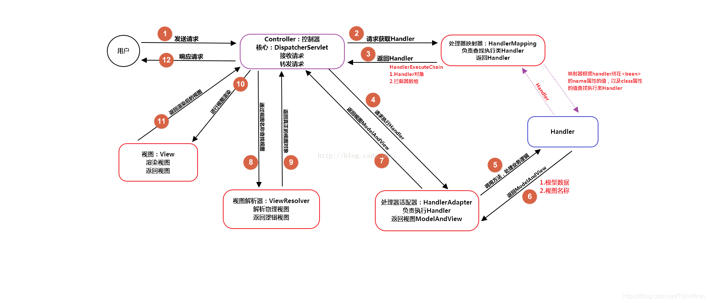

# 九、Spring MVC

# 概述

## ☞ 什么是 Spring MVC？简单介绍下你对 Spring MVC 的理解？

Spring MVC 是一个基于 Java 的实现了 MVC 设计模式的请求驱动类型的轻量级 Web 框架，通过把模型-视图-控制器分离，将 web 层进行职责解耦，把复杂的 web 应用分成逻辑清晰的几部分，简化开发，减少出错，方便组内开发人员之间的配合

## ☞ Spring MVC 的优点

- 可以支持各种视图技术,而不仅仅局限于 JSP
- 与 Spring 框架集成（如 IoC 容器、AOP 等）
- 清晰的角色分配：前端控制器(dispatcherServlet) , 请求到处理器映射（handlerMapping), 处理器适配器（HandlerAdapter), 视图解析器（ViewResolver）
- 支持各种请求资源的映射策略

# 核心组件

## ☞ Spring MVC 的主要组件？

1. 前端控制器 DispatcherServlet（不需要程序员开发）

作用：接收请求、响应结果，相当于转发器，有了 DispatcherServlet 就减少了其它组件之间的耦合度。

1. 处理器映射器 HandlerMapping（不需要程序员开发）

作用：根据请求的 URL 来查找 Handler

1. 处理器适配器 HandlerAdapter

注意：在编写 Handler 的时候要按照 HandlerAdapter 要求的规则去编写，这样适配器 HandlerAdapter 才可以正确的去执行 Handler。

1. 处理器 Handler（需要程序员开发）
2. 视图解析器 ViewResolver（不需要程序员开发）

作用：进行视图的解析，根据视图逻辑名解析成真正的视图（view）

1. 视图 View（需要程序员开发 jsp）

View 是一个接口， 它的实现类支持不同的视图类型（jsp，freemarker，pdf 等等）

## ☞ 什么是 DispatcherServlet

Spring 的 MVC 框架是围绕 DispatcherServlet 来设计的，它用来处理所有的 HTTP 请求和响应

## ☞ 什么是 Spring MVC 框架的控制器？

控制器提供一个访问应用程序的行为，此行为通常通过服务接口实现。控制器解析用户输入并将其转换为一个由视图呈现给用户的模型。Spring 用一个非常抽象的方式实现了一个控制层，允许用户创建多种用途的控制器

## ☞ Spring MVC 的控制器是不是单例模式，如果是，有什么问题，怎么解决？

是单例模式，所以在多线程访问的时候有线程安全问题，不要用同步，会影响性能的，解决方案是在控制器里面不能写字段

## ☞ 请描述 Spring MVC 的工作流程？描述一下 DispatcherServlet 的工作流程？

1. 用户发送请求至前端控制器 DispatcherServlet
2. DispatcherServlet 收到请求后，调用 HandlerMapping 处理器映射器，请求获取 Handle
3. 处理器映射器根据请求 url 找到具体的处理器，生成处理器对象及处理器拦截器(如果有则生成)一并返回给 DispatcherServlet
4. DispatcherServlet 调用 HandlerAdapter 处理器适配器
5. HandlerAdapter 经过适配调用具体处理器(Handler，也叫后端控制器)
6. Handler 执行完成返回 ModelAndView
7. HandlerAdapter 将 Handler 执行结果 ModelAndView 返回给 DispatcherServlet
8. DispatcherServlet 将 ModelAndView 传给 ViewResolver 视图解析器进行解析
9. ViewResolver 解析后返回具体 View
10. DispatcherServlet 对 View 进行渲染视图（即将模型数据填充至视图中）
11. DispatcherServlet 响应用户

# MVC 框架

## ☞ MVC 是什么？MVC 设计模式的好处有哪些

mvc 是一种设计模式（设计模式就是日常开发中编写代码的一种好的方法和经验的总结）。模型（model）-视图（view）-控制器（controller），三层架构的设计模式。用于实现前端页面的展现与后端业务数据处理的分离，mvc 设计模式的好处：

1. 分层设计，实现了业务系统各个组件之间的解耦，有利于业务系统的可扩展性，可维护性
2. 有利于系统的并行开发，提升开发效率

# 常用注解

## ☞ 注解原理是什么

注解本质是一个继承了 Annotation 的特殊接口，其具体实现类是 Java 运行时生成的动态代理类。我们通过反射获取注解时，返回的是 Java 运行时生成的动态代理对象。通过代理对象调用自定义注解的方法，会最终调用 AnnotationInvocationHandler 的 invoke 方法。该方法会从 memberValues 这个 Map 中索引出对应的值。而 memberValues 的来源是 Java 常量池。

## ☞ Spring MVC 常用的注解有哪些？

- @RequestMapping：用于处理请求 url 映射的注解，可用于类或方法上。用于类上，则表示类中的所有响应请求的方法都是以该地址作为父路径
- @RequestBody：注解实现接收 http 请求的 json 数据，将 json 转换为 java 对象
- @ResponseBody：注解实现将 conreoller 方法返回对象转化为 json 对象响应给客户

## ☞ @Controller 注解的作用

在 Spring MVC 中，控制器 Controller 负责处理由 DispatcherServlet 分发的请求，它把用户请求的数据经过业务处理层处理之后封装成一个 Model ，然后再把该 Model 返回给对应的 View 进行展示。在 Spring MVC 中提供了一个非常简便的定义 Controller 的方法，你无需继承特定的类或实现特定的接口，只需使用 @Controller 标记一个类是 Controller ，然后使用 @RequestMapping 和 @RequestParam 等一些注解用以定义 URL 请求和 Controller 方法之间的映射，这样的 Controller 就能被外界访问到。此外 Controller 不会直接依赖于 HttpServletRequest 和 HttpServletResponse 等 HttpServlet 对象，它们可以通过 Controller 的方法参数灵活的获取到。

@Controller 用于标记在一个类上，使用它标记的类就是一个 Spring MVC Controller 对象。分发处理器将会扫描使用了该注解的类的方法，并检测该方法是否使用了 @RequestMapping 注解。@Controller 只是定义了一个控制器类，而使用 @RequestMapping 注解的方法才是真正处理请求的处理器。单单使用 @Controller 标记在一个类上还不能真正意义上的说它就是 Spring MVC 的一个控制器类，因为这个时候 Spring 还不认识它。那么要如何做 Spring 才能认识它呢？这个时候就需要我们把这个控制器类交给 Spring 来管理。有两种方式：

- 在 Spring MVC 的配置文件中定义 MyController 的 bean 对象。
- 在 Spring MVC 的配置文件中告诉 Spring 该到哪里去找标记为 @Controller 的 Controller 控制器

## ☞ @RequestMapping 注解的作用

RequestMapping 是一个用来处理请求地址映射的注解，可用于类或方法上。用于类上，表示类中的所有响应请求的方法都是以该地址作为父路径。

RequestMapping 注解有六个属性，下面我们把她分成三类进行说明（下面有相应示例）。

- value， method

value： 指定请求的实际地址，指定的地址可以是 URI Template 模式（后面将会说明）；

method： 指定请求的 method 类型， GET、POST、PUT、DELETE 等；

- consumes，produces

consumes： 指定处理请求的提交内容类型（Content-Type），例如 application/json, text/html;

produces: 指定返回的内容类型，仅当 request 请求头中的(Accept)类型中包含该指定类型才返回；

- params，headers

params： 指定 request 中必须包含某些参数值是，才让该方法处理。

headers： 指定 request 中必须包含某些指定的 header 值，才能让该方法处理请求

## ☞ @ResponseBody 注解的作用

作用： 该注解用于将 Controller 的方法返回的对象，通过适当的 HttpMessageConverter 转换为指定格式后，写入到 Response 对象的 body 数据区。

使用时机：返回的数据不是 html 标签的页面，而是其他某种格式的数据时（如 json、xml 等）使用

## ☞ @PathVariable 和 @RequestParam 的区别

请求路径上有个 id 的变量值，可以通过 @PathVariable 来获取 @RequestMapping(value = “/page/{id}”, method = RequestMethod.GET)

@RequestParam 用来获得静态的 URL 请求入参 spring 注解时 action 里用到

# 其他

## ☞ Spring MVC 怎么样设定重定向和转发的？

- 转发：在返回值前面加"forward:"，譬如"forward:user.do?name=method4"
- 重定向：在返回值前面加"redirect:"，譬如"redirect:[http://www.baidu.com](http://www.baidu.com/)"

## ☞ Spring MVC 怎么和 AJAX 相互调用的？

通过 Jackson 框架就可以把 Java 里面的对象直接转化成 Js 可以识别的 Json 对象。具体步骤如下 ：

1. 加入 Jackson.jar
2. 在配置文件中配置 json 的映射
3. 在接受 Ajax 方法里面可以直接返回 Object,List 等,但方法前面要加上 @ResponseBody 注解

## ☞ Spring MVC 的异常处理？

可以将异常抛给 Spring 框架，由 Spring 框架来处理；我们只需要配置简单的异常处理器，在异常处理器中添视图页面即可

## ☞ Spring  设置虚拟路径映射

参考：[SpringBoot 设置虚拟路径映射绝对路径_mdw5521 的博客-CSDN 博客_springboot 虚拟路径映射](https://blog.csdn.net/mdw5521/article/details/79204043)

## 参考

- [Spring MVC 面试题（2020 最新版）](https://thinkwon.blog.csdn.net/article/details/104397427)
