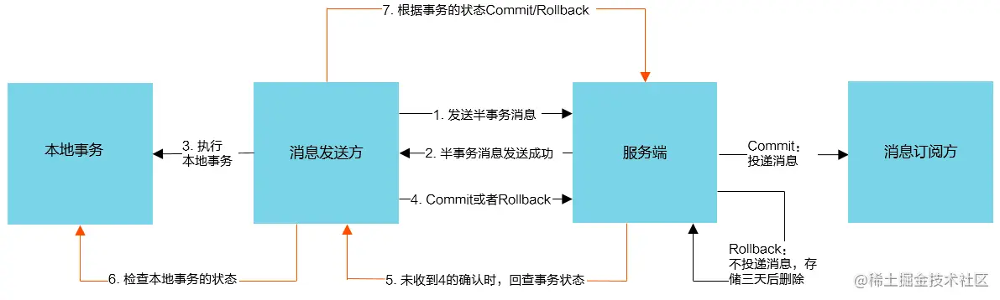

# 二十二、分布式

## 📌 说一下 CAP 理论

### CAP 理论

- <strong>C</strong>onsistency：一致性，代表数据在任何时刻、任何分布式节点中所看到的都是符合预期的
- <strong>A</strong>vailability：可用性，任何时间对系统进行的读写请求都能够正常响应
- <strong>P</strong>artition Tolerance：分区一致性，分区发生故障，整体系统依然能够正常运行

在 CAP 的理论中，P 是必须要保证的（P 是基础，分布式系统必然使用网络进行通信，而网络的不稳定，会导致分区不一致），C 和 A 不能同时满足；反证法：例如出现网络波动，数据丢失，如果要保证一致性，那么在系统完成数据一致性之前，系统将不可用，无法保证 A，反之亦然

### 一致性

- 强一致性：数据在任何时刻、任何分布式节点中所看到的都是符合预期的
- 弱一致性：把牺牲了 C 的 AP 系统又要尽可能获得正确的结果的行为称为追求“弱一致性”
- 最终一致性：数据在某一时刻、某一节点看到的可能不是不符合预期的，但是，经过一段时间后，最终会达到强一致性的效果

### BASE 理论

BASE 分别是基本可用性（Basically Available）、柔性事务（Soft State）和最终一致性（Eventually Consistent）的缩写

BASE 理论落地的核心是最大努力交付，对关键环节进行多次重试实现

## 📌 什么是分布式事务？

### TCC 事务

TCC 是另一种常见的分布式事务机制，它是“Try-Confirm-Cancel”三个单词的缩写

- Try：尝试执行阶段，完成所有业务可执行性的检查（保障一致性），并且预留好全部需用到的业务资源（保障隔离性）。
- Confirm：确认执行阶段，不进行任何业务检查，直接使用 Try 阶段准备的资源来完成业务处理。Confirm 阶段可能会重复执行，因此本阶段所执行的操作需要具备幂等性。
- Cancel：取消执行阶段，释放 Try 阶段预留的业务资源。Cancel 阶段可能会重复执行，也需要满足幂等性。

### SAGA 事务

TCC 事务具有较强的隔离性，避免了“超售”的问题，而且其性能一般来说是本篇提及的几种柔性事务模式中最高的，但它仍不能满足所有的场景。TCC 的最主要限制是它的业务侵入性很强

SAGA 由两部分操作组成

- 大事务拆分若干个小事务，将整个分布式事务 T 分解为 n 个子事务，命名为 T(1)，T(2)，…，T(i)，…，T(n)。每个子事务都应该是或者能被视为是原子行为。如果分布式事务能够正常提交，其对数据的影响（最终一致性）应与连续按顺序成功提交 T(i)等价。
- 为每一个子事务设计对应的补偿动作，命名为 C(1)，C(2)，…，C(i)，…，C(n)。T(i)与 C(i)必须满足以下条件：

  - T(i)与 C(i)都具备幂等性。
  - T(i)与 C(i)满足交换律（Commutative），即先执行 T(i)还是先执行 C(i)，其效果都是一样的。
  - C(i)必须能成功提交，即不考虑 C(i)本身提交失败被回滚的情形，如出现就必须持续重试直至成功，或者要人工介入。

如果 T(1)到 T(n)均成功提交，那事务顺利完成，否则，要采取以下两种恢复策略之一：

- 正向恢复（Forward Recovery）：如果 T(i)事务提交失败，则一直对 T(i)进行重试，直至成功为止（最大努力交付）。这种恢复方式不需要补偿，适用于事务最终都要成功的场景，譬如在别人的银行账号中扣了款，就一定要给别人发货。正向恢复的执行模式为：T(1)，T(2)，…，T(i)（失败），T(i)（重试）…，T(i+1)，…，T(n)。
- 反向恢复（Backward Recovery）：如果 T(i)事务提交失败，则一直执行 C(i)对 T(i)进行补偿，直至成功为止（最大努力交付）。这里要求 C(i)必须（在持续重试后）执行成功。反向恢复的执行模式为：T(1)，T(2)，…，T(i)（失败），C(i)（补偿），…，C(2)，C(1)。

### 分布式事务选型

## 📌 分布式事务通用的解决方案有哪些？各自的优缺点是什么？

## 📌 分布式事务自己更倾向于哪种

- [一万四千字分布式事务原理解析，全部掌握你还怕面试被问](https://segmentfault.com/a/1190000037757622)
- [面试官:聊聊分布式事务，再说说解决方案! - SegmentFault 思否](https://segmentfault.com/a/1190000040549695)

## 📌 说一下 2PC 和 3PC

### 2PC-两阶段提交

- 阶段一：由协调者发起提议，并收集投票结果
- 阶段二：根据收集的结果决定本次事务是 commit/abort

#### 缺点

- 同步阻塞：全部过程中，服务处于阻塞状态
- 单点：协调者宕机，其他节点会处于锁定状态
- 脑裂：阶段二中，如果部分节点执行失败，不同节点间数据会不一致

### 3PC-三阶段提交

- 阶段一：由协调者发起提议，并收集投票结果
- 阶段二：由协调者发起准备提交的指令，并收集各个节点的 ack 结果
- 阶段三：根据收集的结果决定本次事务是 commit/abort

参考：

- [分布式事物-2pc 和 3pc 区别 - 知行-zhixing - 博客园](https://www.cnblogs.com/daixianjun/p/2pc-3pc.html)

## 📌 分布式任务分片原理

## 📌 常见的限流算法有哪些，各有什么优缺点

固定窗口，滑动窗口，漏斗，令牌桶

| 限流算法 | 算法                                                                         | 优点                                       | 缺点                             |
| -------- | ---------------------------------------------------------------------------- | ------------------------------------------ | -------------------------------- |
| 固定窗口 | 在一段时间间隔内，处理请求的最大数量固定，超过部分不做处理                   | 实现简单                                   | 两个计数器临界位置可能会超过限制 |
| 滑动窗口 | 将一秒划分为 10 个格子，每次请求都计算最近 10 个格子的请求量，超过限制则丢弃 | 可以解决固定窗口的临界问题                 | 格子划分越多，占用空间越多       |
| 漏斗     | 漏桶大小固定，处理速度固定，但是请求流入速度不固定                           | 自己调用他人，可以保护他人不被突发流量压垮 | 突发流量到来，可能会丢弃过多请求 |
| 令牌桶   | 令牌桶大小固定，请求流入速度固定，但是处理速度不固定                         | 可以保护自己不被突发流量压垮               |                                  |

## 📌 说一下 Rocket MQ 事务消息机制

RocketMQ 提供了事务消息的功能，采用<strong>2PC</strong>(两阶段协议)+ 补偿机制（事务回查）的分布式事务功能，通过这种方式能达到分布式事务的最终一致。

### 概览

- 半事务消息：
  暂不能投递的消息，发送方已经成功地将消息发送到了消息队列 RocketMQ 版服务端，但是服务端未收到生产者对该消息的二次确认，此时该消息被标记成“暂不能投递”状态，处于该种状态下的消息即半事务消息。
- 消息回查：
  由于网络闪断、生产者应用重启等原因，导致某条事务消息的二次确认丢失，消息队列 RocketMQ 版服务端通过扫描发现某条消息长期处于“半事务消息”时，需要主动向消息生产者询问该消息的最终状态（Commit 或是 Rollback），该询问过程即消息回查。

### 交互流程

事务消息发送步骤如下：

1. 发送方将半事务消息发送至消息队列 RocketMQ 版服务端。
2. 消息队列 RocketMQ 版服务端将消息持久化成功之后，向发送方返回 Ack
   确认消息已经发送成功，此时消息为半事务消息。
3. 发送方开始执行本地事务逻辑。
4. 发送方根据本地事务执行结果向服务端提交二次确认（Commit 或是 Rollback），服务端收到 Commit 状态则将半事务消息标记为可投递，订阅方最终将收到该消息；服务端收到 Rollback 状态则删除半事务消息，订阅方将不会接受该消息。
   事务消息回查步骤如下：
5. 在断网或者是应用重启的特殊情况下，上述步骤 4 提交的二次确认最终未到达服务端，经过固定时间后服务端将对该消息发起消息回查。
6. 发送方收到消息回查后，需要检查对应消息的本地事务执行的最终结果。
7. 发送方根据检查得到的本地事务的最终状态再次提交二次确认，服务端仍按照步骤 4 对半事务消息进行操作。

#### 总体而言 RocketMQ 事务消息分为两条主线

- 发送流程：发送 half message(半消息)，执行本地事务，发送事务执行结果
- 定时任务回查流程：MQ 定时任务扫描半消息，回查本地事务，发送事务执行结果

参考：

- [RocketMq 之事务消息实现原理 - 掘金](https://juejin.cn/post/6844904193526857742)
