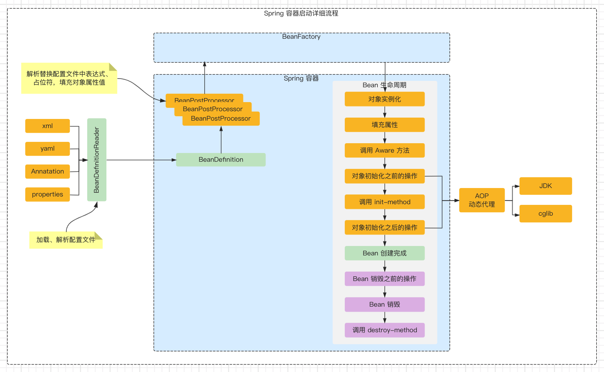
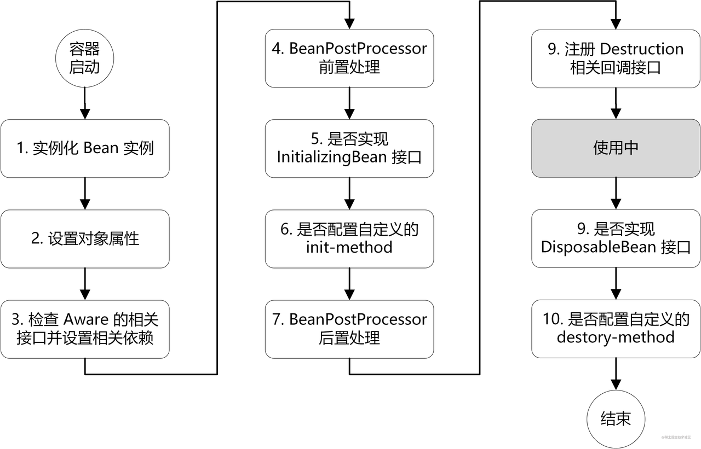
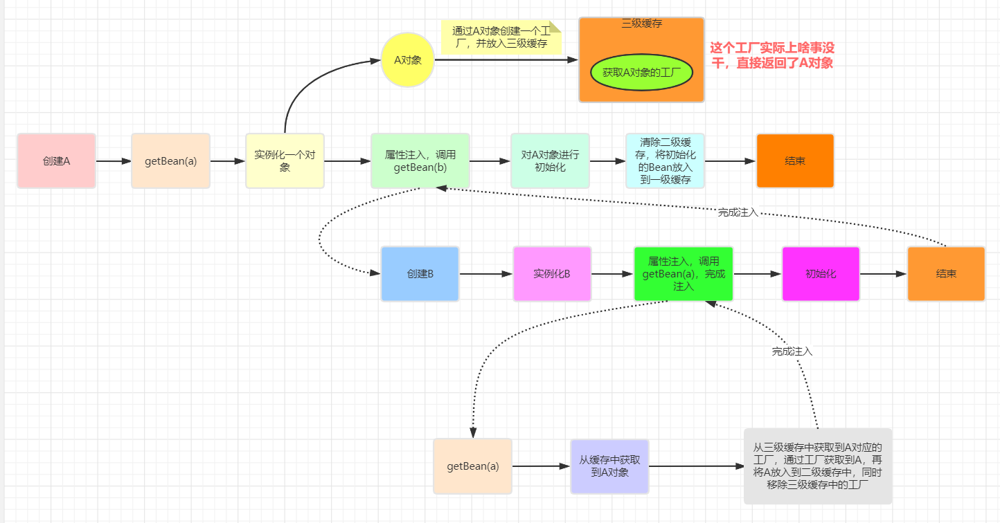
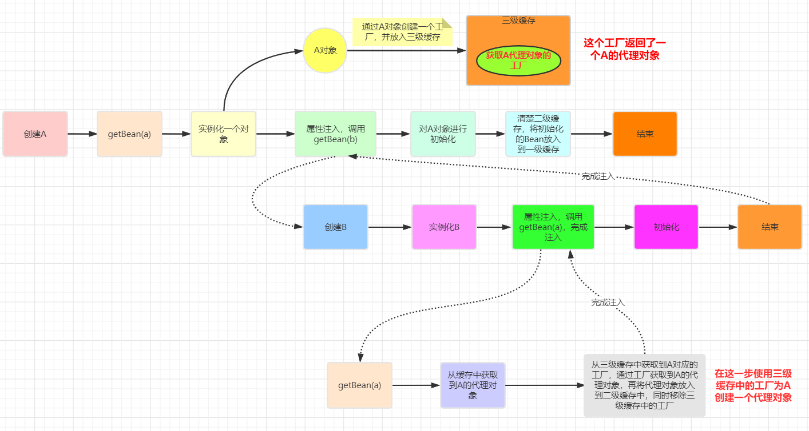
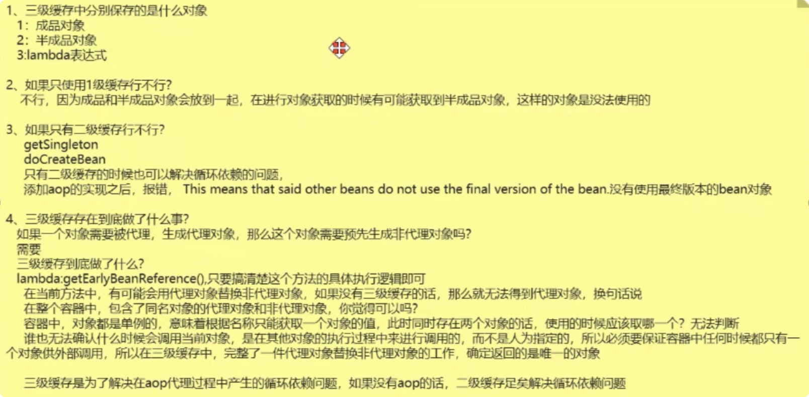

# 八、Spring

# Spring 概述

## <strong>📌 说一下 Spring 的好处（为什么要用 Spring）</strong>

从 Spring 的两个核心来说：<strong>控制反转</strong>（IoC）和 <strong>切面</strong>（AOP）

- 对象管理：应用程序所需要的 bean 均由 spring 容器进行创建；bean 之间的依赖关系均由容器来管理
- 解耦：通过 aop 编程技术实现公共服务抽离，减少了重复代码，降低了模块耦合度
- 简化开发
- 方便测试

## 📌 说一下 Spring 中的设计模式?

- 单例模式：bean 默认都是单例
- 原型模式：作用范围指定 prototype
- 工厂模式：BeanFactory
- 模板方法：onRefresh，postBeanFactoryProcessor
- 策略模式：XmlBeanDefinitionReader，PropertiesBeanDefinitionReader
- 观察者模式：listener，event，multicast
- 装饰者模式：BeanWrapper
- 代理模式：动态代理

# <strong>Spring IOC</strong>

## <strong>📌 说一下对 Spring IoC 的理解（IoC 容器启动流程）</strong>

<strong>总：</strong><strong>Spring IoC 的核心是控制反转和容器</strong>

- <strong>控制反转</strong>：原来对象的管理是由使用者进行控制，有了 Spring 之后，所有的对象都交由 Spring 进行控制，Spring 负责对象的创建，对象的注入；对象注入这块 Spring 主要使用 DI 即依赖注入，比如最常用的注解 @Autowired
- <strong>容器</strong>：Spring 容器本质是一个 map，用来存储所有的对象；Spring 容器一般由三级缓存组成，其中一级缓存 singletonObjects 缓存了所有的单例对象

<strong>分：</strong><strong>Spring 容器的启动流程大致如下：</strong>

主要是：AbstractApplicationContext#refresh 方法

1. 创建 Bean 工厂，一般会创建一个 DefaultListableBeanFactory 其顶级接口为 BeanFactory
2. 根据 BeanFactory 的类型，生成对应的 BeanDefinitionReader，加载 Resource 配置文件，解析配置文件，生成 BeanDefinition 对象，注册到 BeanFactory 中
3. BeanFactoryPostProcessor 的执行，该接口主要用于修改/补充 BeanFactory 中的属性（<strong>BFPP 扩展点</strong>）
4. 注册所有的 BeanPostProcessor，用于后续对 Bean 的扩展（<strong>BPP 扩展点</strong>）
5. 初始化国际化资源，注册广播器、监听器
6. 实例化剩余的所有非懒加载的 Bean，这个过程主要分以下 <strong>6</strong> 个步骤
7. 使用反射的方式实例化 Bean
8. 调用 populateBean 方法为其填充属性
9. 执行 aware 接口的子类的方法
10. 执行 BeanPostProcessors 前置处理方法
11. 执行 init-method
12. 执行 BeanPostProcessors 后置处理方法（AOP 对象的创建与替换）
13. 容器启动完成，通过 getBean 来获取实例对象
14. 容器销毁过程



## <strong>📌 说一下常见的依赖注入实现方式？</strong>

依赖注入是时下最流行的 IoC 实现方式，依赖注入分为接口注入（Interface Injection），Setter 方法注入（Setter Injection）和构造器注入（Constructor Injection）三种方式。其中接口注入由于在灵活性和易用性比较差，现在从 Spring4 开始已被废弃。

#### <strong>构造器依赖注入</strong>

构造器依赖注入通过容器触发一个类的构造器来实现的，该类有一系列参数，每个参数代表一个对其他类的依赖。

#### <strong>Setter 方法注入</strong>

Setter 方法注入是容器通过调用无参构造器或无参 static 工厂 方法实例化 bean 之后，调用该 bean 的 setter 方法，即实现了基于 setter 的依赖注入。

## <strong>📌 构造器依赖注入和 Setter 方法注入的区别</strong>

| 构造函数注入               | setter 注入                |
| -------------------------- | -------------------------- |
| 没有部分注入               | 有部分注入                 |
| 不会覆盖 setter 属性       | 会覆盖 setter 属性         |
| 任意修改都会创建一个新实例 | 任意修改不会创建一个新实例 |
| 适用于设置很多属性         | 适用于设置少量属性         |

## <strong>📌 说一下父子容器及项目中怎么用的</strong>

Spring 父子容器是指存在父子关系的多个 IoC 容器

#### 父子容器的特点

1. 相互隔离：父子容器中的 bean 名称可以相同，互不影响
2. 子容器可以访问父容器的 bean，但是父容器无法访问子容器的（类比双亲委派模型：父类加载器无法访问子类加载器所加载的类）

#### 父子容器的优缺点

优点：相互隔离互不影响

缺点：增加了 Bean 加载的复杂度

#### 项目中如何使用的

Spring mvc

参考：

- [Spring 系列之父子容器详解 - 掘金](https://juejin.cn/post/7094425000450949150)
- [spring 中的父子容器](https://www.mdnice.com/writing/52e3a52deca7471bab236a72c0161437)

## <strong>📌 </strong>说一下 Spring 常见扩展点？项目中怎么用的

### 常见扩展点

#### 1、BeanFactoryPostProcessor 接口

这个扩展点是发生在 bean 实例化之前，BeanDefinition 读取完之后。所以我们在这里可以获取到 BeanDefinition，以改变他默认的实例化方式

- <strong>占位符</strong>与<strong>敏感信息处理</strong>，比如数据库连接信息，在配置文件中可以配置为加密后的串，在项目启动时，加加密串进行解密

参考：

- [Spring 拓展接口之 BeanFactoryPostProcessor，占位符与敏感信息解密原理 - 青石路 - 博客园](https://www.cnblogs.com/youzhibing/p/10559337.html)

#### 2、BeanPostProcessor 接口

可以在 spring 容器实例化 bean 之后，在执行 bean 的初始化方法前后，添加一些自己的处理逻辑

- <strong>@Resource</strong> 注解：CommonAnnotationBeanPostProcessor
- <strong>@Required</strong> 注解：RequiredAnnotationBeanPostProcessor
- <strong>@Autowired</strong> 注解：AutowiredAnnotationBeanPostProcessor

参考：

- [【Spring】常用扩展点及其应用场景_qq_三哥啊的博客-CSDN 博客_spring 扩展点实际应用](https://blog.csdn.net/qq_27579471/article/details/115653149)

### 项目中的使用

#### 1、容器销毁事件 ContextClosedEvent

监听容器关闭事件，优雅关闭线程池

#### 2、自定义插件

@Import 注解实现自定义的插件功能

#### 3、拦截器

HandlerInterceptor 接口，preHandle 方法，利用拦截器，实现权限的控制

#### 4、自定义异常

@ControllerAdvice 注解，可以实现全局异常的统一处理

参考：

- [Spring IoC 容器与扩展点](https://mvbbb.cn/spring-ioc/#spring-%E6%89%A9%E5%B1%95%E7%82%B9%E6%8E%A5%E5%8F%A3)
- [聊聊 Spring 中最常用的 11 个扩展点 - 掘金](https://juejin.cn/post/7145084738775023646)

## <strong>📌 </strong>Spring 中线程池如何优雅关闭？

### 如果没有优雅关闭会有什么问题

比如在线程池中使用 <strong>redisTemplate</strong> 进行操作，如果容器关闭了，对象被回收，可能会报连接池已关闭的错误，导致业务处理中断

### 如何优雅关闭

1. 首先应该考虑的是如何正确关闭线程池：`shutdown` + `awaitTermination`

```java
// 执行shutdown，将会拒绝新任务提交到线程池；待执行的任务不会取消，正在执行的任务也不会取消，将会继续执行直到结束
executorService.shutdown();

// 执行shutdownNow，将会拒绝新任务提交到线程池；取消待执行的任务，尝试取消执行中的任务
// executorService.shutdownNow();

// 超时等待线程池完毕
executorService.awaitTermination(3, TimeUnit.SECONDS);
```

1. 当 JVM 收到 kill 指令后，便会唤醒所有的 Shutdown Hook，而其中有一个 Shutdown Hook 是 Spring 应用在启动之初注册的，它的作用是对 Spring 管理的 Bean 进行回收，并销毁 IOC 容器；此时需要考虑的是，如何在容器销毁之前优雅关闭线程池，有两种方案

- 监听 Spring 的 ContextClosedEvent 事件，在事件被触发时关闭线程池
- 实现 Lifecycle 接口，并在其 stop 方法中关闭线程池

```sql
@EventListener(ContextClosedEvent.class)
public void handlerEvent(Object event) {
    System.out.println("接受到了事件:"+event.getClass());
}
```

参考：

- [Spring 环境中正确关闭线程池的姿势_spring 线程池关闭_神的力量的博客-CSDN 博客](https://blog.csdn.net/qq271859852/article/details/107442161)

# <strong>Spring Beans</strong>

## <strong>📌 描述一下 Bean 的生命周期</strong>

<strong>总：</strong>Bean 的生命周期是指一个 Bean 从创建到使用到销毁的全部过程

<strong>分：</strong>大致分如下步骤

1. 通过反射的方式创建 Bean 实例；具体是调用 Class 类的 getDeclaredConstructor 方法，获取到无参构造器，调用 newInstance 方法创建 Bean 对象
2. 调用 populateBean 对实例进行赋值，此处如果存在循环依赖的情况，则会利用三级缓存进行解决
3. 调用 invokeMethods 方法对 BeanNameAware、BeanClassLoaderAware、BeanFactoryAware 进行设置值
4. 循环执行 BeanPostProcessor 的前置处理方法，在前置处理方法中，主要是对 Spring 基础组件进行赋值，比如：ApplicationContext、Environment、EmbeddedValueResolver、ResourceLoader
5. 调用 invokeInitMethods 执行自定义的 init-method
6. 循环执行 BeanPostProcessor 的后置处理方法，Spring Aop 代理对象就是在这里处理的
7. 生成完整的 Bean 对象，供应用程序使用
8. Bean 的销毁流程



## 📌 Spring 是如何解决循环依赖的问题的?

<strong>总：</strong>循环依赖是指两个对象相互持有对方的属性；Spring 将 Bean 的<strong>实例化和初始化分开操作</strong>，<strong>提前暴露</strong>完成实例化但未完成初始化的 Bean；利用三级缓存存储不同阶段的 Bean；其中三级缓存的含义如下

- 一级缓存（singletonObjects）：缓存完成<strong>实例化</strong>和<strong>初始化</strong>的单例 Bean
- 二级缓存（earlySingletonObjects）：缓存<strong>完成实例化但未完成初始化</strong>的单例 Bean（半成品）
- 三级缓存（singletonFactories）：缓存的是一个 ObjectFactory 接口（Function 接口）用来在 BPP 后置处理时，创建 AOP 对象和其他对象

<strong>分：</strong>假定 A、B 为相互依赖的对象，则 A、B 创建的流程如下

1. Spring 先创建 A 对象，执行 getBean、doGetBean、createBean、doCreateBean
2. 在 doCreateBean 中，调用 initializeBean 对 A 进行实例化，此时 A 的属性 B 是 null，实例化完成后将 A 的 ObjectFactory（即 lambda 表达式，用来获取一个 a 对象） 缓存到三级缓存中
3. 调用 populateBean 对 A 进行属性值的设置，获取到 A 的属性值是 B，是一个 RuntimeBeanReaference，此时开始 B 的创建（因为容器中还没有 B）
4. B 的创建流程同 A 一致，执行到 populateBean 进行属性填充时，从三级缓存中获取到 A 的 ObjectFactroy 调用 getObject 方法进行创建，创建时，会将半成品 A 放入到二级缓存
5. 完成 B 的创建，将其放入一级缓存
6. 完成 A 的创建，将其放入一级缓存
7. 根据上述的流程，其实<strong>对于普通对象只需要两级缓存即可，但是对于 aop 来讲，最终使用的是代理后的对象，如果一个对象需要被代理，则必须先生成原始对象，如果只有两级缓存的话，则缓存中就会出现两个 name 相同的对象，一个原始对象，一个代理对象，这是不允许的；所以利用三级缓存，所有对象首先将 ObjectFactory 放入三级缓存，这是一个 lambda 表达式，由自己来实现即可，后续获取时，如果需要代理对象，则生成代理对象，不需要就返回原始对象</strong>

#### <strong>1. 简单的循环依赖（没有 AOP）</strong>



#### <strong>2.  结合了 AOP 的循环依赖</strong>



## 📌 BeanFactory 与 FactoryBean 有什么区别？

<strong>总：</strong>BeanFactory 和 FactoryBean 都可以获取对象，但是相比较 BeanFactory，FactoryBean 获取对象的流程更简单，支持自定义 Bean

<strong>分：</strong>FactoryBean 有三个方法

- getObject：用来实现创建对象的具体逻辑
- getObjectType： 指定对象的类型
- isSingleton：指定对象是否是单例

MyBatis 通过 FactoryBean 创建代理对象，完成 Mapper 接口的注入

## <strong>📌 什么情况下循环依赖可以被处理</strong>

1. 单例
2. 不全是构造器注入

## <strong>📌 为什么要使用三级缓存呢？二级缓存能解决循环依赖吗？</strong>

- 简单的循环依赖是可以使用二级缓存解决的
- 添加 AOP 之后，则会报错：This means that said other beans do not use the final version of the bean；即：<strong>没有使用最终版本的 Bean</strong>
- 三级缓存做了如下事情



## <strong>📌 Spring bean 的作用域</strong>

1. singleton：单例模式
2. prototype：多例模式
3. request：作用于 web 应用中的请求范围
4. session：作用于 web 应用中的会话范围
5. global-session：作用于集群环境中的会话范围

注意： 缺省的 Spring bean 的作用域是 Singleton。使用 prototype 作用域需要慎重的思考，因为频繁创建和销毁 bean 会带来很大的性能开销

## <strong>📌 说一下 @Autowired 和 @Resource 注解</strong>

1. @Autowired 注解默认按照类型来进行装配；如果需要按照名称来装配，可以结合 @Qualifier 注解一起使用
2. @Resource 注解默认按照名称来进行装配；如果需要按照类型类装配，可以在属性中指定
3. 这两个注解

### 为什么不推荐用 @Autowired 注解？

@Autowired 是 Spring 的注解，@Resource 是 JDK 的注解，如果更换了 IoC 容器，@Autowired 就不能正常使用了

## <strong>📌 说一下 </strong>@PostConstruct 原理

1. 在 CommonAnnotationBeanPostProcessor 中进行处理（BPP 后置）
2. 在项目启动的时候，会执行该注解注释的方法，比如加载省市县编码数据

## <strong>📌 Spring 注解的实现机制</strong>

1. Java  反射机制获取注解
2. BPP 进行实现

# <strong>Spring 数据访问</strong>

## <strong>📌 Spring 支持的事务管理类型， spring 事务实现方式有哪些？</strong>

Spring 支持两种类型的事务管理：

- 编程式事务管理：这意味你通过编程的方式管理事务，给你带来极大的灵活性，但是难维护
- 声明式事务管理：这意味着你可以将业务代码和事务管理分离，你只需用注解和 XML 配置来管理事务，使用 AOP 实现

## <strong>📌 Spring 事务管理接口</strong>

- PlatformTransactionManager： （平台）事务管理器
- TransactionDefinition： 事务定义信息(事务隔离级别、传播行为、超时、只读、回滚规则)
- TransactionStatus： 事务运行状态

## <strong>📌 Spring 事务的实现方式和实现原理</strong>

<strong>总：</strong>Spring 事务是基于 Spring AOP 实现的，首先生成具体的代理对象，然后按照 Aop 的整套流程来处理;AOP 的核心流程是利用通知机制来实现的，但是 Spring 事务是利用 TransactionInterceptor 来实现的，然后调用其 invoke 方法来执行具体的逻辑

<strong>分：</strong>主要步骤如下

1. 准备工作，解析 Spring 事务注解中的各个属性，确定是否需要新开事务，如果需要新开事务，则开启事务，关闭自动提交
2. 执行业务逻辑
3. 执行失败，调用 completeTransactionAfterThrowing 方法，获取当前连接，调用 doRollBack 进行回滚
4. 执行成功，调用 completeTransactionAfterReturning 方法，获取当前连接，调用 doCommit 进行提交
5. 释放资源

## <strong>📌 说一下 Spring 的事务传播行为</strong>

<strong>总：</strong>Spring 的事务传播级别主要有 7 种，比如：required，requires_new，never，nested；事务的传播特性一般指两个方法嵌套时，相互之间的影响；总体可以分为两类：两个方法共用一个事务，两个方法分别使用单独的事务

<strong>分：</strong>工作中主要用到的有如下三种情况

1. 外层方法是 required，内层方法是 required，requires_new，nested：无论内存还是外层抛出异常，都会回滚（只要不是程序捕获异常）
2. 外层方法是 requires_new，内层方法是 required，requires_new，nested
3. 外层方法是 nested，内层方法是 required，requires_new，nested

|                  | （内层）无事务            | （内层）REQUIRED                                                                                                                                                                                                              | （内层）REQUIRES_NEW                                                                                           | （内层）NESTED                                                                          |
| ---------------- | ------------------------- | ----------------------------------------------------------------------------------------------------------------------------------------------------------------------------------------------------------------------------- | -------------------------------------------------------------------------------------------------------------- | --------------------------------------------------------------------------------------- |
| （外层）无事务   |                           | 1. 同一个类，外层无事务，内层有事务，内层异常，内外都不会回滚，因为调用的是外层原始代码而非代理<br/>1. 不同类，外层无事务，内层有事务，内层异常，只会回滚内层<br/>1. 不同类，外层无事务，内层有事务，外层异常，内外都不会回滚 | 同 REQUIRED                                                                                                    | 同 REQUIRED                                                                             |
| （外层）REQUIRED | 同一个类/不同类，都会回滚 | 同一个类/不同类，内层异常/外层异常，都会回滚                                                                                                                                                                                  | 1. 同一个类，内层异常/外层异常，都会回滚<br/>1. 不同类，内层异常，都会回滚<br/>1. 不同类，外层异常，只回滚外层 | 1. 同一个类，内层异常/外层异常，都会回滚<br/>1. 不同类，内层异常/外层异常，都会回滚（） |

## <strong>📌 说一下 spring 的事务隔离？</strong>

spring 有五大隔离级别，默认值为 ISOLATION_DEFAULT（使用数据库的设置），其他四个隔离级别和数据库的隔离级别一致：

1. ISOLATION_DEFAULT：用底层数据库的设置隔离级别，数据库设置的是什么我就用什么
2. ISOLATION_READ_UNCOMMITTED：未提交读，最低隔离级别、事务未提交前，就可被其他事务读取（会出现幻读、脏读、不可重复读）
3. ISOLATION_READ_COMMITTED：提交读，一个事务提交后才能被其他事务读取到（会造成幻读、不可重复读），SQL server 的默认级别
4. ISOLATION_REPEATABLE_READ：可重复读，保证多次读取同一个数据时，其值都和事务开始时候的内容是一致，禁止读取到别的事务未提交的数据（会造成幻读），MySQL 的默认级别
5. ISOLATION_SERIALIZABLE：序列化，代价最高最可靠的隔离级别，该隔离级别能防止脏读、不可重复读、幻读

<strong>脏读</strong>：一个事务中访问到了另外一个事务未提交的数据；比如事务 1 更新了一个用户的年龄，事务 2 此时读取了事务 1 更新的年龄，之后事务 1 因为某些原因进行了 RollBack 操作，事务 2 读取的年龄便是不准确的

<strong>不可重复读</strong>：一个事务读取同一条记录 2 次，得到的结果不一致；比如事务 1 读取一个用户的年龄，事务 2 此时对该用户的年龄做了更新操作，事务 1 再次读取时，发现与第一次的结果不一致

<strong>幻读</strong>：一个事务读取 2 次，得到的记录条数不一致；比如事务 1 第一次读取用户表中年龄大于 18 的记录，读取完成后，事务 2 插入了一条记录，年龄大于 18，事务 1 再次读取时发现记录多了一条

## <strong>📌 说一下 Spring 失效的场景</strong>

1. MyISAM 引擎不支持事务
2. 注解所在的类没有加入 IOC 容器：this 调用

```typescript
public class Test{
    public void save(){
        this.save1();
    }
    
    @Transactional
    public void save1(){
        
    }
}
```

外部调用 save 方法，但是 save 调用 save1 方法，相当于是 this 调用，不是代理对象调用，事务管理不会生效；若想解决，将动态代理改为静态代理：AspectJ；或者从 Spring IOC 容器中获取 Bean

1. 注解所在的方法不是 public 方法

使用声明式事务管理时，是利用 Spring AOP 实现的，如果注解所在的方式不是 public 的就不会获取 @Transactional 的属性配置信息；如果要用在非 public 方法上，可以开启 AspectJ 代理模式

1. rollbackFor、noRollbackFor 属性设置错误

参考：[Spring 如何在一个事务中开启另一个事务](https://mp.weixin.qq.com/s/1TEBnmWynN4nwc6Q-oZfvw)

## <strong>📌 说一下 Spring 事务管理的优点？（为什么要用 Spring 事务）</strong>

- 为不同的事务 API 如 JTA，JDBC，Hibernate，JPA 和 JDO，提供一个不变的编程模式
- 为编程式事务管理提供了一套简单的 API 而不是一些复杂的事务 API
- 支持声明式事务管理
- 和 Spring 各种数据访问抽象层很好得集成

# <strong>Spring AOP</strong>

## <strong>📌 Spring 的 AOP 的底层实现原理?</strong>

<strong>总：</strong>Spring AOP 是利用<strong>动态代理</strong>来实现的，它本质是 IoC 的一个扩展，利用 <strong>BeanPostProcessor</strong> 来扩展的

<strong>分：</strong>具体流程如下

1. 创建 aop 代理需要的相关对象：aspect 对象（切面类），pointCut 对象（切面中的某个方法），advisor 对象（通知类型）
2. 利用 BeanPostProcessor 在后置处理器中（applyBeanPostProcessorsAfterInitialization）调用 createProxy 利用 cglib 或 jdk 创建代理对象
3. 业务请求调用被代理的对象时，从 Spring 容器中拿到 Bean 实际是代理后的对象，执行时从 DynamicAdvisedInterceptor 中 intercept 方法开始执行
4. 首先获取被代理的方法的拦截器链：MethodInterceptor 列表（Advoice 类型的函数式接口，用来执行被代理的方法）
5. 依次执行拦截器中的方法

## <strong>📌 JDK 动态代理和 CGLIB 动态代理的区别</strong>

Spring AOP 中的动态代理主要有两种方式，<strong>JDK 动态代理</strong>和 <strong>CGLIB 动态代理</strong>：

- JDK 动态代理只提供接口的代理，不支持类的代理。核心<strong>InvocationHandler 接口和 Proxy 类</strong>，InvocationHandler 通过 invoke()方法反射来调用目标类中的代码，动态地将横切逻辑和业务编织在一起；接着，Proxy 利用 InvocationHandler 动态创建一个符合某一接口的的实例, 生成目标类的代理对象
- 如果代理类没有实现 InvocationHandler 接口，那么 Spring AOP 会选择使用 CGLIB 来动态代理目标类。CGLIB（Code Generation Library），是一个代码生成的类库，可以在运行时动态的生成指定类的一个子类对象，并覆盖其中特定方法并添加增强代码，从而实现 AOP。CGLIB 是通过继承的方式实现动态代理，因此如果某个类被标记为 final，那么它是无法使用 CGLIB 做动态代理的。

#### 静态代理与动态代理区别

1. 静态代理在编译期就可以知道被代理的对象，而动态代理只有在运行时，才知道被代理的对象
2. 静态代理和动态代理生成 AOP 代理对象的时机不同，相对来说 AspectJ 的静态代理方式具有更好的性能，但是 AspectJ 需要特定的编译器进行处理，而 Spring AOP 则无需特定的编译器处理。

## 📌 选择 CgLib 代理 还是 JDK 代理

- JDK 代理使用时有一个限制：被代理的类必须实现了接口，而 CgLib 不需要这样的形式
- JDK 代理在<strong>生成代理类的效率</strong>优于 CgLib，但是<strong>运行效率</strong>不如 CgLib，所以在单例模式下，使用 CgLib 代理，原型模式下使用 JDK 代理

参考：[Spring AOP 中的 JDK 和 CGLib 动态代理哪个效率更高？](https://blog.csdn.net/xlgen157387/article/details/82497594)

## <strong>📌 Spring 通知有哪些类型？</strong>

在 AOP 术语中，切面的工作被称为通知，实际上是程序执行时要通过 SpringAOP 框架触发的代码段。

Spring 切面可以应用 5 种类型的通知：

- 前置通知（Before）：在目标方法被调用之前调用通知功能；
- 后置通知（After）：在目标方法完成之后调用通知，此时不会关心方法的输出是什么；
- 返回通知（After-returning ）：在目标方法成功执行之后调用通知；
- 异常通知（After-throwing）：在目标方法抛出异常后调用通知；
- 环绕通知（Around）：通知包裹了被通知的方法，在被通知的方法调用之前和调用之后执行自定义的行为

# 其他

## <strong>📌 </strong>说一下过滤器和拦截器的区别

1. 拦截器不依赖 servelet 容器，而过滤器会依赖
2. 拦截器只能拦截 action 请求，而过滤器可以拦截几乎所有请求
3. 拦截器基于 java 反射实现，过滤器基于函数回调实现
4. 拦截器可以注入 spring bean，过滤器不可以

参考：

- [拦截器与过滤器的区别](https://cloud.tencent.com/developer/article/2101021)

# <strong>参考</strong>

- [Spring 面试题（2020 最新版）](https://thinkwon.blog.csdn.net/article/details/104397516)
- [面试必杀技，讲一讲 Spring 中的循环依赖](https://developer.aliyun.com/article/766880)
- [Spring 核心技术详解(一)](https://juejin.cn/post/6844904005714313229)
- [Spring 核心知识点整理](https://juejin.cn/post/6844903988408614926)
