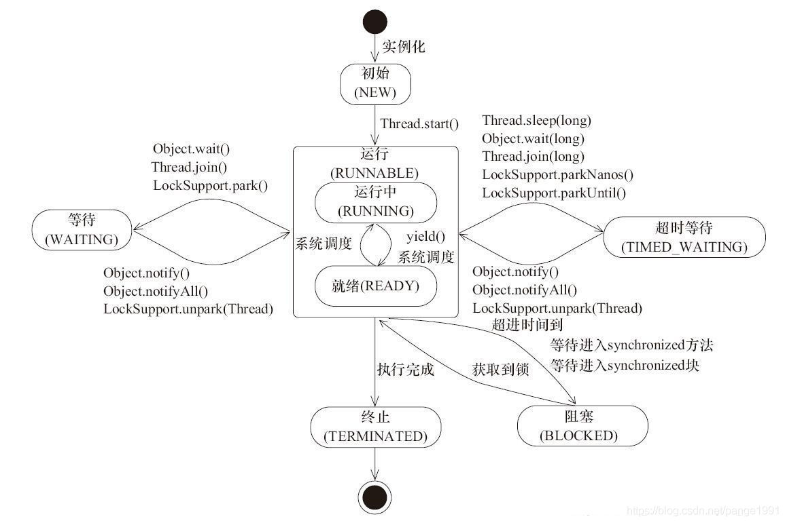

# 六、Java 并发编程

# 基础知识

## 📌 为什么需要多线程

众所周知，CPU、内存、I/O 设备的速度是有极大差异的，为了合理利用 CPU 的高性能，平衡这三者的速度差异，计算机体系结构、操作系统、编译程序都做出了贡献，主要体现为:

- CPU 增加了缓存，以均衡与内存的速度差异 >> 导致<strong>可见性</strong>问题
- 操作系统增加了进程、线程，以分时复用 CPU，进而均衡 CPU 与 I/O 设备的速度差异 >> 导致<strong>原子性</strong>问题
- 编译程序优化指令执行次序，使得缓存能够得到更加合理地利用 >> 导致<strong>有序性</strong>问题

## 📌 并发编程三要素

- 原子性：提供互斥访问，同一时刻只能有一个线程对数据进行操作（Atomic，synchronized）
- 可见性：一个线程对主内存的修改可以及时地被其他线程看到（synchronized，volatile）
- 有序性：一个线程观察其他线程中的指令执行顺序，由于指令重排序，该观察结果一般杂乱无序（volatile）

## 📌 说一下线程安全

### 1、线程安全体现在三个方面

- 原子性：提供互斥访问，同一时刻只能有一个线程对数据进行操作（Atomic，synchronized）
- 可见性：一个线程对主内存的修改可以及时地被其他线程看到（synchronized，volatile）
- 有序性：一个线程观察其他线程中的指令执行顺序，由于指令重排序，该观察结果一般杂乱无序（happens-before 原则）

### 2、Java 中的具体实现

- synchronized 锁（偏向锁，轻量级锁，重量级锁）
- volatile 锁，只能保证线程之间的可见性及禁止指令重排序，但不能保证数据的原子性
- jdk1.5 并发包中提供的 Atomic 原子类
- Lock 锁

## 📌 并行和并发有什么区别

- 并行：多个事件在同一时间段内<strong>同时</strong>发生
- 并发：多个事件在同一时间段内<strong>间隔</strong>发生

## 📌 线程和进程的区别

- 进程：<strong>是程序运行和资源分配的基本单位</strong>；一个程序至少有一个进程，一个进程至少有一个线程；进程在程序运行时，拥有独立的内存资源
- 线程：<strong>是操作系统进行调度的基本单位</strong>；共享内存资源，多个线程之间可以并发执行
- Java 的线程分为两种：User Thread(用户线程)、Daemon Thread(守护线程)

## 📌 守护线程是什么

守护线程（daemon thread），即服务线程，用于给其他线程提供服务；如果 JVM 中存在未结束的非守护线程，守护线程就不会结束，当非守护线程结束后，守护线程随着 JVM 的结束而结束

## 📌 守护线程如何创建

1. 守护线程是一种服务型，支持型的线程，如 Java 虚拟机中的 GC 线程
2. 守护线程随着主线程的消亡而消亡，即主线程结束了，守护线程也会结束
3. 守护线程通过 Thread 中的 setDaemon 方法来设置，设置时机是线程启动之前
4. 守护线程中的 finally 块中的代码不一定会执行

## 📌 Java 中常见的守护线程有哪些？作用是什么？

Java 中常见的守护线程有：主线程（main 方法线程）和 gc；main 方法提供程序的入口，gc 用来进行垃圾回收

## 📌 说一下死锁

多个线程在执行过程中，因资源竞争而相互等待的一种现象，若没有外力作用，将无法继续推进

#### 死锁形成的四个必要条件

1. 互斥条件：同一时间只能有一个线程获取资源。
2. 不可剥夺条件：一个线程已经占有的资源，在释放之前不会被其它线程抢占
3. 请求和保持条件：线程等待过程中不会释放已占有的资源
4. 循环等待条件：多个线程互相等待对方释放资源

## 📌 如何防止死锁

预防死锁，实际就是破坏死锁形成的四个必要条件

##### 由于资源互斥是资源使用的固有特性，无法改变，我们不讨论

##### 破坏不可剥夺条件

一个进程不能获得所需要的全部资源时便处于等待状态，等待期间他占有的资源将 被隐式的释放重新加入到系统的资源列表中，可以被其他的进程使用，而等待的进程只有重新获得自己原有的资源以及新申请的资源才可以重新启动执行

##### 破坏请求与保持条件

第一种方法静态分配即每个进程在开始执行时就申请他所需要的全部资源,

第二种是动态分配即每个进程在申请所需要的资源时他本身不占用系统资源

##### 破坏循环等待条件

采用资源有序分配其基本思想是将系统中的所有资源顺序编号，将紧缺的，稀少的 采用较大的编号，在申请资源时必须按照编号的顺序进行，一个进程只有获得较小 编号的进程才能申请较大编号的进程。

## 📌 创建线程的四种方式

#### 1. 实现 Runnable 接口

- 定义 Runnable 接口的实现类，重写 run()方法，run()方法的方法体是线程要完成的任务
- 创建实现了 Runnable 接口的实现类的实例，并将此实例作为 Thread 的 target 来创建 Thread 对象，该 Thread 对象才是真正的线程对象
- 调用线程对象的 start()方法来启动线程

#### 2. 继承 Thread 类（Thread 类本身也实现了 Runnable 接口）

- 继承 Thread 类重写 run()方法，run()方法的方法体是线程要完成的任务
- 创建继承了 Thread 类的实例，该实例为线程实例
- 调用线程对象的 start()方法来启动线程

#### 3. 利用 FutureTask 创建带返回值的线程

- 创建 Callable 的实现类，并重写 call()方法，方法体即线程执行体，并且有返回值
- 创建 Callable 实现类的实例，并用 FutureTask 类来包装 Callable 对象，该 FutureTask 对象封装了 Callable 对象的 call()方法的返回值
- 使用 FutureTask 对象作为 Thread 的 target 来创建 Thread 对象，该对象为真正的线程对象
- 调用线程对象的 start()方法启动线程

```java
@Test
<em>// 利用 FutureTask 创建可以返回结果的线程
</em><strong>public void </strong>test3() <strong>throws </strong>ExecutionException, InterruptedException {
    FutureTask<String> task = <strong>new </strong>FutureTask<>(<strong>new </strong>Callable<String>() {
        @Override
        <strong>public </strong>String call() <strong>throws </strong>Exception {
            <strong>return </strong>Thread.<em>currentThread</em>().getName() + <strong>" Is Running!"</strong>;
        }
    });
    <strong>new </strong>Thread(task).start();
    System.<strong>out</strong>.println(Thread.<em>currentThread</em>().getName() + <strong>" Is Running! "
</strong><strong>        </strong>+ <strong>"Task Result: " </strong>+ task.get());
}
```

#### 4. 利用线程池创建线程

## 📌 描述一下线程安全活跃态问题，竞态条件？

#### 线程安全的活跃性问题可以分为：死锁、活锁、饥饿

工作中遇到的线程饥饿的案例：读写锁，读多写少的场景下，读的线程数量远高于写的线程，就会导致写的线程获取不到资源发生线程饥饿现象

参考：[StampedLock 详解 - 张孟浩 Jay - 博客园](https://www.cnblogs.com/zmhjay1999/p/15183390.html)

#### <strong>活锁</strong>

<strong>活锁</strong>就是有时线程虽然没有发生阻塞，但是仍然会存在执行不下去的情况，活锁不会阻塞线程，线程会一直重复执行某个相同的操作，并且一直失败重试

我们开发中使用的异步消息队列就有可能造成活锁的问题，在消息队列的消费端如果没有正确的 ack 消息，并且执行过程中报错了，就会再次放回消息头，然后再拿出来执行，一直循环往复的失败。这个问题除了正确的 ack 之外，往往是通过将失败的消息放入到延时队列中，等到一定的延时再进行重试来解决

解决活锁的方案很简单，尝试等待一个随机的时间就可以，会按时间轮去重试

#### <strong>饥饿</strong>

就是线程因无法访问所需资源而无法执行下去的情况，一般分为两种情况：

一是其他的线程在临界区做了无限循环或无限制等待资源的操作，让其他的线程一直不能拿到锁进入临界区，对其他线程来说，就进入了饥饿状态

二是因为线程优先级不合理的分配，导致部分线程始终无法获取到 CPU 资源而一直无法执行

解决饥饿的问题有几种方案:

1. 保证资源充足，很多场景下，资源的稀缺性无法解决
2. 公平分配资源，在并发编程里使用公平锁，例如 FIFO 策略，线程等待是有顺序的，排在等待队列前面的线程会优先获得资源
3. 避免持有锁的线程长时间执行，很多场景下，持有锁的线程的执行时间也很难缩短

#### <strong>死锁</strong>

<strong>死锁</strong>线程在对同一把锁进行竞争的时候，未抢占到锁的线程会等待持有锁的线程释放锁后继续抢占，如果两个或两个以上的线程互相持有对方将要抢占的锁，互相等待对方先行释放锁就会进入到一个循环等待的过程，这个过程就叫做死锁

<strong>线程安全的竞态条件问题</strong>

同一个程序多线程访问同一个资源，如果对资源的访问顺序敏感，就称存在竞态条件，代码区成为临界区。大多数并发错误一样，竞态条件不总是会产生问题，还需要不恰当的执行时序

最常见的竞态条件为

先检测后执行执行依赖于检测的结果，而检测结果依赖于多个线程的执行时序，而多个线程的执行时序通常情况下是不固定不可判断的，从而导致执行结果出现各种问题，见一种可能的解决办法就是：在一个线程修改访问一个状态时，要防止其他线程访问修改，也就是加锁机制，保证原子性

延迟初始化（典型为单例）

## 📌 说一下 runnable 和 callable 有什么区别

1. Runnable 接口中 run 方法没有返回值，Callable 接口中 call 方法有返回值
2. Runnable 接口中 run 方法不抛出异常，Callable 接口中 call 方法有异常抛出

## 📌 什么是 Callable 和 Future?

- Callable 接口类似于 Runnable，从名字就可以看出来了，但是 Runnable 不会返回结果，并且无法抛出返回结果的异常，而 Callable 功能更强大一些，被线程执行后，可以返回值，这个返回值可以被 Future 拿到，也就是说，Future 可以拿到异步执行任务的返回值。
- Future 接口表示异步任务，是一个可能还没有完成的异步任务的结果。所以说 Callable 用于产生结果，Future 用于获取结果。

## 📌 说一下 FutureTask

FutureTask 表示一个异步运算的任务。FutureTask 里面可以传入一个 Callable 的具体实现类，可以对这个异步运算的任务的结果进行等待获取、判断是否已经完成、取消任务等操作。只有当运算完成的时候结果才能取回，如果运算尚未完成 get 方法将会阻塞。一个 FutureTask 对象可以对调用了 Callable 和 Runnable 的对象进行包装，由于 FutureTask 也是 Runnable 接口的实现类，所以 FutureTask 也可以放入线程池中。

## 📌 说一下 Java 中线程的状态



#### NEW：新建状态

线程创建完毕，但是还没有开始运行

#### RUNNABLE：就绪状态

表示线程处于可以运行的状态（JVM 中是运行状态），处于运行状态的线程，等待操作系统的调度

#### WAITING：不限时等待状态

线程处于不限时等待状态；调用了如下方法会使线程进入该状态

- Object.wait
- Thread.join
- LockSupport.park

相反，调用了如下方法，线程会由 WAITING 进入 RUNNABLE 状态

- Object.notify
- Object.notifyAll
- LockSupport.unpark

#### TIMED_WAITING：限时等待状态

线程处于等待状态，与 WAITING 不同的是，线程的等待时间是确定的，线程调用了如下方法，会进入该状态

- Thread.sleep 指定超时时间
- Thread.join 指定超时时间
- LockSupport.parkNanos
- LockSupport.parkUntil

#### BLOCKED：阻塞状态

阻塞状态，线程 A 尝试给一个对象加锁时，但是该对象已经被其他线程锁定，线程 A 变进入 BLOCKED 状态

#### TERMINATED：终止状态

线程执行完成，进入该状态

## 📌 操作系统线程生命周期


#### 初始状态

线程对象创建成功，高级语言层面的线程对象已经初始化完成，但是操作系统内 核暂时还不能分配 CPU 资源，内核线程还没有与之绑定或者创建

#### 就绪状态

线程已经就绪完毕，随时可以进行运行，等待 CPU 的调度

#### 运行状态

线程获得 CPU 的时间片资源，正在执行指令序列

#### 阻塞状态

运行状态的线程调用了一些阻塞 API，例如睡眠、挂起等，就会处于阻塞状态

#### 终止状态

线程将其指令序列执行完毕或者遇到异常进入终止状态

参考：

- [https://juejin.cn/post/7115670084420370446](https://juejin.cn/post/7115670084420370446)

## 📌 Java 中线程同步以及线程调度相关的方法

- <strong>java.lang.Object#wait</strong>：使一个线程处于等待（阻塞）状态，并且释放所持有的对象的锁
- <strong>java.lang.Thread#sleep</strong>：使一个正在运行的线程处于睡眠状态，是一个静态方法，调用此方法要处理 InterruptedException 异常
- <strong>java.lang.Object#notify</strong>：唤醒一个处于等待状态的线程，当然在调用此方法的时候，并不能确切的唤醒某一个等待状态的线程，而是由 JVM 确定唤醒哪个线程，而且与优先级无关
- <strong>java.lang.Object#notifyAll</strong>：唤醒所有处于等待状态的线程，该方法并不是将对象的锁给所有线程，而是让它们竞争，只有获得锁的线程才能进入就绪状态；

## 📌 sleep()和 wait() 区别和联系

<strong>联系</strong>：两者都可以暂停线程的执行

<strong>区别</strong>：

- 类的不同：sleep() 是 Thread 线程类的静态方法，wait() 是 Object 类的方法
- 是否释放锁：sleep() 不释放锁；wait() 释放锁
- 用途不同：Wait 通常被用于线程间交互/通信，sleep 通常被用于暂停执行
- 用法不同：wait() 方法被调用后，线程不会自动苏醒，需要别的线程调用同一个对象上的 notify() 或者 notifyAll() 方法。sleep() 方法执行完成后，线程会自动苏醒。或者可以使用 wait(long timeout)超时后线程会自动苏醒。

参考：[https://blog.csdn.net/weixin_33446857/article/details/117776593](https://blog.csdn.net/weixin_33446857/article/details/117776593)

## 📌 你是如何调用 wait() 方法的？使用 if 块还是循环？为什么？

处于等待状态的线程可能会收到错误警报和伪唤醒，如果不在循环中检查等待条件，程序就会在没有满足结束条件的情况下退出。

wait() 方法应该在循环调用，因为当线程获取到 CPU 开始执行的时候，其他条件可能还没有满足，所以在处理前，循环检测条件是否满足会更好。下面是一段标准的使用 wait 和 notify 方法的代码：

```javascript
synchronized (monitor) {
    //  判断条件谓词是否得到满足
    while(!locked) {
        //  等待唤醒
        monitor.wait();
    }
    //  处理其他的业务逻辑
}
```

## 📌 为什么 wait(), notify()和 notifyAll()必须在同步方法或者同步块中被调用？

当一个线程需要调用对象的 wait()方法的时候，这个线程必须拥有该对象的锁，接着它就会释放这个对象锁并进入等待状态直到其他线程调用这个对象上的 notify()方法。同样的，当一个线程需要调用对象的 notify()方法时，它会释放这个对象的锁，以便其他在等待的线程就可以得到这个对象锁。由于所有的这些方法都需要线程持有对象的锁，这样就只能通过同步来实现，所以他们只能在同步方法或者同步块中被调用。

## 📌 Thread 类中的 yield 方法有什么作用？

使当前线程从执行状态（运行状态）变为可执行态（就绪状态）。

当前线程到了就绪状态，那么接下来哪个线程会从就绪状态变成执行状态呢？可能是当前线程，也可能是其他线程，看系统的分配了。

## 📌 线程的 sleep()方法和 yield()方法有什么区别？

1. sleep()方法给其他线程运行机会时不考虑线程的优先级，因此会给低优先级的线程以运行的机会；yield()方法只会给相同优先级或更高优先级的线程以运行的机会
2. 线程执行 sleep()方法后转入阻塞（blocked）状态，而执行 yield()方法后转入就绪（ready）状态
3. sleep()方法声明抛出 InterruptedException，而 yield()方法没有声明任何异常
4. sleep()方法比 yield()方法（跟操作系统 CPU 调度相关）具有更好的可移植性，通常不建议使用 yield()方法来控制并发线程的执行。

## 📌 notify()和 notifyAll()有什么区别

- 首先需要说明的是锁池和等待池的概念

  - 锁池：如果一个线程 A 想要获取一个对象 O 的锁，但是该对象的锁已经被其他线程持有，此时线程 A 就会进入到对象 O 的锁池
  - 等待池：假设一个线程 A 调用了某个对象的 wait()方法，线程 A 就会释放该对象的锁(因为 wait()方法必须出现在 synchronized 中，这样自然在执行 wait()方法之前线程 A 就已经拥 有了该对象的锁)，同时线程 A 就进入到了该对象的等待池中。如果另外的一个线程调用 了相同对象的 notifyAll()方法，那么处于该对象的等待池中的线程就会全部进入该对象的 锁池中，准备争夺锁的拥有权。如果另外的一个线程调用了相同对象的 notify()方法，那 么仅仅有一个处于该对象的等待池中的线程(随机)会进入该对象的锁池.
- 调用 notify 时，会随机的从一个对象的等待池中唤醒一个线程进入对象的锁池
- 调用 notifyAll 时，会将该对象所有等待池中的线程唤醒进入对象的锁池准备锁的争抢

## 📌 Java 如何实现多线程之间的通讯和协作

可以通过中断和共享变量的方式实现线程间的通讯和协作

比如说最经典的生产者-消费者模型：当队列满时，生产者需要等待队列有空间才能继续往里面放入商品，而在等待的期间内，生产者必须释放对临界资源（即队列）的占用权。因为生产者如果不释放对临界资源的占用权，那么消费者就无法消费队列中的商品，就不会让队列有空间，那么生产者就会一直无限等待下去。因此，一般情况下，当队列满时，会让生产者交出对临界资源的占用权，并进入挂起状态。然后等待消费者消费了商品，然后消费者通知生产者队列有空间了。同样地，当队列空时，消费者也必须等待，等待生产者通知它队列中有商品了。这种互相通信的过程就是线程间的协作。

#### Java 中线程通信协作的最常见的两种方式

- syncrhoized 加锁的线程的 Object 类的 wait()/notify()/notifyAll()
- ReentrantLock 类加锁的线程的 Condition 类的 await()/signal()/signalAll()

#### 线程间直接的数据交换：

通过管道进行线程间通信：1）字节流；2）字符流

## 📌 JDK 乐观锁，悲观锁

- 乐观锁：假设不会发生并发冲突，在拿数据时认为别人不会修改，只有在写入数据时会判断一下是否被别人更新过；可以利用版本号和 CAS 锁来实现乐观锁； 数据库提供的 write_condition 和 Java juc 包中的 atomic 包下的都是乐观锁的体现
- 悲观锁：假设会发生并发冲突，在操作数据时总是会上锁，这样别人在操作数据时只能阻塞直到拿到锁；传统关系型数据库中的表锁，行锁，读写锁，Java 中 synchronized 和 Reentrantlock 都是利用了悲观锁的思想

参考：[面试必备之乐观锁与悲观锁](https://juejin.im/post/5b4977ae5188251b146b2fc8/)

## 📌  Thread 中 stop、suspend、resume 为什么废弃，调用之后监视器的状态是什么

- Thread 中 stop 方法天生是不安全的，调用该方法时，监视器以捕捉栈顶 ThreadDeath 异常的方式停止线程，而线程会在任意位置产生 ThreadDeath 异常，导致处理困难，最终容易导致被锁对象不一致的问题产生
- Suspend 和 resume 容易导致死锁

## 📌  Thread.join 方法

<strong>B</strong>线程调用<strong>A</strong>线程的 join 方法，可以让<strong>B</strong>线程等待<strong>A</strong>线程执行完毕以后再继续执行

## 📌  Thread.interrupt 方法

将线程的中断标志位置为 true，线程并不会停下来

## 📌 Thread.interrupted 静态方法

判断当前线程中断标志位是否为 true，并清除标志位，置为 false

## 📌  Thread.isInterrupted 方法

判断当前线程中断标志位是否为 true，不会清除中断标志位

判断某个线程是否已被发送过中断请求，请使用 Thread.currentThread().isInterrupted()方法（因为它将线程中断标示位设置为 true 后，不会立刻清除中断标示位，即不会将中断标设置为 false），而不要使用 thread.interrupted()（该方法调用后会将中断标示位清除，即重新设置为 false）方法来判断，下面是线程在循环中时的中断方式：

```java
while(!Thread.currentThread().isInterrupted() && more work to do){
    do more work
}
```

## 📌  说一下线程中断

### 判断线程是否中断

Thread.isInterrupted 方法，可以判断线程的中断标志是否是 true

### 如何中断线程

#### 中断非阻塞线程

调用 Thread.interrupt 方法将线程中断位标记为 true，调用 Thread.isInterrupted 周期性检查线程中断位，如果为 true，则停止自己的应用

#### 中断阻塞中的线程

调用 Thread.interrupt 方法中断阻塞中的线程时，会抛出 InterruptedException 异常，线程从阻塞状态恢复，同时会重置线程中断标志位，所以需要根据实际情况，判断业务是否需要捕获 InterruptedException 异常并将线程中断标志重置为 true

参考：

- [Thread 的中断机制(interrupt) - 寂静沙滩 - 博客园](https://www.cnblogs.com/onlywujun/p/3565082.html)

# 并发理论

## 📌 说一下 JVM 内存模型（说一下 JMM）

1. Java 中所有的共享变量都存储在主内存中（Main Memory）
2. 每个线程都有自己私有的一块工作内存，在操作变量时，需要将变量从主存中拷贝到自己的工作内存中，操作完成后，再将变量写回到主内存中
3. 线程之间是相互独立的，每个线程不能访问其他线程的数据；线程之间的通信是通过主存来完成的


###### 示例：线程之间无法直接通信

```typescript
public class Jmm_01 {

    int number = 10;

    public void add() {
        this.number = 20;
    }

    public static void main(String[] args){
        Jmm_01 jmm_01 = new Jmm_01();
        new Thread(() -> {
            try {
                Thread.sleep(3000);
            } catch (InterruptedException e) {
                e.printStackTrace();
            }
            jmm_01.add();
            System.out.println("Thread: " + Thread.currentThread().getName() + ", Number is: " + jmm_01.number);
        }, "A").start();

        while (jmm_01.number == 10){}
        System.out.println("Main Thread Mission Is Over! " + Thread.currentThread().getName() + "Number is: " + jmm_01.number);
    }
}
```

输出：

```groovy
Thread: A, Number is: 20
```

上述示例说明线程 A 和 Main 线程无法直接通信（即操作 number 变量）；若需要实现正常通信，可以使用 volatile 修饰 number 变量

# 线程池

## 📌 为什么要用线程池

- <strong>降低资源消耗</strong>：通过重复利用已创建的线程降低线程创建和销毁造成的消耗
- <strong>提高响应速度</strong>：当任务到达时，任务可以不需要的等到线程创建就能立即执行
- <strong>提高线程的可管理性</strong>：线程是稀缺资源，如果无限制的创建，不仅会消耗系统资源，还会降低系统的稳定性，使用线程池可以进行统一的分配，调优和监控

## 📌 说一下线程池 ThreadPoolExecutor

#### 1、线程池是什么？

线程池利用池化思想将线程预先创建好缓存起来，等到需要使用时直接从线程池中获取，使用完成后由线程池统一管理

#### 2、线程池的作用？

- <strong>降低资源消耗</strong>：通过重复利用已创建的线程降低线程创建和销毁造成的消耗
- <strong>提高响应速度</strong>：当任务到达时，任务可以不需要的等到线程创建就能立即执行
- <strong>提高线程的可管理性</strong>：线程是稀缺资源，如果无限制的创建，不仅会消耗系统资源，还会降低系统的稳定性，使用线程池可以进行统一的分配，调优和监控

#### 3、线程池的几个核心参数？

1. <strong>corePoolSize：</strong>核心线程数，线程创建之初就会在线程池中初始化这么多线程
2. <strong>maximumPoolSize：</strong>最大线程数，当提交的任务塞满阻塞队列时，线程池会创建新的线程，但是新线程的最大数量不会超过该值
3. <strong>keepAliveTime：</strong>非核心线程数空闲的存活时间长度
4. <strong>TimeUnit：</strong>非核心线程数空闲的存活时间单位
5. <strong>BlockingQueue：</strong>任务阻塞队列，当核心线程数都处于 RUNNING 或者 WAITING 等工作状态时，新提交的任务会进入阻塞队列
6. <strong>threadFactory：</strong>线程工厂，可以指定线程的名称，优先级
7. <strong>RejectedExecutionHandler：</strong>拒绝策略，可以用来监控线程池当时的状况，或者将任务丢到消息队列

[java 线程池工作原理和实现原理 - Franson - 博客园](https://www.cnblogs.com/franson-2016/p/13291591.html)

## 📌 新创建的线程是先执行队列中的任务还是新提交的任务

1. 会先执行新提交的任务，addWorker 中，会创建 Worker 对象，并调用 Worker 对象线程的 start 方法，执行 runWorker 方法
2. 原因：如果队列满了，新任务要么入队，要么立即执行，队列本来就满了，入队不太可能，所以只能立即执行

## 📌 核心线程是如何保证不被回收的

核心线程如果没有设置存活时间，会调用阻塞队列的 take 方法进行阻塞

## 📌 创建线程池有哪几种方式

| 名称                              | 描述                                                                                                                                                                                                |
| --------------------------------- | --------------------------------------------------------------------------------------------------------------------------------------------------------------------------------------------------- |
| Executors.newFixedThreadPool      | 固定线程数的线程池，核心线程数和最大线程数是一样的；任务队列是 LinkedBlockingQueue，它的容量限制是 Integer.MAX_VALUE，在使用的时候需要注意内存溢出问题                                              |
| Executors.newSingleThreadExecutor | 单线程的线程池，核心线程数和最大线程数都是 1，适合任务顺序执行；任务队列是 LinkedBlockingQueue，它的容量限制是 Integer.MAX_VALUE                                                                    |
| Executors.newCachedThreadPool     | 可扩容的线程核心线程数 0，最大线程数 Integer.MAX_VALUE, 线程 keepAlive 时间 60s，用的队列是 SynchronousQueue，这种队列本身不会存任务，只做转发，所以 newCachedThreadPool 适合执行大量的，轻量级任务 |
| Executors.newScheduledThreadPool  | 执行周期性任务，类似定时器，使用 DelayedWorkQueue                                                                                                                                                   |

## 📌 线程池都有哪些状态

| 状态       | 描述                                                               |
| ---------- | ------------------------------------------------------------------ |
| RUNNING    | 能接受新提交的任务，并且也能处理任务队列中的数据                   |
| SHUTDOWN   | 关闭状态，不再接受新提交的任务，但是会处理任务队列中的任务         |
| STOP       | 不能接收新任务，也不处理任务队列中的任务，会中断正在处理任务的线程 |
| TIDYING    | 所有的任务都终止了，workCount（有效线程数）为 0                    |
| TERMINATED | 在 terminated()方法执行后进入该状态                                |

[优雅关闭线程池的方案](https://segmentfault.com/a/1190000038258152)

生命周期状态转换如下


## 📌 线程池中 submit()和 execute()方法有什么区别

1. execute() 方法用于提交不需要返回值的任务，所以无法判断任务是否被线程池执行成功与否
2. submit()方法用于提交需要返回值的任务。线程池会返回一个 future 类型的对象，通过这个 future 对象可以判断任务是否执行成功，并且可以通过 future 的 get()方法来获取返回值，get()方法会阻塞当前线程直到任务完成，而使用 get（long timeout，TimeUnit unit）方法则会阻塞当前线程一段时间后立即返回，这时候有可能任务没有执行完。
3. 接收的参数不一样
4. submit 方便 Exception 处理，只有在 get 时，才会抛出异常

## 📌 如何优雅的关闭线程池

##### 参考：

- [ThreadPoolExecutor 源码解读（三）如何优雅的关闭线程池 - InfoQ](https://xie.infoq.cn/article/107f27711cd893bcdddc21291)

## 📌 线程数设置多少合适

- 线程数的设置主要看实际的应用场景，实际的应用场景分为 IO 密集型和 CPU 计算密集型
- CPU 计算密集型的场景，比如压缩文件，加解密，这类场景主要是消耗 CPU 计算能力，整个过程 CPU 都在运行，不会出现空闲等待的情况，所以为了降低线程切换上下文的消耗，线程数的设置和 CPU 保持一致即可
- IO 密集型的场景，CPU 运行过程中可能会等待资源的加载，此时为了提高 CPU 的利用率，理论上线程数越多越好，但是计算机内存是有限的，所以通用的做法是将线程数设置为 CPU 核心数的 2 倍；如果想精确的计算出线程数，可以根据 CPU 的使用率来确定线程数

# ThreadLocal

## 📌 说一下 ThreadLocal

- ThreadLocal 可以看做线程独有的空间，其他线程不能访问，保证了并发安全
- 每个线程维护了一个 ThreadLocalMap，ThreadLocalMap 内部维护了一个 Entry 数组
- Entry 是一个 key value 的结构，key 是弱引用类型的 ThreadLocal，value 是 Object 类型，用来存储数据
- 插入元素时，调用 ThreadLocal 的 set 方法，最终会将元素插入到 Entry 数组中，key 是弱引用 value 是对应值


## 📌 ThreadLocal 的应用场景

- 解决线程并发安全问题（比如 SimpleDateFormat 线程安全问题，比如 JDBC 连接）
- 代替显示传参
- 全局用户信息缓存

## 📌 ThreadLocal key 为啥为弱引用

- 引用 A 是对象 B 的弱引用，GC 时，会把 B 回收掉，A 就变成了 Null
- 为了避免内存泄漏；如果 key 是强应用，可能会导致 ThreadLocal 对象无法被回收

```sql
public void func1() {
    ThreadLocal tl = new ThreadLocal<Integer>();
    tl.set(100);
    tl.get();
}
```

## 📌 说一下 ThreadLocal 内存泄漏问题

#### ThreadLocal 内存泄漏复现

- 单个线程执行完成后，thread 对象会被回收， ThreadLocalMap 会被回收，Entry 数组会被回收，所以不会发生内存泄漏问题
- 线程池场景下，thread 可能不会被回收，thread 拥有的 ThreadLocalMap 和对应的 Entry 数组不会被回收，数组中的 value 指向的对象也不会被回收，这样造成了内存泄漏

```java
/**
 * 复现 ThreadLocal 内存泄漏问题
 * 内存 20MB, 新老各一半
 * 线程池, 15 个核心线程, 每个线程在 ThreadLocal 中塞 1MB
 * 调用 remove: 不会 OOM
 * 不调用 remove: 会 OOM
 -Xms20m
 -Xmx20m
 */
@Test
public void test3() throws Exception {
  ThreadLocal<byte[]> local = new ThreadLocal<>();
    ExecutorService executor = Executors.newFixedThreadPool(20);
    for (int i = 0; i < 20; i++) {
        executor.execute(() -> {
            try {
                local.set(new byte[1024 * 1024]);
            } finally {
           local.get();
//             local.remove();
            }
        });
    }
    executor.shutdown();
}
```


#### ThreadLocal 造成内存泄漏的原因

- 线程池/长生命周期的线程中使用 ThreadLocal，由于线程生命周期较长，持有 ThreadLocalMap 时间较长，Entry 数组中 Value 存活时间会相应变长，导致内存泄漏

#### ThreadLocal 内存泄漏解决方案

- 每次使用完 ThreadLocal，都调用它的 remove()方法，清除数据。
- ThreadLocal 本身也做了一些优化：set 和 remove 时会清除 key 为 null 的 value；get 时，获取不到，会清除 key 为 null 的 value

# synchronized

参考：

- 以此为准：[囧辉-synchronized 面试题深度解析](https://blog.csdn.net/v123411739/article/details/117401299?ops_request_misc=%257B%2522request%255Fid%2522%253A%2522167644365016800192277947%2522%252C%2522scm%2522%253A%252220140713.130102334.pc%255Fblog.%2522%257D&request_id=167644365016800192277947&biz_id=0&utm_medium=distribute.pc_search_result.none-task-blog-2~blog~first_rank_ecpm_v1~rank_v31_ecpm-1-117401299-null-null.blog_rank_default&utm_term=synchronized&spm=1018.2226.3001.4450)
- [干货来了!Java 的 CAS 和 synchronized 原理解析 - 掘金](https://juejin.cn/post/7115670084420370446#heading-0)

## 📌 说一下 synchronized

- synchronized 又称 `Java内置锁`，底层是基于 Monitor 监视器机制实现，其内存原语是基于操作系统的 `Mutex互斥量` 进行的
- JDK5 之前内置锁是重量级的，性能较低，在 JDK5 之后 JVM 进行了对其优化，例如锁粗化、锁消除、轻量级锁、偏向锁、自适应自旋等技术来避免了许多重量级开销，性能大幅提高。
- synchronized 在 JVM 层面是由两个指令 `Monitorenter` 和 `Monitorexit` 实现。

## 📌 synchronized 三种用法

- 对于普通同步方法，锁是当前实例对象
- 对于静态同步方法，锁是当前类的 Class 对象
- 对于同步方法块，锁是 synchronized 括号里配置的对象

## 📌 synchronized 底层实现原理

- synchronized 又称为内置锁，底层基于 Monitor 监视器机制进行实现，对应的 JVM 指令为 monitorenter 和 monitorexit
- JDK 1.5 之前，synchronized 是重量级的锁，加锁和解锁需要切换内核态；JDK 1.5 之后，进行了优化，手段为锁粗化、锁消除、轻量级锁、偏向锁、自适应自旋锁

#### 1. synchronized 同步语句块

```java
public class SynchronizedDemo {
    public void method() {
        synchronized (this) {
            System.out.println("synchronized 代码块");
        }
    }
}
```

通过 JDK 自带的 javap 命令查看 SynchronizedDemo 类的相关字节码信息：首先切换到类的对应目录执行 `javac SynchronizedDemo.java` 命令生成编译后的 .class 文件，然后执行 `javap -c -s -v -l SynchronizedDemo.class`


从上面我们可以看出：

<strong>synchronized 同步语句块的实现使用的是 monitorenter 和 monitorexit 指令，其中 monitorenter 指令指向同步代码块的开始位置，monitorexit 指令则指明同步代码块的结束位置。</strong> 当执行 monitorenter 指令时，线程试图获取锁也就是获取 monitor(monitor 对象存在于每个 Java 对象的对象头中，synchronized 锁便是通过这种方式获取锁的，也是为什么 Java 中任意对象可以作为锁的原因) 的持有权.当计数器为 0 则可以成功获取，获取后将锁计数器设为 1 也就是加 1。相应的在执行 monitorexit 指令后，将锁计数器设为 0，表明锁被释放。如果获取对象锁失败，那当前线程就要阻塞等待，直到锁被另外一个线程释放为止

#### 2. synchronized 修饰方法

```java
public class SynchronizedDemo2 {
    public synchronized void method() {
        System.out.println("synchronized 方法");
    }
}
```

synchronized 修饰的方法并没有 monitorenter 指令和 monitorexit 指令，取得代之的确实是 ACC_SYNCHRONIZED 标识，该标识指明了该方法是一个同步方法，JVM 通过该 ACC_SYNCHRONIZED 访问标志来辨别一个方法是否声明为同步方法，从而执行相应的同步调用。

#### 3. 总结

- 从 JVM 规范中可以看到 Synchonized 在 JVM 里的实现原理，JVM 基于进入和退出 Monitor 对象来实现方法同步和代码块同步
- monitorenter 指令是在编译后插入到同步代码块的开始位置，而 monitorexit 是插入到方法结束处和异常处，JVM 要保证每个 monitorenter 必须有对应的 monitorexit 与之配对
- 任何对象都有一个 monitor 与之关联，当且一个 monitor 被持有后，它将处于锁定状态。线程执行到 monitorenter 指令时，将会尝试获取对象所对应的 monitor 的所有权，即尝试获得对象的锁

参考：

- [synchronized 实现原理及代码证明各种锁_源码_Darren_InfoQ 写作平台](https://xie.infoq.cn/article/f66a1ea339e71c2012713a91f)

## 📌 synchronized 加锁流程


参考：

- [一个 synchronized 跟面试官扯了半个小时](https://blog.csdn.net/zhengwangzw/article/details/105141484)
- [synchronized 实现原理及代码证明各种锁](https://xie.infoq.cn/article/f66a1ea339e71c2012713a91f)
- [囧辉-synchronized 面试题深度解析](https://blog.csdn.net/v123411739/article/details/117401299?ops_request_misc=%257B%2522request%255Fid%2522%253A%2522167644365016800192277947%2522%252C%2522scm%2522%253A%252220140713.130102334.pc%255Fblog.%2522%257D&request_id=167644365016800192277947&biz_id=0&utm_medium=distribute.pc_search_result.none-task-blog-2~blog~first_rank_ecpm_v1~rank_v31_ecpm-1-117401299-null-null.blog_rank_default&utm_term=synchronized&spm=1018.2226.3001.4450)

## 📌 synchronized 锁膨胀和锁优化

### 对象头


- 对象头

  - Mark Word：包括 gc 分代年龄，对象锁标记，hashCode，偏向标记，偏向线程 ID
- 对象实例数据
- 对象填充

### 锁升级

无锁 > 偏向锁 > 轻量级锁 > 重量级锁

#### 偏向锁获取

当线程第一次访问同步块并获取锁时，偏向锁处理流程如下：

1. 在对象头中设置偏向模式，值为 1
2. 采用 CAS 的方式设置偏向线程 ID 为当前线程，该线程后面再次获取锁时，不需要其他操作可以直接获取到锁

#### 轻量级锁获取

- 当偏向锁关闭或多个线程竞争偏向锁时，会导致偏向锁升级为轻量级锁

#### 重量级锁获取

- 当锁升级为轻量级锁之后，还会有线程来竞争，新线程会尝试自旋获取锁
- 尝试一定次数后，会将该线程放入 CXQ 队列，线程进入阻塞状态
- 锁释放之后，会从队列中唤醒线程，再次尝试获取锁

参考：

- [一个 synchronized 跟面试官扯了半个小时](https://blog.csdn.net/zhengwangzw/article/details/105141484)
- [synchronized 实现原理及代码证明各种锁](https://xie.infoq.cn/article/f66a1ea339e71c2012713a91f)
- [囧辉-synchronized 面试题深度解析](https://blog.csdn.net/v123411739/article/details/117401299?ops_request_misc=%257B%2522request%255Fid%2522%253A%2522167644365016800192277947%2522%252C%2522scm%2522%253A%252220140713.130102334.pc%255Fblog.%2522%257D&request_id=167644365016800192277947&biz_id=0&utm_medium=distribute.pc_search_result.none-task-blog-2~blog~first_rank_ecpm_v1~rank_v31_ecpm-1-117401299-null-null.blog_rank_default&utm_term=synchronized&spm=1018.2226.3001.4450)

## 📌 synchronize 底层维护了几个列表存放被阻塞的线程？

- synchronized 底层对应的 JVM 模型为 objectMonitor，使用了 3 个双向链表来存放被阻塞的线程：_cxq（Contention queue）、_EntryList（EntryList）、_WaitSet（WaitSet）
- 当线程获取锁失败进入阻塞后，首先会被加入到 _cxq 链表，_cxq 链表的节点会在某个时刻被进一步转移到 _EntryList 链表。
- 当持有锁的线程释放锁后，_EntryList 链表头结点的线程会被唤醒，该线程称为 successor（假定继承者），然后该线程会尝试抢占锁。
- 当我们调用 wait() 时，线程会被放入 _WaitSet，直到调用了 notify()/notifyAll() 后，线程才被重新放入 _cxq 或 _EntryList，默认放入 _cxq 链表头部。

objectMonitor 的整体流程如下图：


## 📌 项目中是如何使用 synchronized 的

<strong>双重检查实现单例</strong>

```typescript
class Singleton{
    private volatile static Singleton instance = null;
     
    private Singleton() {
         
    }
     
    public static Singleton getInstance() {
        if(instance==null) {
            synchronized (Singleton.class) {
                if(instance==null)
                    instance = new Singleton();
            }
        }
        return instance;
    }
}
```

- 双重检查中 volatile 的作用

> 禁止指令重排序；在多线程环境下，多个线程可能同时通过了第一次判空 `if (instance == null)`，然后其中一个线程进入对象创建过程；在对象创建时，主要有 3 个环节：分配内存，创建对象，返回引用；其中环节 2 和 3 可能会发生指令重排：在对象还没有创建完成时，就将引用返回了；此时其他线程拿到对象引用之后进行使用，有可能报 NPE 错误；如果增加了 volatile，就不会发生指令重排，保证了对象不为空

## 📌 synchronized 和 volatile 的区别是什么

| 比较项         | synchronized   | volatile |
| -------------- | -------------- | -------- |
| 原子性         | 满足           | 不满足   |
| 可见性         | 满足           | 满足     |
| 有序性         | 不满足         | 满足     |
| 编译器是否优化 | 是             | 否       |
| 作用范围       | 类，方法，变量 | 变量     |
| 是否阻塞       | 是             | 否       |

- volatile 本质是在告诉 jvm 当前变量在寄存器（工作内存）中的值是不确定的，需要从主存中读取；synchronized 则是锁定当前变量，只有当前线程可以访问该变量，其他线程被阻塞住
- 作用范围 volatile 仅能使用在变量级别；synchronized 则可以使用在变量、方法、和类级别的
- volatile 仅能实现变量的修改可见性，不能保证原子性；而 synchronized 则可以保证变量的修改可见性和原子性
- volatile 不会造成线程的阻塞；synchronized 可能会造成线程的阻塞
- volatile 标记的变量不会被编译器优化；synchronized 标记的变量可以被编译器优化

## 📌 synchronized 和 Lock 有什么区别

| 比较项   | synchronized                                | lock                        |
| -------- | ------------------------------------------- | --------------------------- |
| 实现机制 | synchronized 是 jvm 层面利用 monitor 实现的 | lock 是 Java api            |
| 锁的获取 | 获取对象的锁，获取不到阻塞等待锁的释放      | 可以使用 tryLock 来尝试加锁 |
| 锁的释放 | 自动释放                                    | 需要在 finally 里手动释放   |
| 锁的类型 | 可重入，非公平，不可中断                    | 可重入，公平/非公平，可中断 |
| 锁的性能 | 低                                          | 高                          |
| 适用场景 | 并发小，代码少                              | 并发高，代码多              |

## 📌 synchronized 和 ReentrantLock 区别

# CAS

## 📌 说一下 CAS

- CAS 是利用操作系统 compare and swap 指令原子的实现变量的赋值
- CAS 一共有三个参数，第一个参数表示变量在内存中偏移地址，参数二表示变量的原始值，参数三表示变量的目标值
- CAS 含义是比较变量的值是否等于初始值，如果相等，则替换为目标值

##### CAS 优点

并发场景下，无锁化实现变量的赋值，提高了效率

##### CAS 缺点

- ABA 问题（Java AtomicStampedReference 版本号来解决）
- 自旋消耗 CPU

参考：[解决 CAS 机制中 ABA 问题的 AtomicStampedReference 详解-Java 知音](https://www.javazhiyin.com/54447.html)

# Atomic

## 📌 介绍一下 Atomic 原子类

Atomic 是指一个操作是不可中断；即使是在多个线程一起执行的时候，一个操作一旦开始，就不会被其他线程干扰；所以，所谓原子类说简单点就是具有原子/原子操作特征的类

并发包 `java.util.concurrent` 的原子类都存放在 `java.util.concurrent.atomic` 下

## 📌 JUC 包中的原子类是哪 4 类

#### 1、基本类型

- AtomicInteger：整形原子类
- AtomicLong：长整型原子类
- AtomicBoolean ：布尔型原子类

#### 2、数组类型

- AtomicIntegerArray：整形数组原子类
- AtomicLongArray：长整形数组原子类
- AtomicReferenceArray ：引用类型数组原子类

#### 3、引用类型

- AtomicReference：引用类型原子类
- AtomicStampedRerence：原子更新引用类型里的字段原子类
- AtomicMarkableReference ：原子更新带有标记位的引用类型

#### 4、对象的属性修改类型

- AtomicIntegerFieldUpdater：原子更新整形字段的更新器
- AtomicLongFieldUpdater：原子更新长整形字段的更新器
- AtomicStampedReference：原子更新带有版本号的引用类型。该类将整数值与引用关联起来，可用于解决原子的更新数据和数据的版本号，可以解决使用 CAS 进行原子更新时可能出现的 ABA 问题。

## 📌 AtomicInteger 的使用

#### AtomicInteger 类常用方法

```java
public final int get() //获取当前的值
public final int getAndSet(int newValue)//获取当前的值，并设置新的值
public final int getAndIncrement()//获取当前的值，并自增
public final int getAndDecrement() //获取当前的值，并自减
public final int getAndAdd(int delta) //获取当前的值，并加上预期的值
boolean compareAndSet(int expect, int update) //如果输入的数值等于预期值，则以原子方式将该值设置为输入值（update）
public final void lazySet(int newValue)//最终设置为newValue,使用 lazySet 设置之后可能导致其他线程在之后的一小段时间内还是可以读到旧的值。
```

#### AtomicInteger 类的使用示例

使用 AtomicInteger 之后，不用对 increment() 方法加锁也可以保证线程安全

```typescript
class AtomicIntegerTest {
        private AtomicInteger count = new AtomicInteger();
      //使用AtomicInteger之后，不需要对该方法加锁，也可以实现线程安全。
        public void increment() {
                  count.incrementAndGet();
        }
     
       public int getCount() {
                return count.get();
        }
}
```

## 📌 AtomicInteger 类的原理

#### AtomicInteger 线程安全原理简单分析

AtomicInteger 类的部分源码：

```d
// setup to use Unsafe.compareAndSwapInt for updates（更新操作时提供“比较并替换”的作用）
private static final Unsafe unsafe = Unsafe.getUnsafe();
private static final long valueOffset;

static {
    try {
        valueOffset = unsafe.objectFieldOffset
            (AtomicInteger.class.getDeclaredField("value"));
    } catch (Exception ex) { throw new Error(ex); }
}

private volatile int value;
```

AtomicInteger 类主要利用 CAS (Compare And Swap) + volatile 和 native 方法来保证原子操作，从而避免 synchronized 的高开销，执行效率大为提升

CAS 的原理是拿期望的值和原本的一个值作比较，如果相同则更新成新的值。UnSafe 类的 objectFieldOffset() 方法是一个本地方法，这个方法是用来拿到“原来的值”的内存地址，返回值是 valueOffset。另外 value 是一个 volatile 变量，在内存中可见，因此 JVM 可以保证任何时刻任何线程总能拿到该变量的最新值。

# AQS

参考：

- [Java AQS 机制-哔哩哔哩](https://www.bilibili.com/video/BV12K411G7Fg/?spm_id_from=333.999.0.0&vd_source=b4974145db4a002a60536830f7890e47)
- [从 ReentrantLock 的实现看 AQS 的原理及应用](https://tech.meituan.com/2019/12/05/aqs-theory-and-apply.html)

## 📌 AQS（AbstractQueuedSynchronizer） 是什么

AQS 是一个用来构建锁和同步器的框架，使用 AQS 能简单且高效地构造出应用广泛的大量的同步器，比如 ReentrantLock，Semaphore，其他的诸如 ReentrantReadWriteLock，SynchronousQueue，FutureTask 等等皆是基于 AQS 的

## 📌 AQS （AbstractQueuedSynchronizer）原理

#### AQS 原理

- AQS 核心思想是，如果被请求的共享资源空闲，那么就将当前请求资源的线程设置为有效的工作线程，将共享资源设置为锁定状态；如果共享资源被占用，就需要一定的阻塞等待唤醒机制来保证锁分配。这个机制主要用的是 CLH 队列的变体实现的，将暂时获取不到锁的线程加入到队列中。
- CLH：Craig、Landin and Hagersten 队列，是单向链表，AQS 中的队列是 CLH 变体的虚拟双向队列（FIFO），AQS 是通过将每条请求共享资源的线程封装成一个节点来实现锁的分配。

主要原理图如下：


- AQS 使用一个 Volatile 的 int 类型的成员变量来表示同步状态，通过内置的 FIFO 队列来完成资源获取的排队工作，通过 CAS 完成对 State 值的修改。

#### AQS 要解决的问题

- 加锁
- 加锁失败后排队等待

#### 加锁流程（以独占锁为例）

- 用 CAS 的方式尝试修改 State 的值，改为 1
- 如果成功，设置 AQS 的独占线程为当前线程
- 如果失败，调用 acquire 进行阻塞，进入队列排队


#### 处于排队等候机制中的线程，什么时候可以有机会获取锁呢？

- 进入队列的的节点自旋进行抢锁，为了避免自旋对 CPU 的性能消耗，会将线程挂起
- 如何判断线程是否应该被挂起呢？如果前驱节点是唤醒状态，则当前节点的线程就应该挂起
- 挂起的线程何时唤醒呢？tryRelease 中进行唤醒

## 📌 独占锁和共享锁如何实现

#### 常见的独占锁

- ReentrantLock

#### 常见的共享锁

- ReentrantReadWriteLock

#### 共享锁的加锁流程

- 每次调用读锁都会将 state 变量加一，解锁会减一

## 📌 公平锁和非公平锁如何实现

- 非公平锁：调用 lock 方法后，会先进行加锁尝试，成功了表示获取到了锁
- 公平锁：调用 lock 方法后，会判断队列中头元素的线程是否是当前线程，如果不是，说明需要继续等待

## 📌 重入锁如何实现

节点持有线程对象，加锁时，判断节点线程是否是当前线程即可实现可重入锁

## 📌 CLH 为什么是双向队列

- 加锁时，需要追加在队尾
- 释放锁时，需要从尾部向头部扫描

## 📌 Semaphore：信号量

Semaphore 可以用于限流控制场景，也可以作为互斥锁来使用（初始化时，并发度设置为 1）

#### 原理

- 初始化时，需要指定并发度（即 state，可以为负数）
- 调用 acquire 方法，会将 state 减 1，<strong>为 0 时阻塞</strong>
- 调用 release 时，会将 state 加 1

#### 使用

```java
public void test1() throws Exception {
    Semaphore semaphore = new Semaphore(3);
    for (int i = 1; i < 8; i++) {
        new Thread(() -> {
            try {
                // 会占用一个并发度
                semaphore.acquire();
                // 业务处理
                // do somethings...
            } catch (InterruptedException e) {
                e.printStackTrace();
            } finally {
                // 会释放一个并发度
                semaphore.release();
            }
        }, String.valueOf(i)).start();
    }
}
```

参考：

- [限流工具 RateLimiter 和 Semaphore 解析](https://memoforward.cn/2020/10/30/%E9%99%90%E6%B5%81%E5%B7%A5%E5%85%B7RateLimiter%E5%92%8CSemaphore/)

## 📌 CountDownLatch：闭锁

用于等待多个线程都执行完了，主线程再继续执行

#### 原理

- 初始化时需要指定任务数，state 等于任务数
- 调用 countDown，state 会减 1
- 调用 await 方法，<strong>state 不为 0 会阻塞</strong>，等 state 为 0 时，继续执行

#### 用法

```java
public void test1() throws Exception {
    CountDownLatch counter = new CountDownLatch(10);
    for (int i = 0; i < 10; i++) {
        new Thread(() -> {
            // 业务处理
            // do somethings
            counter.countDown();
        }, String.valueOf(i)).start();
    }
    counter.await();
}
```

## 📌 CyclicBarrier：循环栅栏

CyclicBarrier 和 CountDownLatch 非常类似，它也可以实现线程间的技术等待，但是它的功能比 CountDownLatch 更加复杂和强大。主要应用场景和 CountDownLatch 类似。CyclicBarrier 的字面意思是可循环使用（Cyclic）的屏障（Barrier）。它要做的事情是，让一组线程到达一个屏障（也可以叫同步点）时被阻塞，直到最后一个线程到达屏障时，屏障才会开门，所有被屏障拦截的线程才会继续干活。CyclicBarrier 默认的构造方法是 CyclicBarrier(int parties)，其参数表示屏障拦截的线程数量，每个线程调用 await 方法告诉 CyclicBarrier 我已经到达了屏障，然后当前线程被阻塞

# 并发容器

## 📌 ConcurrentHashMap 原理

JDK 1.7

1. 分段锁

参考：

- [ConcurrentHashMap 原理浅析 - 掘金](https://juejin.cn/post/6844904018729254926)

## 📌 ConcurrentHashMap 1.7 和 1.8 的区别？

- 并发安全：1.7 中使用 ReentrantLock 分段锁来实现线程安全；1.8 中采用了 synchronized 加上 CAS 来保证线程安全
- 数据存储：1.7 数据存储采用了 HashEntry；1.8 数据存储采用了 HashEntry + 红黑树
- 扩容机制：1.7 单线程扩容；1.8 并发扩容

## 📌 ConcurrentHashMap 使用什么技术来保证线程安全

- Java 8 中，ConcurrentHashMap 摒弃了分段锁的方式，采取 CAS 加上 synchronized 关键字来实现线程安全
- 1.8 中的 ConcurrentHashMap 是基于 sun.misc.Unsafe 中原子操作来实现并发场景下无锁化操作，提升了并发的性能

## 📌 ConcurrentHashMap 中 put() 方法如何实现线程安全呢

- 在第一次调用 put 方法时，会首先调用 initTable 方法来进行 hashTable 的初始化工作；在调用 initTable 方法时，会根据 sizeCtl 的值来判断是否有其他线程在进行初始化，如果 sizeCtl 小于 0，说明有其他线程在初始化，则轮询等待
- 后面调用 put 方法时，如果不存在 hash 冲突，则利用 CAS 操作将值插入到 hashTable 中
- 如果存在 hash 冲突，则利用 synchronized 进行加锁进行后续处理

## 📌 ConcurrentHashMap 的扩容机制

参考

- [ConcurrentHashMap 源码分析(1.8) - Ouka 傅 - 博客园](https://www.cnblogs.com/zerotomax/p/8687425.html#go6)

# 阻塞队列

## 📌 CopyOnWriteArrayList 是什么，可以用于什么应用场景？有哪些优缺点？

CopyOnWriteArrayList 是一个并发容器。有很多人称它是线程安全的，我认为这句话不严谨，缺少一个前提条件，那就是非复合场景下操作它是线程安全的。

CopyOnWriteArrayList(免锁容器)的好处之一是当多个迭代器同时遍历和修改这个列表时，不会抛出 ConcurrentModificationException。在 CopyOnWriteArrayList 中，写入将导致创建整个底层数组的副本，而源数组将保留在原地，使得复制的数组在被修改时，读取操作可以安全地执行。

#### CopyOnWriteArrayList 的使用场景

通过源码分析，我们看出它的优缺点比较明显，所以使用场景也就比较明显。就是合适读多写少的场景。

#### CopyOnWriteArrayList 的缺点

由于写操作的时候，需要拷贝数组，会消耗内存，如果原数组的内容比较多的情况下，可能导致 young gc 或者 full gc。 不能用于实时读的场景，像拷贝数组、新增元素都需要时间，所以调用一个 set 操作后，读取到数据可能还是旧的，虽然 CopyOnWriteArrayList 能做到最终一致性,但是还是没法满足实时性要求。 由于实际使用中可能没法保证 CopyOnWriteArrayList 到底要放置多少数据，万一数据稍微有点多，每次 add/set 都要重新复制数组，这个代价实在太高昂了。在高性能的互联网应用中，这种操作分分钟引起故障。 CopyOnWriteArrayList 的设计思想

读写分离，读和写分开 最终一致性 使用另外开辟空间的思路，来解决并发冲突

## 📌 什么是阻塞队列？阻塞队列的实现原理是什么？如何使用阻塞队列来实现生产者-消费者模型？

阻塞队列（BlockingQueue）是一个支持两个附加操作的队列。

这两个附加的操作是：在队列为空时，获取元素的线程会等待队列变为非空。当队列满时，存储元素的线程会等待队列可用。

阻塞队列常用于生产者和消费者的场景，生产者是往队列里添加元素的线程，消费者是从队列里拿元素的线程。阻塞队列就是生产者存放元素的容器，而消费者也只从容器里拿元素。

JDK7 提供了 7 个阻塞队列。分别是：

ArrayBlockingQueue ：一个由数组结构组成的有界阻塞队列。

LinkedBlockingQueue ：一个由链表结构组成的有界阻塞队列。

PriorityBlockingQueue ：一个支持优先级排序的无界阻塞队列。

DelayQueue：一个使用优先级队列实现的无界阻塞队列。

SynchronousQueue：一个不存储元素的阻塞队列。

LinkedTransferQueue：一个由链表结构组成的无界阻塞队列。

LinkedBlockingDeque：一个由链表结构组成的双向阻塞队列。

Java 5 之前实现同步存取时，可以使用普通的一个集合，然后在使用线程的协作和线程同步可以实现生产者，消费者模式，主要的技术就是用好，wait,notify,notifyAll,sychronized 这些关键字。而在 java 5 之后，可以使用阻塞队列来实现，此方式大大简少了代码量，使得多线程编程更加容易，安全方面也有保障。

BlockingQueue 接口是 Queue 的子接口，它的主要用途并不是作为容器，而是作为线程同步的的工具，因此他具有一个很明显的特性，当生产者线程试图向 BlockingQueue 放入元素时，如果队列已满，则线程被阻塞，当消费者线程试图从中取出一个元素时，如果队列为空，则该线程会被阻塞，正是因为它所具有这个特性，所以在程序中多个线程交替向 BlockingQueue 中放入元素，取出元素，它可以很好的控制线程之间的通信。

阻塞队列使用最经典的场景就是 socket 客户端数据的读取和解析，读取数据的线程不断将数据放入队列，然后解析线程不断从队列取数据解析。

## 📌 说一下阻塞队列类结构

## 📌 说一下阻塞队列的有界和无界

## 📌 说一下 ArrayBlockingQueue 和 LinkedBlockingQueue

两把锁，缓存行填充

## 📌  说一下 PriorityBlockingQueue

小顶堆，大顶堆

Comparator 接口

## 📌

# 并发工具类

## 📌 常用的并发工具类

1. CountDownLatch
2. CyclicBarrier
3. Semaphore
4. Exchanger

## 📌 在 Java 中 CycliBarriar 和 CountdownLatch 有什么区别？

CountDownLatch 与 CyclicBarrier 都是用于控制并发的工具类，都可以理解成维护的就是一个计数器，但是这两者还是各有不同侧重点的：

CountDownLatch 一般用于某个线程 A 等待若干个其他线程执行完任务之后，它才执行；而 CyclicBarrier 一般用于一组线程互相等待至某个状态，然后这一组线程再同时执行；CountDownLatch 强调一个线程等多个线程完成某件事情。CyclicBarrier 是多个线程互等，等大家都完成，再携手共进。

调用 CountDownLatch 的 countDown 方法后，当前线程并不会阻塞，会继续往下执行；而调用 CyclicBarrier 的 await 方法，会阻塞当前线程，直到 CyclicBarrier 指定的线程全部都到达了指定点的时候，才能继续往下执行；

CountDownLatch 方法比较少，操作比较简单，而 CyclicBarrier 提供的方法更多，比如能够通过 getNumberWaiting()，isBroken()这些方法获取当前多个线程的状态，并且 CyclicBarrier 的构造方法可以传入 barrierAction，指定当所有线程都到达时执行的业务功能；

CountDownLatch 是不能复用的，而 CyclicLatch 是可以复用的。

## 📌 Semaphore 有什么作用

Semaphore 就是一个信号量，它的作用是限制某段代码块的并发数。Semaphore 有一个构造函数，可以传入一个 int 型整数 n，表示某段代码最多只有 n 个线程可以访问，如果超出了 n，那么请等待，等到某个线程执行完毕这段代码块，下一个线程再进入。由此可以看出如果 Semaphore 构造函数中传入的 int 型整数 n=1，相当于变成了一个 synchronized 了。

Semaphore(信号量)-允许多个线程同时访问： synchronized 和 ReentrantLock 都是一次只允许一个线程访问某个资源，Semaphore(信号量)可以指定多个线程同时访问某个资源。

## 📌 什么是线程间交换数据的工具 Exchanger

Exchanger 是一个用于线程间协作的工具类，用于两个线程间交换数据。它提供了一个交换的同步点，在这个同步点两个线程能够交换数据。交换数据是通过 exchange 方法来实现的，如果一个线程先执行 exchange 方法，那么它会同步等待另一个线程也执行 exchange 方法，这个时候两个线程就都达到了同步点，两个线程就可以交换数据。

## 📌 常用的并发工具类有哪些？

- Semaphore(信号量)-允许多个线程同时访问： synchronized 和 ReentrantLock 都是一次只允许一个线程访问某个资源，Semaphore(信号量)可以指定多个线程同时访问某个资源。
- CountDownLatch(倒计时器)： CountDownLatch 是一个同步工具类，用来协调多个线程之间的同步。这个工具通常用来控制线程等待，它可以让某一个线程等待直到倒计时结束，再开始执行。
- CyclicBarrier(循环栅栏)： CyclicBarrier 和 CountDownLatch 非常类似，它也可以实现线程间的技术等待，但是它的功能比 CountDownLatch 更加复杂和强大。主要应用场景和 CountDownLatch 类似。CyclicBarrier 的字面意思是可循环使用（Cyclic）的屏障（Barrier）。它要做的事情是，让一组线程到达一个屏障（也可以叫同步点）时被阻塞，直到最后一个线程到达屏障时，屏障才会开门，所有被屏障拦截的线程才会继续干活。CyclicBarrier 默认的构造方法是 CyclicBarrier(int parties)，其参数表示屏障拦截的线程数量，每个线程调用 await()方法告诉 CyclicBarrier 我已经到达了屏障，然后当前线程被阻塞

## 📌 说一下 CountDownLatch

- CountDownLatch

# 实践

## 📌 两个线程交替打印 1、0，执行 10 次

### 题目

两个线程，操作一个初始值为 0 的数据，一个线程每次对数据加 1，另一个线程每次对该数据减 1，实现交替，操作 10 次

#### 1. synchronized 实现

```typescript
public class Counter {

    private int count;

    public synchronized void increase() {
        // 判断: 若count不为0, 说明执行increase()方法的线程应该阻塞, 让执行decrease()方法的线程执行
        if (count != 0) try { this.wait(); } catch (Exception e) { e.printStackTrace(); }
        // 干活: 执行实际的操作
        count++;
        // 通知: 操作完成后通知其他线程继续
        this.notifyAll();
        System.out.println(Thread.currentThread().getName() + ": " + count);
    }

    public synchronized void decrease() {
        // 判断: 若count为0, 说明执行decrease()方法的线程应该阻塞, 让执行increase()方法的线程执行
        if (count == 0) try { this.wait(); } catch (Exception e) { e.printStackTrace(); }
        // 干活: 执行实际的操作
        count--;
        // 通知: 操作完成后通知其他线程继续
        this.notifyAll();
        System.out.println(Thread.currentThread().getName() + ": " + count);
    }
}
```

```typescript
public class Test {

    public static void main(String[] args){
        Counter counter = new Counter();
        new Thread(() -> {
            for (int i = 0; i < 5; i++) counter.increase();
        }, "A").start();
        new Thread(() -> {
            for (int i = 0; i < 5; i++) counter.decrease();
        }, "B").start();
    }
}
```

输出：

```apache
A: 1
B: 0
A: 1
B: 0
A: 1
B: 0
A: 1
B: 0
A: 1
B: 0
```

#### 2. Lock 实现

```csharp
public class Counter {

    private int count;
    private Lock lock = new ReentrantLock();
    private Condition condition = lock.newCondition();

    public void increase() {
        lock.lock();
        try {
            if (count != 0) condition.await();
            count++;
            System.out.println(Thread.currentThread().getName() + ": " + count);
            condition.signalAll();
        } catch (Exception e) {
            e.printStackTrace();
        } finally {
            lock.unlock();
        }
    }

    public void decrease() {
        lock.lock();
        try {
            if (count == 0) condition.await();
            count--;
            System.out.println(Thread.currentThread().getName() + ": " + count);
            condition.signalAll();
        } catch (Exception e) {
            e.printStackTrace();
        } finally {
            lock.unlock();
        }
    }
}
```

```typescript
public class Test {

    public static void main(String[] args){
        Counter counter = new Counter();
        new Thread(() -> {
            for (int i = 0; i < 5; i++) counter.increase();
        }, "A").start();
        new Thread(() -> {
            for (int i = 0; i < 5; i++) counter.decrease();
        }, "B").start();
    }
}
```

输出：

```apache
A: 1
B: 0
A: 1
B: 0
A: 1
B: 0
A: 1
B: 0
A: 1
B: 0
```

#### 3. 再增加两个线程同时操作

Counter 代码同上

```coffeescript
public class Test {

    public static void main(String[] args){
        Counter counter = new Counter();
        new Thread(() -> {
            for (int i = 0; i < 5; i++) counter.increase();
        }, "A").start();
        new Thread(() -> {
            for (int i = 0; i < 5; i++) counter.decrease();
        }, "B").start();
        new Thread(() -> {
            for (int i = 0; i < 5; i++) counter.increase();
        }, "C").start();
        new Thread(() -> {
            for (int i = 0; i < 5; i++) counter.decrease();
        }, "D").start();
    }
}
```

输出：

```apache
A: 1
B: 0
A: 1
B: 0
A: 1
B: 0
C: 1
A: 2
B: 1
B: 0
C: 1
A: 2
C: 3
D: 2
D: 1
D: 0
C: 1
D: 0
C: 1
D: 0
```

当线程超过两个时，输出的结果不再是 0，1 有序队列；原因在于 increase()和 decrease()方法中判断 count 时使用了 if，多个线程操作时可能会出现以下情况

1. 线程 A 执行 increase()方法，执行完后 count 为 1
2. 线程 A 抢到了 CPU 资源执行 increase()方法，经过 if 判断 count 不为 0，执行 await()方法
3. 线程 C 抢到了 CPU 资源执行 increase()方法，经过 if 判断 count 不为 0，执行 await()方法，至此，线程 A，C 都在阻塞状态
4. 线程 B 抢到了 CPU 资源，执行 ++ 操作，执行完成后，执行 signalAll()方法，唤醒该对象阻塞的所有线程，即 A，C
5. A，C 对 count 执行 ++ 操作，结束后，count 为 2

总结：多线程通信时，不能使用 if 进行判断，因为这样可能会造成虚假唤醒；要使用 while 进行判断，换成 while 后，步骤 4 的 A，C 线程在向下执行时会再次判断 count 是否不为 0，如果不是 0 则继续进行阻塞

## 📌 三个线程交替打印 A，B，C，打印 5 次

```csharp
public class Printer {

    private String flag = "A";
    private Lock lock = new ReentrantLock();
    private Condition condition1 = lock.newCondition();
    private Condition condition2 = lock.newCondition();
    private Condition condition3 = lock.newCondition();

    public void printA() {
        lock.lock();
        try {
            while (!flag.equals("A")) condition1.await();
            System.out.println(flag);
            flag = "B";
            condition2.signal();
        } catch (Exception e) {
            e.printStackTrace();
        } finally {
            lock.unlock();
        }
    }

    public void printB() {
        lock.lock();
        try {
            while (!flag.equals("B")) condition2.await();
            System.out.println(flag);
            flag = "C";
            condition3.signal();
        } catch (Exception e) {
            e.printStackTrace();
        } finally {
            lock.unlock();
        }
    }

    public void printC() {
        lock.lock();
        try {
            while (!flag.equals("C")) condition3.await();
            System.out.println(flag);
            flag = "A";
            condition1.signal();
        } catch (Exception e) {
            e.printStackTrace();
        } finally {
            lock.unlock();
        }
    }
}
```

```coffeescript
public class Test {
    public static void main(String[] args){
        Printer printer = new Printer();
        new Thread(() -> {
            for (int i = 0; i < 5; i++) {
                printer.printA();
            }
        }, "A").start();
        new Thread(() -> {
            for (int i = 0; i < 5; i++) {
                printer.printB();
            }
        }, "B").start();
        new Thread(() -> {
            for (int i = 0; i < 5; i++) {
                printer.printC();
            }
        }, "C").start();
    }
}
```

## 参考

- [并发编程面试题（2020 最新版）](https://thinkwon.blog.csdn.net/article/details/104863992)
