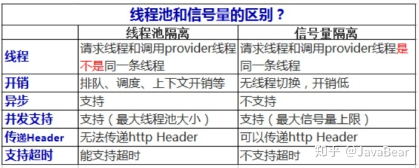

# 十一、Spring Cloud

# 服务注册组件：Eureka

## 📌 说一下 Eureka 原理

Eureka 是 Spring Cloud 官方提供的服务注册中心组件

### 服务组件

Eureka 的服务组件主要有 3 个：服务提供者、服务消费者、服务注册中心

#### 服务提供者

1. 服务启动后，调用 register 接口，向服务注册中心进行注册
2. 服务运行过程中，定时调用 renew 接口，向服务注册中心发送心跳信息，证明服务还活着
3. 服务下线后，调用 cancel 接口，向服务注册中心发送下线消息，清空服务信息

#### 服务消费者

1. 服务启动后，从服务注册中心拉取服务提供者信息并缓存
2. 服务运行过程中，定时从服务注册中心拉取并更新服务提供者信息

#### 服务注册中心

1. 节点启动后，会从其他节点拉取服务注册信息
2. 服务运行中，会定时清理没有 renew 上报的服务提供者节点
3. 运行过程中，节点接收到的 register、renew、cancel 信息都会同步到其他节点

### 数据存储

#### 三级缓存

| 缓存                        | 缓存类型                         | 所处类                   | 概述                                                               |
| --------------------------- | -------------------------------- | ------------------------ | ------------------------------------------------------------------ |
| 一级缓存：registry          | ConcurrentHashMap                | AbstractInstanceRegistry | 实时更新，又名注册表，UI 界面从这里获取服务注册信息；              |
| 二级缓存：readWriteCacheMap | Guava Cache （LoadingCache） | ResponseCacheImpl        | 实时更新，缓存时间 180 秒；                                        |
| 三级缓存：readOnlyCacheMap  | ConcurrentHashMap                | ResponseCacheImpl        | 周期更新，默认每 30s 从二级缓存 readWriteCacheMap 中同步数据更新； |

1. 一级缓存：registry，由 ConcurrentHashMap 实现，UI 界面直接读取
2. 二级缓存：readWriteCacheMap，由 Guava Cach 实现，实时更新
3. 三级缓存：readOnlyCacheMap，由 ConcurrentHashMap 实现，定时更新，默认每 30s 从 二级缓存中更新

#### 三级缓存的优缺点

##### 优点

- 读写分离，避免写请求被阻塞

##### 缺点

- 三级缓存 readOnlyCancheMap 是定时刷新，客户端获取的服务注册信息有一定的延迟

参考：

- [详解 Eureka 缓存机制_架构_冯永彪_InfoQ 精选文章](https://www.infoq.cn/article/y_1bcrblonu61s1gbgsu)

## 📌 说一下 Eureka 消息同步机制

# 负载均衡组件：Ribbon

## 📌 Ribbon 的负载均衡策略有哪些

- <strong>RoundRobinRule：</strong>轮询（默认规则）
- <strong>RandomRule：</strong>随机
- <strong>RetryRule：</strong>先按照 RoundRobinRule 进行轮询，轮询完成后进行重试
- <strong>WeightedResponseTimeRule：</strong>加权轮询
- <strong>BestAvailableRule：</strong>跳过断路器的服务器并选择并发请求最低的服务器的规则
- <strong>AvailabilityFilteringRule：</strong>先过滤掉故障实例，再选择并发比较小的实例
- <strong>ZoneAvoidanceRule：</strong>

## 📌 Ribbon BestAvailableRule 原理

1. BestAvailableRule 策略在选择 Server 节点时，会选择并发请求最低的的 Server 节点
2. Server 节点的并发度是维护在  <strong>RibbonLoadBalancerContext</strong> 中的
3. 在进行服务调用时，会对并发连接数进行增加操作，调用完成后进行减少操作

# 服务熔断组件：Hytrix

## 📌 Hystrix 中线程池隔离与信号量隔离区别

### 线程池隔离

为每一个服务接口单独开辟一个线程池，保持与其他服务接口线程的隔离，提高该服务接口的独立性和高可用

#### 优点

- 使用线程进行隔离，互不影响
- 独立的线程池提高了并发的性能

#### 缺点

- 过多的线程池，增加了系统的开销，增加了上下文切换的性能损耗
- 无法传递 Http Header 信息

#### 哪些场景使用线程池隔离

- 接口耗时较长，IO 操作较多的接口可以考虑使用线程池隔离

### 信号量隔离

使用信号量进行隔离，得到信号量的请求可以执行正常的业务逻辑，执行完成后会归还信号量；没有得到的请求进入 fallback 逻辑

#### 优点

- 系统开销小
- 可以传递 Http Header 信息

#### 缺点

- 隔离效果不如线程池隔离好

### 两者对比

参考：

- [Hystrix 中线程池隔离与信号量隔离区别 - 明天,你好啊 - 博客园](https://www.cnblogs.com/ming-blogs/p/14596721.html)
