# 十三、Redis

# 概述

## ☞ Redis 有哪些优缺点

#### 优点

- 读写性能优异， Redis 能读的速度是 110000 次/s，写的速度是 81000 次/s。
- 支持数据持久化，支持 AOF 和 RDB 两种持久化方式。
- 支持事务，Redis 的所有操作都是原子性的，同时 Redis 还支持对几个操作合并后的原子性执行。
- 数据结构丰富，除了支持 string 类型的 value 外还支持 hash、set、zset、list 等数据结构。
- 支持主从复制，主机会自动将数据同步到从机，可以进行读写分离。

#### 缺点

- 数据库容量受到物理内存的限制，不能用作海量数据的高性能读写，因此 Redis 适合的场景主要局限在较小数据量的高性能操作和运算上。
- Redis 不具备自动容错和恢复功能，主机从机的宕机都会导致前端部分读写请求失败，需要等待机器重启或者手动切换前端的 IP 才能恢复。
- 主机宕机，宕机前有部分数据未能及时同步到从机，切换 IP 后还会引入数据不一致的问题，降低了系统的可用性。
- Redis 较难支持在线扩容，在集群容量达到上限时在线扩容会变得很复杂。为避免这一问题，运维人员在系统上线时必须确保有足够的空间，这对资源造成了很大的浪费。

## ☞ 为什么要用 Redis /为什么要用缓存

主要从“高性能”和“高并发”这两点来看待这个问题。

#### 高性能

假如用户第一次访问数据库中的某些数据。这个过程会比较慢，因为是从硬盘上读取的。将该用户访问的数据存在数缓存中，这样下一次再访问这些数据的时候就可以直接从缓存中获取了。操作缓存就是直接操作内存，所以速度相当快。如果数据库中的对应数据改变的之后，同步改变缓存中相应的数据即可

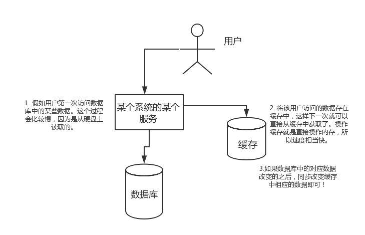

#### 高并发

直接操作缓存能够承受的请求是远远大于直接访问数据库的，所以我们可以考虑把数据库中的部分数据转移到缓存中去，这样用户的一部分请求会直接到缓存这里而不用经过数据库

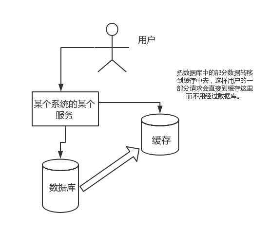

## ☞ 为什么要用 Redis 而不用 map/guava 做缓存?

缓存分为本地缓存和分布式缓存。以 Java 为例，使用自带的 map 或者 guava 实现的是本地缓存，最主要的特点是轻量以及快速，生命周期随着 jvm 的销毁而结束，并且在多实例的情况下，每个实例都需要各自保存一份缓存，缓存不具有一致性。

使用 redis 或 memcached 之类的称为分布式缓存，在多实例的情况下，各实例共用一份缓存数据，缓存具有一致性。缺点是需要保持 redis 或 memcached 服务的高可用，整个程序架构上较为复杂

## ☞ Redis 为什么这么快

1. 绝大部分操作完全基于内存
2. 使用了 IO 多路复用机制

分：

- IO 多路复用机制，IO 多路复用机制主要涉及三个函数：select/poll/epoll

## ☞ 说一下 Redis IO 多路复用机制

参考：

- [select、poll、epoll 详解 - 掘金](https://juejin.cn/post/6987717504986513421#heading-20)

# 数据类型

## ☞ Redis 有哪些数据类型

Redis 主要有 5 种数据类型，包括 String，List，Set，Zset，Hash，满足大部分的使用要求

| 数据类型 | 可以存储的值           | 操作                                                                                                 | 应用场景                                                           |
| -------- | ---------------------- | ---------------------------------------------------------------------------------------------------- | ------------------------------------------------------------------ |
| String   | 字符串、整数或者浮点数 | 对整个字符串或者字符串的其中一部分执行操作；对整数和浮点数执行自增或者自减操作                       | 做简单的键值对缓存                                                 |
| List     | 列表                   | 从两端压入或者弹出元素；对单个或者多个元素进行修剪，只保留一个范围内的元素                           | 存储一些列表型的数据结构，类似粉丝列表、文章的评论列表之类的数据   |
| Set      | 无序集合               | 添加、获取、移除单个元素；检查一个元素是否存在于集合中；计算交集、并集、差集；从集合里面随机获取元素 | 交集、并集、差集的操作，比如交集，可以把两个人的粉丝列表整一个交集 |
| Hash     | 包含键值对的无序散列表 | 添加、获取、移除单个键值对；获取所有键值对；检查某个键是否存在                                       | 结构化的数据，比如一个对象                                         |
| Zset     | 有序集合               | 添加、获取、删除元素；根据分值范围或者成员来获取元素；计算一个键的排名                               | 去重但可以排序，如获取排名前几名的用户                             |

## ☞ Redis 常用数据类型的数据结构

#### 1、String

- String 常用的实现是 int 和 SDS （动态字符串）
- Int 就是常见的整数类型，比如我们设置一个 123，在 Redis 中会存储为 int 类型
- SDS 可以存储字符串，具备动态扩充的特性

#### 2、List

- 常用的数据结构是 quicklist 是个双向的链表结构

#### 3、Hash

- 常用的数据结构是 hashtable 和 ziplist
- Hashtable 类似于 Java 中的 hashMap，需要根据 key 计算 hash，根据 hash 计算下标
- Hashtable 在 rehash 时采用渐进式的方式去扩容，因为工作线程是单线程，如果 entry 较多，一次性扩容会导致用户线程阻塞

#### 4、set

- 常用的数据结构是 hashtbale 和 intset

#### 5、zset

- 常用的数据结构是 ziplist 和 skiplist
- Skiplist 即跳跃链表，是个多层结构的链表

  - Skiplist 是多层结构的链表
  - 如果某一层出现了某个节点，那么它下面的层级都会出现
  - 查找时从最上层开始查找

## ☞ 说一下跳跃链表

- Redis 跳跃链表是一种可以提高查询效率的数据结构，时间复杂度为 O(LogN)
- 跳跃链表是一个多层结构的链表，查询时，从上往下进行

参考：

- [今天终于知道 Redis 为什么要用跳跃表了 - 掘金](https://juejin.cn/post/7149101822756519949)

## ☞ Redis 中 String 最长可以存多少

根据官方文档，String 类型的 Value 最大可以存储 512 MB 的数据

## ☞ Redis 的应用场景

### 应用场景

#### 计数器

可以对 String 进行自增自减运算，从而实现计数器功能。Redis 这种内存型数据库的读写性能非常高，很适合存储频繁读写的计数量。

#### 缓存

将热点数据放到内存中，设置内存的最大使用量以及淘汰策略来保证缓存的命中率。

#### 会话缓存

可以使用 Redis 来统一存储多台应用服务器的会话信息。当应用服务器不再存储用户的会话信息，也就不再具有状态，一个用户可以请求任意一个应用服务器，从而更容易实现高可用性以及可伸缩性。

#### 全页缓存（FPC）

除基本的会话 token 之外，Redis 还提供很简便的 FPC 平台。以 Magento 为例，Magento 提供一个插件来使用 Redis 作为全页缓存后端。此外，对 WordPress 的用户来说，Pantheon 有一个非常好的插件 wp-redis，这个插件能帮助你以最快速度加载你曾浏览过的页面。

#### 查找表

例如 DNS 记录就很适合使用 Redis 进行存储。查找表和缓存类似，也是利用了 Redis 快速的查找特性。但是查找表的内容不能失效，而缓存的内容可以失效，因为缓存不作为可靠的数据来源。

#### 消息队列(发布/订阅功能)

List 是一个双向链表，可以通过 lpush 和 rpop 写入和读取消息。不过最好使用 Kafka、RabbitMQ 等消息中间件。

#### 分布式锁实现

在分布式场景下，无法使用单机环境下的锁来对多个节点上的进程进行同步。可以使用 Redis 自带的 SETNX 命令实现分布式锁，除此之外，还可以使用官方提供的 RedLock 分布式锁实现。

#### 排行榜

# 持久化

## ☞ 说一下 Redis 持久化机制

Redis 提供三种持久化机制 RDB（默认） 、 AOF 机制以及混合模式

#### RDB：是 Redis DataBase 缩写快照

RDB 是 Redis 默认的持久化方式。按照一定的时间将内存的数据以快照的形式保存到硬盘中，对应产生的数据文件为 dump.rdb。通过配置文件中的 save 参数来定义快照的周期


##### 配置

在 redis.conf 中添加 `save <秒> <更新>` 进行配置，比如：

```apache
save 300 10
```

表示 300 秒至少有 10 个 key 更新才会去做快照同步

- 参考：[redis 配置文件 snapshotting RDB 数据库快照部分](https://blog.csdn.net/wkupaochuan/article/details/8773527)

##### 优点：

- 性能更好，fork 子进程来完成写操作，让主进程继续处理命令，所以是 IO 最大化。使用单独子进程来进行持久化，主进程不会进行任何 IO 操作，保证了 redis 的高性能
- 相对于数据集大时，比 AOF 的启动效率更高。

##### 缺点：

- 数据安全性低。RDB 是间隔一段时间进行持久化，如果持久化之间 redis 发生故障，会发生数据丢失。所以这种方式更适合数据要求不严谨的时候)

#### AOF：持久化

AOF 持久化(即 Append Only File 持久化)，则是将 Redis 执行的每次写命令记录到单独的日志文件中，当重启 Redis 会重新将持久化的日志中文件恢复数据。

当两种方式同时开启时，数据恢复 Redis 会优先选择 AOF 恢复。

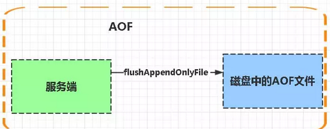

##### 配置

通过配置 `appendonly yes` 来开启 AOF 持久化机制，具体参考：[redis 的持久化：AOF 的配置和原理](https://blog.csdn.net/aitangyong/article/details/52072708)

##### 优点：

- 数据安全，aof 持久化可以配置 appendfsync 属性，有 always，每进行一次 命令操作就记录到 aof 文件中一次
- 通过 append 模式写文件，即使中途服务器宕机，可以通过 redis-check-aof 工具解决数据一致性问题
- AOF 机制的 rewrite 模式。AOF 文件没被 rewrite 之前（文件过大时会对命令 进行合并重写），可以删除其中的某些命令（比如误操作的 flushall）)

##### 缺点：

- AOF 文件比 RDB 文件大，且恢复速度慢
- 数据集大的时候，比 rdb 启动效率低

#### AOF 和 RDB 比较

- AOF 文件比 RDB 更新频率高，优先使用 AOF 还原数据
- AOF 比 RDB 更安全也更大
- RDB 性能比 AOF 好
- 如果两个都配了优先加载 AOF

## ☞ 说一下 AOF 文件瘦身

- AOF 记录的是 Redis 指令，所以相比较 RDB 体积会比较大，过大的体积，在恢复时，会比较慢，所以需要瘦身
- AOF 记录的是 Redis 指令，对于同一个 key 的多次写操作，只有最后一次有意义，所以可以手动执行 bgrewriteaof 命令，来对 AOF 文件进行瘦身操作
- 除了手动操作，还可以对文件增长的比例和文件的体积进行设置阈值，到达阈值后，Redis 会自动进行瘦身操作

```
AOF文件比上次文件 增长超过多少百分比则触发重写
<strong>auto</strong>-aof-rewrite-percentage 100
# AOF文件体积最小多大以上才触发重写 
<strong>auto</strong>-aof-rewrite-min-size 64mb
```

参考：

- [【Redis】持久化:RDB 和 AOF 机制详解 - 掘金](https://juejin.cn/post/7172610508707594277)

## ☞ 说一下写时复制

- Redis 写时复制发生在 AOF 日志瘦身阶段
- fork 采用操作系统提供的写时复制（copy on write）机制，就是为了避免一次性拷贝大量内存数据给子进程造成阻塞。<strong>fork 子进程时，子进程时会拷贝父进程的页表</strong>，即虚实映射关系（虚拟内存和物理内存的映射索引表），而不会拷贝物理内存。这个拷贝会消耗大量 cpu 资源，并且拷贝完成前会阻塞主线程，阻塞时间取决于内存中的数据量，数据量越大，则内存页表越大。拷贝完成后，父子进程使用相同的内存地址空间。
- 但主进程是可以有数据写入的，这时候就会拷贝物理内存中的数据。如下图（进程 1 看做是主进程，进程 2 看做是子进程）：

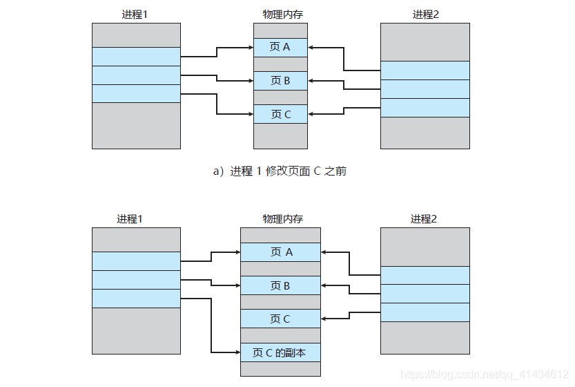

- 在主进程有数据写入时，而这个数据刚好在页 c 中，操作系统会创建这个页面的副本（页 c 的副本），即拷贝当前页的物理数据，将其映射到主进程中，而子进程还是使用原来的的页 c。

## ☞ 如何选择合适的持久化方式

- 一般来说， 如果想达到足以媲美 PostgreSQL 的数据安全性，你应该同时使用两种持久化功能。在这种情况下，当 Redis 重启的时候会优先载入 AOF 文件来恢复原始的数据，因为在通常情况下 AOF 文件保存的数据集要比 RDB 文件保存的数据集要完整
- 如果你非常关心你的数据， 但仍然可以承受数分钟以内的数据丢失，那么你可以只使用 RDB 持久化
- 有很多用户都只使用 AOF 持久化，但并不推荐这种方式，因为定时生成 RDB 快照（snapshot）非常便于进行数据库备份， 并且 RDB 恢复数据集的速度也要比 AOF 恢复的速度要快，除此之外，使用 RDB 还可以避免 AOF 程序的 bug
- 如果你只希望你的数据在服务器运行的时候存在，你也可以不使用任何持久化方式

## ☞ Redis 持久化数据和缓存怎么做扩容？

- 如果 Redis 被当做缓存使用，使用一致性哈希实现动态扩容缩容
- 如果 Redis 被当做一个持久化存储使用，必须使用固定的 keys-to-nodes 映射关系，节点的数量一旦确定不能变化。否则的话(即 Redis 节点需要动态变化的情况），必须使用可以在运行时进行数据再平衡的一套系统，而当前只有 Redis 集群可以做到这样

# 内存相关

## ☞ 说一下 Redis 的内存淘汰机制（缓存淘汰策略）

Redis 的内存淘汰策略是指在 Redis 的用于缓存的<strong>内存不足</strong>时，怎么处理需要新写入且需要申请额外空间的数据。Redis 6 的 8 种淘汰策略，默认是 noeviction，表示不做淘汰，内存满了时返回 error

```shell
# volatile-lru -> Evict using approximated LRU, only keys with an expire set.
# allkeys-lru -> Evict any key using approximated LRU.
# volatile-lfu -> Evict using approximated LFU, only keys with an expire set.
# allkeys-lfu -> Evict any key using approximated LFU.
# volatile-random -> Remove a random key having an expire set.
# allkeys-random -> Remove a random key, any key.
# volatile-ttl -> Remove the key with the nearest expire time (minor TTL)
# noeviction -> Don't evict anything, just return an error on write operations.

# LRU means Least Recently Used
# LFU means Least Frequently Used
```

- volatile 开头的策略清理的 key 是带 ttl 的，allkeys 扫描的是所有的 key
- <strong>LRU 表示最近最少访问</strong>；<strong>LFU 访问频率最低</strong>，R 表示时间 Recently，F 表示次数 Frequently

## ☞ 说一下 Redis 内存回收机制（缓存过期策略）

Redis 内存回收是指 Redis 清理过期 Key，即使<strong>内存足够用</strong><strong>，</strong>过期策略通常有以下三种：

- 定时过期：每个设置过期时间的 key 都需要创建一个定时器，到过期时间就会立即清除。该策略可以立即清除过期的数据，对内存很友好；但是会占用大量的 CPU 资源去处理过期的数据，从而影响缓存的响应时间和吞吐量
- 惰性过期：只有当访问一个 key 时，才会判断该 key 是否已过期，过期则清除。该策略可以最大化地节省 CPU 资源，却对内存非常不友好。极端情况可能出现大量的过期 key 没有再次被访问，从而不会被清除，占用大量内存
- 定期过期：每隔一定的时间，会扫描一定数量的数据库的<strong>expires 字典</strong>中一定数量的 key，并清除其中已过期的 key。该策略是前两者的一个折中方案。通过调整定时扫描的时间间隔和每次扫描的限定耗时，可以在不同情况下使得 CPU 和内存资源达到最优的平衡效果； (expires 字典会保存所有设置了过期时间的 key 的过期时间数据，其中，key 是指向键空间中的某个键的指针，value 是该键的毫秒精度的 UNIX 时间戳表示的过期时间。键空间是指该 Redis 集群中保存的所有键。)

Redis 中同时使用了惰性过期和定期过期两种过期策略。

## ☞ Redis 如何做内存优化？

可以好好利用 Hash,list,sorted set,set 等集合类型数据，因为通常情况下很多小的 Key-Value 可以用更紧凑的方式存放到一起。尽可能使用散列表（hashes），散列表（是说散列表里面存储的数少）使用的内存非常小，所以你应该尽可能的将你的数据模型抽象到一个散列表里面。比如你的 web 系统中有一个用户对象，不要为这个用户的名称，姓氏，邮箱，密码设置单独的 key，而是应该把这个用户的所有信息存储到一张散列表里面

## ☞ 如何查看 redis 的内存使用

使用 `redis-cli` 连接 redis 服务器

```powershell
redis-cli -h host -p port -a password
```

使用 `info memory` 查看内存使用情况

```apache
# Memory
used_memory:2585176
used_memory_human:2.47M
used_memory_rss:71237632
used_memory_peak:1747794184
used_memory_peak_human:1.63G
used_memory_lua:41984
mem_fragmentation_ratio:27.56
mem_allocator:jemalloc-3.6.0
```

- used_memory_human：内存使用量
- used_memory_peak_human：内存使用峰值
- used_memory_lua：lua 引擎占用的内存（字节）
- mem_fragmentation_ratio：内存碎片率

## ☞ 如何查看设置 redis 的最大内存以及内存淘汰策略

打开 redis 的配置文件 `redis.conf` 进行设置，设置完成需要重启 redis

```apache
maxmemory 1024mb
```

对于内存淘汰策略，需要在配置文件中进行如下设置：

```cpp
maxmemory-policy volatile-lru
```

## ☞ 说一下 Redis 大 key

#### 什么是 Redis 大 key

Redis 大 key 是指 value 很大的 key

- String 类型，value 超过 10kb
- hash、list、zset、set 的 value 中元素超过 5000 个

#### 大 key 会造成什么问题

- 网络阻塞
- 客户端阻塞
- Redis 服务阻塞：redis 是单线程操作，在操作大 key 时，可能会阻塞工作线程
- 影响持久化

#### 如何找到大 key

- Bigkeys 指令
- Scan 指令
- 工具：RdbTools

#### 如何删除大 key

- 代码分批删除：比如每次删除 hash 的 100 个字段
- 异步删除，需要 redis 4 以上的版本

参考：

- [Redis 大 Key 要如何处理](https://www.51cto.com/article/715874.html)

## 说一下热 key 解决方案

1. 缓存预热
2. 动态更新热 key 时间
3. 大 key 打散
4. 离线分析热 key hit 命中率

# 线程模型

## ☞ Redis 线程模型

Redis 基于 Reactor 模式开发了网络事件处理器，这个处理器被称为文件事件处理器（file event handler）。它的组成结构为 4 部分：多个套接字、IO 多路复用程序、文件事件分派器、事件处理器。因为文件事件分派器队列的消费是单线程的，所以 Redis 才叫单线程模型。

文件事件处理器使用 I/O 多路复用（multiplexing）程序来同时监听多个套接字， 并根据套接字目前执行的任务来为套接字关联不同的事件处理器。

当被监听的套接字准备好执行连接应答（accept）、读取（read）、写入（write）、关闭（close）等操作时， 与操作相对应的文件事件就会产生， 这时文件事件处理器就会调用套接字之前关联好的事件处理器来处理这些事件。

虽然文件事件处理器以单线程方式运行， 但通过使用 I/O 多路复用程序来监听多个套接字， 文件事件处理器既实现了高性能的网络通信模型， 又可以很好地与 redis 服务器中其他同样以单线程方式运行的模块进行对接， 这保持了 Redis 内部单线程设计的简单性。

## ☞ Redis 是单线程还是多线程?

1. 无论是什么版本，工作线程都是 1 个
2. 6.x 版本之后，将 IO 进行了多线程处理，但是工作线程还是一个
3. IO 多线程的好处是可以利用多核 CPU 的资源，进行快速的从内核缓冲区拷贝数据，并且可以提高网卡的效率
4. 多个客户端的指令同时到达时，执行顺序不能保证

## ☞ Redis 存在线程安全的问题吗？

- Redis 工作线程是单线程，所以内部是线程安全的
- 但是对于业务来讲，如果需要修改同一个值，可能会存在线程不安全的情况

# 事务

## ☞ Redis pipline 和事务

- Pipline 是先攒后发：即在客户端将多个指令攒一块发给 Redis 执行，整个过程不保证原子性
- 事务是先发后攒：即客户端将一条条指令发到 Redis，等收到执行的指令时，再进行执行；一个事务中如果有指令因为编译失败，所有指令均不会提交，如果有指令因为运行失败，则会跳过失败的指令，提交成功的指令
- Redis 事务是通过 MUTI，WATCH，DISCARD，EXEC，UNWATCH 指令来实现的

参考：

1. [Java Redis Pipeline 使用示例 - panchanggui - 博客园](https://www.cnblogs.com/panchanggui/p/9878912.html)
2. [Redis 进阶 - 事务：Redis 事务详解](https://pdai.tech/md/db/nosql-redis/db-redis-x-trans.html)
3. [Redis 集群 JedisCluster 的 pipeline 自定义实现](https://xie.infoq.cn/article/92dcb516327addd3ddd7dc189)

## ☞ Redis 事务相关命令

#### 概述

1. Redis 事务功能是通过<strong>MULTI、EXEC、DISCARD 和 WATCH</strong> 四个原语实现的
2. Redis 会将一个事务中的所有命令序列化，然后按顺序执行
3. redis 不支持回滚，“Redis 在事务失败时不进行回滚，而是继续执行余下的命令”， 所以 Redis 的内部可以保持简单且快速
4. 如果在一个事务中的命令出现错误，那么所有的命令都不会执行； 如果在一个事务中出现运行错误，那么正确的命令会被执行

#### 命令

- WATCH 命令是一个乐观锁，可以为 Redis 事务提供 check-and-set （CAS）行为。 可以监控一个或多个键，一旦其中有一个键被修改（或删除），之后的事务就不会执行，监控一直持续到 EXEC 命令
- MULTI 命令用于开启一个事务，它总是返回 OK。 MULTI 执行之后，客户端可以继续向服务器发送任意多条命令，这些命令不会立即被执行，而是被放到一个队列中，当 EXEC 命令被调用时，所有队列中的命令才会被执行
- EXEC：执行所有事务块内的命令。返回事务块内所有命令的返回值，按命令执行的先后顺序排列。 当操作被打断时，返回空值 nil
- 通过调用 DISCARD，客户端可以清空事务队列，并放弃执行事务， 并且客户端会从事务状态中退出
- UNWATCH 命令可以取消 watch 对所有 key 的监控。

## ☞ Redis 事务支持隔离性吗

Redis 是单进程程序，并且它保证在执行事务时，不会对事务进行中断，事务可以运行直到执行完所有事务队列中的命令为止。因此，Redis 的事务是总是带有隔离性的。

## ☞ Redis 事务其他实现

- 基于 Lua 脚本，Redis 可以保证脚本内的命令一次性、按顺序地执行，其同时也不提供事务运行错误的回滚，执行过程中如果部分命令运行错误，剩下的命令还是会继续运行完
- 基于中间标记变量，通过另外的标记变量来标识事务是否执行完成，读取数据时先读取该标记变量判断是否事务执行完成。但这样会需要额外写代码实现，比较繁琐

# 集群方案

## ☞ 主从复制模式

#### Redis 主从同步策略

slave 刚加入集群后，会先进行一次全量同步，在全量同步完成后，进行增量同步；slave 优先进行增量同步，增量同步失败时，会尝试进行全量同步

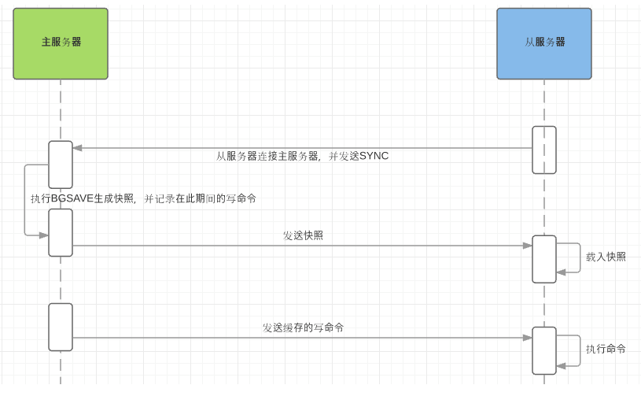

#### 主从复制模式的流程

1. slave 启动后，会先连接到 master 并向 master 发送 SYNC 命令
2. master 在接收到 SYNC 命令后会执行 BGSAVE 指令，生成 RDB 快照文件，在此期间 master 所有的写请求都会被缓存
3. RDB 快照文件生成后，master 将快照发送到 slave
4. slave 接收到快照后，丢弃旧的数据，载入新的数据
5. master 完成快照文件发送后，会执行之前缓存的写指令，并将这些指令同步到 slave
6. 完成初始化的这些工作后，master 和 slave 正常工作

全量复制对主从都是非阻塞的，是异步复制

#### 主从复制模式的优缺点

##### 优点

1. 结构简单，实现容易
2. 主库与从库的数据同步是以非阻塞的方式进行，数据同步期间仍然可以接收处理读写请求
3. master 可以主动将数据同步到 slave，可以进行读写分离，分担主库压力

##### 缺点

1. 不支持在线扩容
2. master 或 slave 宕机，会导致客户端请求失败，必须手动进行重启恢复
3. master 宕机，主备切换需要人工介入，比较耗时且对运维要求较高

## ☞ 哨兵模式

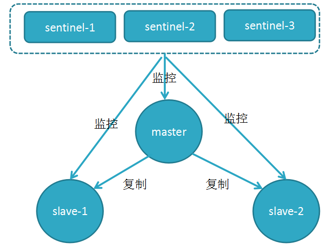

#### 哨兵的介绍

sentinel，中文名是哨兵。哨兵是 redis 集群机构中非常重要的一个组件，主要有以下功能：

- 集群监控：负责监控 redis master 和 slave 进程是否正常工作。
- 消息通知：如果某个 redis 实例有故障，那么哨兵负责发送消息作为报警通知给管理员。
- 故障转移：如果 master node 挂掉了，会自动转移到 slave node 上。
- 配置中心：如果故障转移发生了，通知 client 客户端新的 master 地址。

哨兵用于实现 redis 集群的高可用，本身也是分布式的，作为一个哨兵集群去运行，互相协同工作。

- 故障转移时，判断一个 master node 是否宕机了，需要大部分的哨兵都同意才行，涉及到了分布式选举的问题。
- 即使部分哨兵节点挂掉了，哨兵集群还是能正常工作的，因为如果一个作为高可用机制重要组成部分的故障转移系统本身是单点的，那就很坑爹了。

#### 哨兵的核心知识

- 哨兵至少需要 3 个实例，来保证自己的健壮性
- 哨兵 + redis 主从的部署架构，是不保证数据零丢失的，只能保证 redis 集群的高可用性
- 对于哨兵 + redis 主从这种复杂的部署架构，尽量在测试环境和生产环境，都进行充足的测试和演练

#### slave 变成 master 的选举算法

如果一个 master 被认为 odown 了，而且 majority 数量的哨兵都允许主备切换，那么某个哨兵就会执行主备切换操作，此时首先要选举一个 slave 来，会考虑 slave 的一些信息：

- 跟 master 断开连接的时长（断开时间长度超过一定限制不予考虑）
- slave 优先级
- 复制 offset
- run id（前三个条件一样，则选择 run id 较小的 slave 作为新的 master）

<strong>参考：</strong>[Redis 主从复制架构和 Sentinel 哨兵机制](https://www.cnblogs.com/hello-shf/p/12072330.html)

## ☞ Redis 集群

[九、Redis 集群](https://jqz3pp5nv2.feishu.cn/docs/doccnm7HEllsptOKx4ax4bu8cag)

## ☞ redis 集群模式的工作原理能说一下么？在集群模式下，redis 的 key 是如何寻址的？分布式寻址都有哪些算法？了解一致性 hash 算法吗？

### 简介

Redis Cluster 是一种服务端 Sharding 技术，3.0 版本开始正式提供。Redis Cluster 并没有使用一致性 hash，而是采用 slot(槽)的概念，一共分成 16384 个槽。将请求发送到任意节点，接收到请求的节点会将查询请求转发到正确的节点上执行

### 方案说明

1. 通过哈希的方式，将数据分片，每个节点均存储一定哈希槽(哈希值)区间的数据，默认分配了 16384 个槽位
2. 每份数据分片会存储在多个互为主从的多节点上
3. 数据写入先写主节点，再同步到从节点(支持配置为阻塞同步)
4. 同一分片多个节点间的数据不保持一致性
5. 读取数据时，当客户端操作的 key 没有分配在该节点上时，redis 会返回转向指令，指向正确的节点
6. 扩容时时需要需要把旧节点的数据迁移一部分到新节点
7. 在 redis cluster 架构下，每个 redis 要放开两个端口号，比如一个是 6379，另外一个就是 加 1w 的端口号，比如 16379。
8. 16379 端口号是用来进行节点间通信的，也就是 cluster bus 的东西，cluster bus 的通信，用来进行故障检测、配置更新、故障转移授权。cluster bus 用了另外一种二进制的协议，gossip 协议，用于节点间进行高效的数据交换，占用更少的网络带宽和处理时间。

### 节点间的内部通信机制

#### 基本通信原理

集群元数据的维护有两种方式：集中式、Gossip 协议。redis cluster 节点间采用 gossip 协议进行通信。

#### 分布式寻址算法

- hash 算法（大量缓存重建）
- 一致性 hash 算法（自动缓存迁移）+ 虚拟节点（自动负载均衡）
- redis cluster 的 hash slot 算法

##### 优点

- 无中心架构，支持动态扩容，对业务透明
- 具备 Sentinel 的监控和自动 Failover(故障转移)能力
- 客户端不需要连接集群所有节点，连接集群中任何一个可用节点即可
- 高性能，客户端直连 redis 服务，免去了 proxy 代理的损耗

##### 缺点

- 运维也很复杂，数据迁移需要人工干预
- 只能使用 0 号数据库
- 不支持批量操作(pipeline 管道操作)
- 分布式逻辑和存储模块耦合等

## ☞ 基于客户端分配

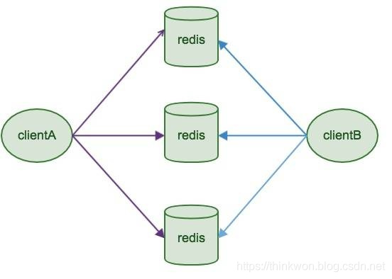

#### 简介

Redis Sharding 是 Redis Cluster 出来之前，业界普遍使用的多 Redis 实例集群方法。其主要思想是采用哈希算法将 Redis 数据的 key 进行散列，通过 hash 函数，特定的 key 会映射到特定的 Redis 节点上。Java redis 客户端驱动 jedis，支持 Redis Sharding 功能，即 ShardedJedis 以及结合缓存池的 ShardedJedisPool

#### 优点

优势在于非常简单，服务端的 Redis 实例彼此独立，相互无关联，每个 Redis 实例像单服务器一样运行，非常容易线性扩展，系统的灵活性很强

#### 缺点

- 由于 sharding 处理放到客户端，规模进一步扩大时给运维带来挑战。
- 客户端 sharding 不支持动态增删节点。服务端 Redis 实例群拓扑结构有变化时，每个客户端都需要更新调整。连接不能共享，当应用规模增大时，资源浪费制约优化

## ☞ 基于代理服务器分片

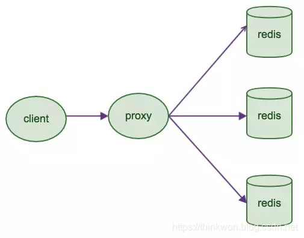

#### 简介

客户端发送请求到一个代理组件，代理解析客户端的数据，并将请求转发至正确的节点，最后将结果回复给客户端

#### 特征

- 透明接入，业务程序不用关心后端 Redis 实例，切换成本低
- Proxy 的逻辑和存储的逻辑是隔离的
- 代理层多了一次转发，性能有所损耗

#### 业界开源方案

- Twtter 开源的 Twemproxy
- 豌豆荚开源的 Codis

## ☞ Redis 主从架构

单机的 redis，能够承载的 QPS 大概就在上万到几万不等。对于缓存来说，一般都是用来支撑读高并发的。因此架构做成主从(master-slave)架构，一主多从，主负责写，并且将数据复制到其它的 slave 节点，从节点负责读。所有的读请求全部走从节点。这样也可以很轻松实现水平扩容，支撑读高并发。

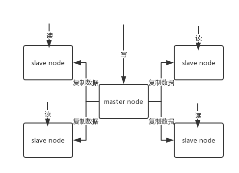

redis replication -> 主从架构 -> 读写分离 -> 水平扩容支撑读高并发

#### redis replication 的核心机制

- redis 采用异步方式复制数据到 slave 节点，不过 redis2.8 开始，slave node 会周期性地确认自己每次复制的数据量；
- 一个 master node 是可以配置多个 slave node 的；
- slave node 也可以连接其他的 slave node；
- slave node 做复制的时候，不会 block master node 的正常工作；
- slave node 在做复制的时候，也不会 block 对自己的查询操作，它会用旧的数据集来提供服务；但是复制完成的时候，需要删除旧数据集，加载新数据集，这个时候就会暂停对外服务了；
- slave node 主要用来进行横向扩容，做读写分离，扩容的 slave node 可以提高读的吞吐量。
- 注意，如果采用了主从架构，那么建议必须开启 master node 的持久化，不建议用 slave node 作为 master node 的数据热备，因为那样的话，如果你关掉 master 的持久化，可能在 master 宕机重启的时候数据是空的，然后可能一经过复制， slave node 的数据也丢了。
- 另外，master 的各种备份方案，也需要做。万一本地的所有文件丢失了，从备份中挑选一份 rdb 去恢复 master，这样才能确保启动的时候，是有数据的，即使采用了后续讲解的高可用机制，slave node 可以自动接管 master node，但也可能 sentinel 还没检测到 master failure，master node 就自动重启了，还是可能导致上面所有的 slave node 数据被清空。

#### redis 主从复制的核心原理

1. 当启动一个 slave node 的时候，它会发送一个 PSYNC 命令给 master node。
2. 如果这是 slave node 初次连接到 master node，那么会触发一次 full resynchronization 全量复制。此时 master 会启动一个后台线程，开始生成一份 RDB 快照文件，
3. 同时还会将从客户端 client 新收到的所有写命令缓存在内存中。RDB 文件生成完毕后， master 会将这个 RDB 发送给 slave，slave 会先写入本地磁盘，然后再从本地磁盘加载到内存中，接着 master 会将内存中缓存的写命令发送到 slave，slave 也会同步这些数据。
4. slave node 如果跟 master node 有网络故障，断开了连接，会自动重连，连接之后 master node 仅会复制给 slave 部分缺少的数据。

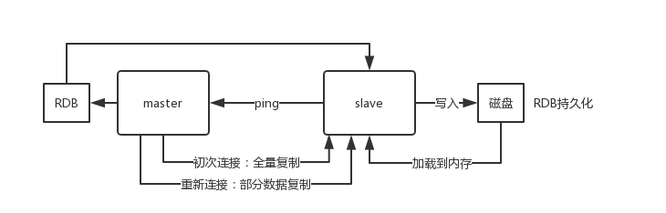

#### 过程原理

1. 当从库和主库建立 MS 关系后，会向主数据库发送 SYNC 命令
2. 主库接收到 SYNC 命令后会开始在后台保存快照(RDB 持久化过程)，并将期间接收到的写命令缓存起来
3. 当快照完成后，主 Redis 会将快照文件和所有缓存的写命令发送给从 Redis
4. 从 Redis 接收到后，会载入快照文件并且执行收到的缓存的命令
5. 之后，主 Redis 每当接收到写命令时就会将命令发送从 Redis，从而保证数据的一致

#### 缺点

所有的 slave 节点数据的复制和同步都由 master 节点来处理，会照成 master 节点压力太大，使用主从从结构来解决

## ☞ Redis 集群的主从复制模型是怎样的？

为了使在部分节点失败或者大部分节点无法通信的情况下集群仍然可用，所以集群使用了主从复制模型，每个节点都会有 N-1 个复制品

## ☞ 生产环境中的 redis 是怎么部署的？

redis cluster，10 台机器，5 台机器部署了 redis 主实例，另外 5 台机器部署了 redis 的从实例，每个主实例挂了一个从实例，5 个节点对外提供读写服务，每个节点的读写高峰 qps 可能可以达到每秒 5 万，5 台机器最多是 25 万读写请求/s。

机器是什么配置？32G 内存 + 8 核 CPU + 1T 磁盘，但是分配给 redis 进程的是 10g 内存，一般线上生产环境，redis 的内存尽量不要超过 10g，超过 10g 可能会有问题。

5 台机器对外提供读写，一共有 50g 内存。

因为每个主实例都挂了一个从实例，所以是高可用的，任何一个主实例宕机，都会自动故障迁移，redis 从实例会自动变成主实例继续提供读写服务。

你往内存里写的是什么数据？每条数据的大小是多少？商品数据，每条数据是 10kb。100 条数据是 1mb，10 万条数据是 1g。常驻内存的是 200 万条商品数据，占用内存是 20g，仅仅不到总内存的 50%。目前高峰期每秒就是 3500 左右的请求量。

其实大型的公司，会有基础架构的 team 负责缓存集群的运维。

## ☞ 说说 Redis 哈希槽的概念？

Redis 集群没有使用一致性 hash,而是引入了哈希槽的概念，Redis 集群有 16384 个哈希槽，每个 key 通过 CRC16 校验后对 16384 取模来决定放置哪个槽，集群的每个节点负责一部分 hash 槽。

## ☞ Redis 集群会有写操作丢失吗？为什么？

Redis 并不能保证数据的强一致性，这意味这在实际中集群在特定的条件下可能会丢失写操作。

## ☞ Redis 集群之间是如何复制的？

异步复制

## ☞ Redis 集群最大节点个数是多少？

16384 个

## ☞ 说一下 Gossip 协议

# 分区

## ☞ Redis 是单线程的，如何提高多核 CPU 的利用率？

可以在同一个服务器部署多个 Redis 的实例，并把他们当作不同的服务器来使用，在某些时候，无论如何一个服务器是不够的， 所以，如果你想使用多个 CPU，你可以考虑一下分片（shard）。

## ☞ 为什么要做 Redis 分区？

分区可以让 Redis 管理更大的内存，Redis 将可以使用所有机器的内存。如果没有分区，你最多只能使用一台机器的内存。分区使 Redis 的计算能力通过简单地增加计算机得到成倍提升，Redis 的网络带宽也会随着计算机和网卡的增加而成倍增长。

## ☞ 你知道有哪些 Redis 分区实现方案？

- 客户端分区就是在客户端就已经决定数据会被存储到哪个 redis 节点或者从哪个 redis 节点读取。大多数客户端已经实现了客户端分区。
- 代理分区 意味着客户端将请求发送给代理，然后代理决定去哪个节点写数据或者读数据。代理根据分区规则决定请求哪些 Redis 实例，然后根据 Redis 的响应结果返回给客户端。redis 和 memcached 的一种代理实现就是 Twemproxy
- 查询路由(Query routing) 的意思是客户端随机地请求任意一个 redis 实例，然后由 Redis 将请求转发给正确的 Redis 节点。Redis Cluster 实现了一种混合形式的查询路由，但并不是直接将请求从一个 redis 节点转发到另一个 redis 节点，而是在客户端的帮助下直接 redirected 到正确的 redis 节点。

## ☞ Redis 分区有什么缺点？

- 涉及多个 key 的操作通常不会被支持。例如你不能对两个集合求交集，因为他们可能被存储到不同的 Redis 实例（实际上这种情况也有办法，但是不能直接使用交集指令）。
- 同时操作多个 key,则不能使用 Redis 事务.
- 分区使用的粒度是 key，不能使用一个非常长的排序 key 存储一个数据集（The partitioning granularity is the key, so it is not possible to shard a dataset with a single huge key like a very big sorted set）
- 当使用分区的时候，数据处理会非常复杂，例如为了备份你必须从不同的 Redis 实例和主机同时收集 RDB / AOF 文件。
- 分区时动态扩容或缩容可能非常复杂。Redis 集群在运行时增加或者删除 Redis 节点，能做到最大程度对用户透明地数据再平衡，但其他一些客户端分区或者代理分区方法则不支持这种特性。然而，有一种预分片的技术也可以较好的解决这个问题。

# 分布式问题

## ☞ 说一下 Redis 分布式锁

#### 1、利用 setnx + expire 指令来实现

方案：setnx 表示给一个 key 设置值，如果 key 不存在，则可以设置成功，key 存在则设置失败；expire 设置过期时间，防止锁忘记释放

优点：实现简单

缺点：setnx 和 expire 操作不是原子的，如果执行完 setnx 后，程序发生异常，该锁可能永久不会释放了

#### 2、利用 lua 脚本 + setnx expire 实现

方案：针对方案一中的 setnx 和 expire 不是原子性的问题，可以使用 lua 脚本来实现这两个指令的原子性；具体是 jedis.eval 方法

优点：解决了两个指令不是原子性的问题

缺点：需要了解和编写 lua 脚本

#### 3、利用 set ex nx 扩展指令来实现

方案：使用 set 的扩展指令来实现；ex 表示过期时间多少秒，nx 表示如果 key 不存在则可以设置成功

优点：是 lua 脚本的替代方案，更优雅

缺点：如果是耗时较久的操作，在锁过期后，操作还是没有完成，那么就会导致其他线程进入

#### 4、利用 Redisson 框架来实现

方案：利用 Redisson 框架来实现分布式锁，Redisson 中有一个后台线程 watch dog 负责轮询扫描锁，如果发现某个线程持有锁，就会适当延长过期时间

优点：解决了锁过期但是操作未完成的问题

缺点：无法适应 Redis 集群，在 Redis 集群模式下，存在 Master 向 Slave 节点同步锁的操作，但是如果同步期间，Master 宕机，Slave 升级为 Master 此时，锁丢失，其他线程可以进入

参考：

- [Redis 进阶-Redisson 分布式锁实现原理及源码解析 - 掘金](https://juejin.cn/post/6991016570143113229)

#### 5、利用 Redlock + Redisson 框架来实现

方案：利用 Redlock + Redisson 实现 Redis 集群下的分布式锁

步骤：

1. 同时向多个 Master 尝试加锁，超时时间设置需要比锁失效时间短，避免锁失效了还没连接成功
2. 只要超过一半 master 加锁成功，那么认为加锁成功
3. 加锁失败释放锁

优点：解决了集群模式下，Master 宕机的问题

参考：

- [Redis 分布式锁七种实现方案 - 掘金](https://juejin.cn/post/6936956908007850014)

## ☞ RedissonLock 的 tryLock 是如何实现阻塞的

## ☞ Redis 分布式锁和 Zookeeper 分布式锁比较

#### Redis  分布式锁

Redis 可以使用 Redlock + Redisson 来实现分布式锁

优点：性能高，Redis 可以保证 AP，保证高可用

缺点：不能保证一致性，如果 master 宕机，但是 master 上的锁信息没有同步到 slave，新的线程可能会加锁成功，导致原来锁信息丢失

#### Zookeeper 分布式锁

Zookeeper 可以借助 curator 客户端来实现分布式锁

优点：可以保证锁的一致性

缺点：性能较 Redis 会差一点

## ☞ 如何解决 Redis 的并发竞争 Key 问题

所谓 Redis 的并发竞争 Key 的问题也就是多个系统同时对一个 key 进行操作，但是最后执行的顺序和我们期望的顺序不同，这样也就导致了结果的不同！

推荐一种方案：分布式锁（zookeeper 和 redis 都可以实现分布式锁）。（如果不存在 Redis 的并发竞争 Key 问题，不要使用分布式锁，这样会影响性能）

基于 zookeeper 临时有序节点可以实现的分布式锁。大致思想为：每个客户端对某个方法加锁时，在 zookeeper 上的与该方法对应的指定节点的目录下，生成一个唯一的瞬时有序节点。 判断是否获取锁的方式很简单，只需要判断有序节点中序号最小的一个。 当释放锁的时候，只需将这个瞬时节点删除即可。同时，其可以避免服务宕机导致的锁无法释放，而产生的死锁问题。完成业务流程后，删除对应的子节点释放锁。

在实践中，当然是从以可靠性为主。所以首推 Zookeeper。

参考：[https://www.jianshu.com/p/8bddd381de06](https://www.jianshu.com/p/8bddd381de06)

## ☞ 分布式 Redis 是前期做还是后期规模上来了再做好？为什么？

既然 Redis 是如此的轻量（单实例只使用 1M 内存），为防止以后的扩容，最好的办法就是一开始就启动较多实例。即便你只有一台服务器，你也可以一开始就让 Redis 以分布式的方式运行，使用分区，在同一台服务器上启动多个实例。

一开始就多设置几个 Redis 实例，例如 32 或者 64 个实例，对大多数用户来说这操作起来可能比较麻烦，但是从长久来看做这点牺牲是值得的。

这样的话，当你的数据不断增长，需要更多的 Redis 服务器时，你需要做的就是仅仅将 Redis 实例从一台服务迁移到另外一台服务器而已（而不用考虑重新分区的问题）。一旦你添加了另一台服务器，你需要将你一半的 Redis 实例从第一台机器迁移到第二台机器。

## ☞ 什么是 RedLock

Redis 官方站提出了一种权威的基于 Redis 实现分布式锁的方式名叫 Redlock，此种方式比原先的单节点的方法更安全。它可以保证以下特性：

- 安全特性：互斥访问，即永远只有一个 client 能拿到锁
- 避免死锁：最终 client 都可能拿到锁，不会出现死锁的情况，即使原本锁住某资源的 client crash 了或者出现了网络分区
- 容错性：只要大部分 Redis 节点存活就可以正常提供服务

# 缓存异常

## ☞ 缓存雪崩

缓存雪崩是指<strong>缓存同一时间大面积失效</strong>，所以，后面的请求都会落到数据库上，造成数据库短时间内承受大量请求而崩掉

#### 解决方案

- 缓存数据的过期时间设置随机，防止同一时间大量数据过期现象发生
- 一般并发量不是特别多的时候，使用最多的解决方案是加锁排队
- 给每一个缓存数据增加相应的缓存标记，记录缓存的是否失效，如果缓存标记失效，则更新数据缓存

## ☞ 缓存穿透

缓存穿透是指<strong>缓存和数据库中都没有的数据</strong>，导致所有的请求都落到数据库上，造成数据库短时间内承受大量请求而崩掉。

#### 解决方案

- 接口层增加校验，如用户鉴权校验，id 做基础校验，id<=0 的直接拦截；
- 从缓存取不到的数据，在数据库中也没有取到，这时也可以将 key-value 对写为 key-null，缓存有效时间可以设置短点，如 30 秒（设置太长会导致正常情况也没法使用）。这样可以防止攻击用户反复用同一个 id 暴力攻击（缓存 key-null 时，需要考虑是否加锁，如果并发较大，需要加一个锁，多个请求去抢锁，抢到锁的去数据库查询，查询完设置缓存，然后释放锁；这样做的好处是保证一次性不要让过多的请求打到 DB）
- 采用布隆过滤器，将所有可能存在的数据哈希到一个足够大的 bitmap 中，一个一定不存在的数据会被这个 bitmap 拦截掉，从而避免了对底层存储系统的查询压力

## ☞ 缓存击穿

缓存击穿是指<strong>缓存中没有但数据库中有的数据</strong>（一般可能由于 Key 过期或者被 Redis 淘汰），这时由于并发用户特别多，同时读缓存没读到数据，又同时去数据库去取数据，引起数据库压力瞬间增大，造成过大压力。和缓存雪崩不同的是，缓存击穿指并发查同一条数据，缓存雪崩是不同数据都过期了，很多数据都查不到从而查数据库。

#### 解决方案

- 设置热点数据永远不过期
- 在请求 DB 时，加互斥锁保证同一时间点只有一个请求到达 DB

具体流程：

1. 请求 Redis
2. 如果 Redis 没有，多个请求抢锁
3. 抢到锁的请求 DB，拿到数据更新 Redis
4. 没有抢到锁的 sleep（或者直接返回一个状态，让用户稍后重试），之后走继续请求 Redis

## ☞ 缓存预热

1. 数据量不大时，在项目启动时进行提前加载到 Redis
2. 数据量较大时，需要区分冷热数据，这时候按照缓存穿透的方式，加锁处理

## ☞ 缓存降级

当访问量剧增、服务出现问题（如响应时间慢或不响应）或非核心服务影响到核心流程的性能时，仍然需要保证服务还是可用的，即使是有损服务。系统可以根据一些关键数据进行自动降级，也可以配置开关实现人工降级。

缓存降级的最终目的是保证核心服务可用，即使是有损的。而且有些服务是无法降级的（如加入购物车、结算）。

在进行降级之前要对系统进行梳理，看看系统是不是可以丢卒保帅；从而梳理出哪些必须誓死保护，哪些可降级；比如可以参考日志级别设置预案：

- 一般：比如有些服务偶尔因为网络抖动或者服务正在上线而超时，可以自动降级；
- 警告：有些服务在一段时间内成功率有波动（如在 95~100% 之间），可以自动降级或人工降级，并发送告警；
- 错误：比如可用率低于 90%，或者数据库连接池被打爆了，或者访问量突然猛增到系统能承受的最大阀值，此时可以根据情况自动降级或者人工降级；
- 严重错误：比如因为特殊原因数据错误了，此时需要紧急人工降级。

服务降级的目的，是为了防止 Redis 服务故障，导致数据库跟着一起发生雪崩问题。因此，对于不重要的缓存数据，可以采取服务降级策略，例如一个比较常见的做法就是，Redis 出现问题，不去数据库查询，而是直接返回默认值给用户。

## ☞ 热点数据和冷数据

热点数据，缓存才有价值

对于冷数据而言，大部分数据可能还没有再次访问到就已经被挤出内存，不仅占用内存，而且价值不大。频繁修改的数据，看情况考虑使用缓存

对于热点数据，比如我们的某 IM 产品，生日祝福模块，当天的寿星列表，缓存以后可能读取数十万次。再举个例子，某导航产品，我们将导航信息，缓存以后可能读取数百万次。

数据更新前至少读取两次，缓存才有意义。这个是最基本的策略，如果缓存还没有起作用就失效了，那就没有太大价值了。

那存不存在，修改频率很高，但是又不得不考虑缓存的场景呢？有！比如，这个读取接口对数据库的压力很大，但是又是热点数据，这个时候就需要考虑通过缓存手段，减少数据库的压力，比如我们的某助手产品的，点赞数，收藏数，分享数等是非常典型的热点数据，但是又不断变化，此时就需要将数据同步保存到 Redis 缓存，减少数据库压力。

## ☞ 缓存热点 key

缓存中的一个 Key(比如一个促销商品)，在某个时间点过期的时候，恰好在这个时间点对这个 Key 有大量的并发请求过来，这些请求发现缓存过期一般都会从后端 DB 加载数据并回设到缓存，这个时候大并发的请求可能会瞬间把后端 DB 压垮。

#### 解决方案

对缓存查询加锁，如果 KEY 不存在，就加锁，然后查 DB 入缓存，然后解锁；其他进程如果发现有锁就等待，然后等解锁后返回数据或者进入 DB 查询

# 常用工具

## ☞ Redis 支持的 Java 客户端都有哪些？官方推荐用哪个？

Redisson、Jedis、lettuce 等等，官方推荐使用 Redisson。

## ☞ Redis 和 Redisson 有什么关系？

Redisson 是一个高级的分布式协调 Redis 客服端，能帮助用户在分布式环境中轻松实现一些 Java 的对象 (Bloom filter, BitSet, Set, SetMultimap, ScoredSortedSet, SortedSet, Map, ConcurrentMap, List, ListMultimap, Queue, BlockingQueue, Deque, BlockingDeque, Semaphore, Lock, ReadWriteLock, AtomicLong, CountDownLatch, Publish / Subscribe, HyperLogLog)。

## ☞ Jedis 与 Redisson 对比有什么优缺点？

Jedis 是 Redis 的 Java 实现的客户端，其 API 提供了比较全面的 Redis 命令的支持；Redisson 实现了分布式和可扩展的 Java 数据结构，和 Jedis 相比，功能较为简单，不支持字符串操作，不支持排序、事务、管道、分区等 Redis 特性。Redisson 的宗旨是促进使用者对 Redis 的关注分离，从而让使用者能够将精力更集中地放在处理业务逻辑上。

# 其他问题

## ☞ 更新缓存的 3 种策略

一般来说，缓存有以下三种模式：

- Cache Aside 更新模式
- Read/Write Through 更新模式
- Write Behind Caching 更新模式

#### 1. Cache Aside 更新模式

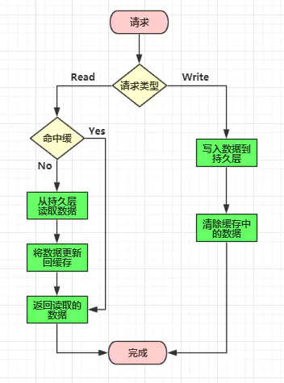

缓存更新时先更新数据库，然后在让缓存失效

#### 2. Read/Write Through 更新模式

##### Read Through

Read Through 模式就是在查询操作中更新缓存，也就是说，当缓存失效的时候，Cache Aside 模式是由调用方负责把数据加载入缓存，而 Read Through 则用缓存服务自己来加载。

##### Write Through

Write Through 模式和 Read Through 相仿，不过是在更新数据时发生。当有数据更新的时候，如果没有命中缓存，直接更新数据库，然后返回。如果命中了缓存，则更新缓存，然后由缓存自己更新数据库（这是一个同步操作）。

#### 3. Write Behind Caching 更新模式

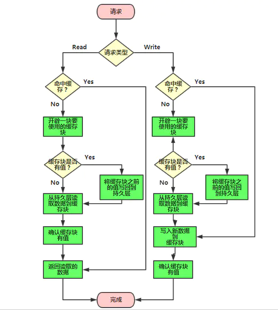

Write Behind Caching 更新模式就是在更新数据的时候，只更新缓存，不更新数据库，而我们的缓存会异步地批量更新数据库。这个设计的好处就是直接操作内存速度快。因为异步，Write Behind Caching 更新模式还可以合并对同一个数据的多次操作到数据库，所以性能的提高是相当可观的。

但其带来的问题是，数据不是强一致性的，而且可能会丢失。另外，Write Behind Caching 更新模式实现逻辑比较复杂，因为它需要确认有哪些数据是被更新了的，哪些数据需要刷到持久层上。只有在缓存需要失效的时候，才会把它真正持久起来。

参考：[使用缓存的正确姿势](https://juejin.cn/post/6844903604998914055)

## ☞ Redis 与 Memcached 的区别

两者都是非关系型内存键值数据库，现在公司一般都是用 Redis 来实现缓存，而且 Redis 自身也越来越强大了！Redis 与 Memcached 主要有以下不同：

| 对比项           | Redis                                                                                | Memcached                                                                                                                                                                                                                         |
| ---------------- | ------------------------------------------------------------------------------------ | --------------------------------------------------------------------------------------------------------------------------------------------------------------------------------------------------------------------------------- |
| 类型             | 1. 支持内存 2. 非关系型数据库                                                        | 1. 支持内存 2. 键值对形式 3. 缓存形式                                                                                                                                                                                             |
| 数据存储类型     | 1. String 2. List 3. Set 4. Hash 5. Sort Set 【俗称 ZSet】                           | 1. 文本型 2. 二进制类型                                                                                                                                                                                                           |
| 查询【操作】类型 | 1. 批量操作 2. 事务支持 3. 每个类型不同的 CRUD                                       | 1.常用的 CRUD 2. 少量的其他命令                                                                                                                                                                                                   |
| 附加功能         | 1. 发布/订阅模式 2. 主从分区 3. 序列化支持 4. 脚本支持【Lua 脚本】                   | 1. 多线程服务支持                                                                                                                                                                                                                 |
| 网络 IO 模型     | 1. 单线程的多路 IO 复用模型                                                          | 1. 多线程，非阻塞 IO 模式                                                                                                                                                                                                         |
| 事件库           | 自封转简易事件库 AeEvent                                                             | 贵族血统的 LibEvent 事件库                                                                                                                                                                                                        |
| 持久化支持       | 1. RDB 2. AOF                                                                        | 不支持                                                                                                                                                                                                                            |
| 集群模式         | 原生支持 cluster 模式，可以实现主从复制，读写分离                                    | 没有原生的集群模式，需要依靠客户端来实现往集群中分片写入数据                                                                                                                                                                      |
| 内存管理机制     | 在 Redis 中，并不是所有数据都一直存储在内存中，可以将一些很久没用的 value 交换到磁盘 | Memcached 的数据则会一直在内存中，Memcached 将内存分割成特定长度的块来存储数据，以完全解决内存碎片的问题。但是这种方式会使得内存的利用率不高，例如块的大小为 128 bytes，只存储 100 bytes 的数据，那么剩下的 28 bytes 就浪费掉了。 |
| 适用场景         | 复杂数据结构，有持久化，高可用需求，value 存储内容较大                               | 纯 key-value，数据量非常大，并发量非常大的业务                                                                                                                                                                                    |

1. memcached 所有的值均是简单的字符串，redis 作为其替代者，支持更为丰富的数据类型
2. redis 的速度比 memcached 快很多
3. redis 可以持久化其数据

## ☞ 如何解决缓存一致性问题

1. 缓存双删：先删 Redis，再改 DB，再删 Redis（可以考虑同步和延迟）
2. 写 DB，利用 canal 将数据同步到 Redis
3. 写 MQ，MQ 消费端负责同步数据

## ☞ Redis 常见性能问题和解决方案？

参考：[Redis 进阶 - 性能调优：Redis 性能调优详解](https://pdai.tech/md/db/nosql-redis/db-redis-x-performance.html)

## ☞ 一个字符串类型的值能存储最大容量是多少？

512M

## ☞ Redis 如何做大量数据插入？

Redis 2.6 开始支持 pipeline 批量操作

## ☞ Redis keys 命令和 scan 命令

- Keys 命令和 Scan 命令执行时间复杂度都是 O(N)
- Keys 命令执行会把内存中所有的 key 都查出来，scan 命令利用游标进行查询，可以指定每次查询的游标和数量，分多次查，避免阻塞工作线程

参考：[Redis Scan 原理解析与踩坑 - 指月小筑 | 意琦行的个人博客](https://www.lixueduan.com/post/redis/redis-scan/)

## ☞ 假如 Redis 里面有 1 亿个 key，其中有 10w 个 key 是以某个固定的已知的前缀开头的，如果将它们全部找出来？

使用 keys 指令可以扫出指定模式的 key 列表。 对方接着追问：如果这个 redis 正在给线上的业务提供服务，那使用 keys 指令会有什么问题？ 这个时候你要回答 redis 关键的一个特性：redis 的单线程的。keys 指令会导致线程阻塞一段时间，线上服务会停顿，直到指令执行完毕，服务才能恢复。这个时候可以使用 scan 指令，scan 指令可以无阻塞的提取出指定模式的 key 列表，但是会有一定的重复概率，在客户端做一次去重就可以了，但是整体所花费的时间会比直接用 keys 指令长。

## ☞ 使用 Redis 做过异步队列吗，是如何实现的

使用 list 类型保存数据信息，rpush 生产消息，lpop 消费消息，当 lpop 没有消息时，可以 sleep 一段时间，然后再检查有没有信息，如果不想 sleep 的话，可以使用 blpop, 在没有信息的时候，会一直阻塞，直到信息的到来。redis 可以通过 pub/sub 主题订阅模式实现一个生产者，多个消费者，当然也存在一定的缺点，当消费者下线时，生产的消息会丢失。

## ☞ Redis 如何实现延时队列

使用 sortedset，使用时间戳做 score, 消息内容作为 key,调用 zadd 来生产消息，消费者使用 zrangbyscore 获取 n 秒之前的数据做轮询处理。

## ☞ Redis 回收进程如何工作的？

1. 一个客户端运行了新的命令，添加了新的数据。
2. Redis 检查内存使用情况，如果大于 maxmemory 的限制， 则根据设定好的策略进行回收。
3. 一个新的命令被执行，等等。
4. 所以我们不断地穿越内存限制的边界，通过不断达到边界然后不断地回收回到边界以下。
5. 如果一个命令的结果导致大量内存被使用（例如很大的集合的交集保存到一个新的键），不用多久内存限制就会被这个内存使用量超越。

## ☞ Redis 回收使用的是什么算法？

LRU/LFU

# 场景题

## ☞ redis cpu 百分百是为什么

1. 大 key
2. RDB Fork 子进程，需要拷贝父进程的页空间
3. 连接数过高
4. 慢查询

# 参考

- [Redis 面试题（2020 最新版）](https://thinkwon.blog.csdn.net/article/details/103522351)
- [Redis 线程模型](https://www.cnblogs.com/barrywxx/p/8570821.html)
