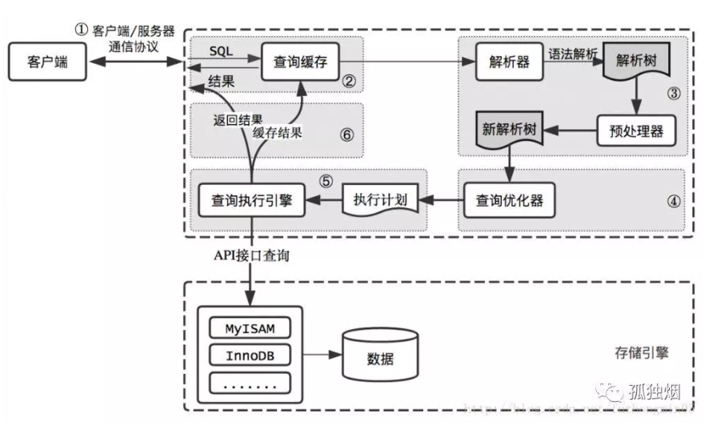

# 十二、MySql

# <strong>MySQL 基础</strong>

## <strong>📌 说一下 MySQL 的 binlog</strong>

MySQL 的二进制日志 binlog 可以说是 MySQL 最重要的日志，它记录了所有的 DDL 和 DML 语句（除了数据查询语句 select、show 等），以事件形式记录，还包含语句所执行的消耗的时间，MySQL 的二进制日志是事务安全型的。binlog 的主要目的是<strong>复制</strong>和<strong>恢复</strong>。

## <strong>📌 MySQL 的 binlog 应用场景</strong>

- MySQL 主从复制：MySQL Replication 在 Master 端开启 binlog，Master 把它的二进制日志传递给 slaves 来达到 master-slave 数据一致的目的
- 数据恢复：通过使用 mysql binlog 工具来使恢复数据
- 数据同步：数据由 MySQL 同步到 ES 等

## <strong>📌 如何启用 binlog</strong>

- 在配置文件 `my.cnf` 中加入 `log-bin` 配置，表示启用 binlog，如果没有给定值，写成 `log-bin=`，则默认名称为主机名
- 通过 `SET SQL_LOG_BIN=1` 命令来启用 binlog，通过 `SET SQL_LOG_BIN=0` 命令停用 binlog；启用 binlog 之后须重启 MySQL 才能生效

## <strong>📌 常用的 binlog 配置</strong>

```ruby
# 是否启用binlog日志
show variables like 'log_bin';
# 查看详细的日志配置信息
show global variables like '%log%';
# mysql数据存储目录
show variables like '%dir%';
# 查看binlog的目录
show global variables like "%log_bin%";
# 查看当前服务器使用的biglog文件及大小
show binary logs;
# 查看主服务器使用的biglog文件及大小
# 查看最新一个binlog日志文件名称和Position
show master status;
# 事件查询命令
# IN 'log_name' ：指定要查询的binlog文件名(不指定就是第一个binlog文件)
# FROM pos ：指定从哪个pos起始点开始查起(不指定就是从整个文件首个pos点开始算)
# LIMIT [offset,] ：偏移量(不指定就是0)
# row_count ：查询总条数(不指定就是所有行)
show binlog events [IN 'log_name'] [FROM pos] [LIMIT [offset,] row_count];
# 查看 binlog 内容
show binlog events;
# 查看具体一个binlog文件的内容 （in 后面为binlog的文件名）
show binlog events in 'master.000003';
# 设置binlog文件保存事件，过期删除，单位天
set global expire_log_days=3;
# 删除当前的binlog文件
reset master; 
# 删除slave的中继日志
reset slave;
# 删除指定日期前的日志索引中binlog日志文件
purge master logs before '2019-03-09 14:00:00';
# 删除指定日志文件
purge master logs to 'master.000003';
```

## <strong>📌 MySQL 写 binlog 的时机</strong>

<strong>根据 MySQL 文档，写 Binlog 的时机是：SQL transaction 执行完，</strong><strong>但任何相关的 Locks 还未释放或事务还未最终 commit 前</strong><strong>。这样保证了 Binlog 记录的操作时序与数据库实际的数据变更顺序一致。</strong>

## <strong>📌 MySQL 写 binlog 的刷盘策略</strong>

binlog 什么时候刷新到磁盘跟参数 sync_binlog 相关，sync_binlog = n 表示当每进行 n 次事务提交之后，MySQL 将进行一次 <strong>fsync</strong> 之类的磁盘同步指令来将 binlog_cache 中的数据强制写入磁盘。

- 如果设置为 0，则表示 MySQL 不控制 binlog 的刷新，由文件系统去控制它缓存的刷新；
- 如果设置为不为 0 的值，则表示每 sync_binlog 次事务，MySQL 调用文件系统的刷新操作刷新 binlog 到磁盘中。
- 设为 1 是最安全的，在系统故障时最多丢失一个事务的更新，但是会对性能有所影响。
- 如果 sync_binlog=0 或 sync_binlog 大于 1，当发生电源故障或操作系统崩溃时，可能有一部分已提交但其 binlog 未被同步到磁盘的事务会被丢失，恢复程序将无法恢复这部分事务。

在 MySQL 5.7.7 之前，默认值 sync_binlog 是 0，MySQL 5.7.7 和更高版本使用默认值 1，这是最安全的选择。一般情况下会设置为 100 或者 0，牺牲一定的一致性来获取更好的性能。

参考：

[带你了解 MySQL Binlog 不为人知的秘密 - rickiyang - 博客园](https://www.cnblogs.com/rickiyang/p/13841811.html)

## <strong>📌 MySQL 的 binlog 有几种录入格式？分别有什么区别？</strong>

有三种格式，statement，row 和 mixed。

#### <strong>statement</strong>

每一条会修改数据的 sql 都会记录在 binlog 中

- 优点：不需要记录每一行的变化，减少了 binlog 日志量，节约了 IO，提高性能。(相比 row 能节约多少性能与日志量，这个取决于应用的 SQL 情况，正常同一条记录修改或者插入 row 格式所产生的日志量还小于 Statement 产生的日志量，但是考虑到如果带条件的 update 操作，以及整表删除，alter 表等操作，ROW 格式会产生大量日志，因此在考虑是否使用 ROW 格式日志时应该跟据应用的实际情况，其所产生的日志量会增加多少，以及带来的 IO 性能问题。)
- 缺点：由于记录的只是执行语句，为了这些语句能在 slave 上正确运行，因此还必须记录每条语句在执行的时候的一些相关信息，以保证所有语句能在 slave 得到和在 master 端执行时候相同的结果。另外 mysql 的复制,像一些特定函数功能，slave 可与 master 上要保持一致会有很多相关问题(如 sleep()函数， last_insert_id()，以及 user-defined functions(udf)会出现问题).

#### <strong>row</strong>

不记录 sql 语句上下文相关信息，仅保存哪条记录被修改，不记录 sql 语句上下文相关信息，仅保存哪条记录被修改

- 优点： binlog 中可以不记录执行的 sql 语句的上下文相关的信息，仅需要记录那一条记录被修改成什么了。所以 rowlevel 的日志内容会非常清楚的记录下每一行数据修改的细节。而且不会出现某些特定情况下的存储过程，或 function，以及 trigger 的调用和触发无法被正确复制的问题
- 缺点：所有的执行的语句当记录到日志中的时候，都将以每行记录的修改来记录，这样可能会产生大量的日志内容,比如一条 update 语句，修改多条记录，则 binlog 中每一条修改都会有记录，这样造成 binlog 日志量会很大，特别是当执行 alter table 之类的语句的时候，由于表结构修改，每条记录都发生改变，那么该表每一条记录都会记录到日志中。

#### <strong>mixed</strong>

是以上两种 level 的混合使用，一般的语句修改使用 statment 格式保存 binlog，如一些函数，statement 无法完成主从复制的操作，则采用 row 格式保存 binlog,MySQL 会根据执行的每一条具体的 sql 语句来区分对待记录的日志形式，也就是在 Statement 和 Row 之间选择一种.新版本的 MySQL 中队 row level 模式也被做了优化，并不是所有的修改都会以 row level 来记录，像遇到表结构变更的时候就会以 statement 模式来记录。至于 update 或者 delete 等修改数据的语句，还是会记录所有行的变更。

## <strong>📌 binlog 需要注意的地方</strong>

1. 在使用 mysql 的 innodb 引擎时，mysql 采用了<strong>两段式提交</strong>方案来解决数据一致性和性能问题。<strong>保存数据到内存 > 写 redolog 日志（Prepare 阶段）> 写 binlog 日志 > 提交事务（Commit 阶段）</strong>

- Prepare 阶段：将 undo 设置为 Prepared 状态，将产生的 redolog 刷入磁盘，binlog 不做操作
- Commit 阶段：将产生的 binlog 刷入磁盘，设置 undo 为 Commit 状态，释放资源，清理回滚段

1. 在使用 binlog 进行主从同步时，大事务有可能会导致数据产生很高的延迟，于是就需要注意一个问题，binlog 的定时清理时间的设置，如果设置的时间不合适的话，会导致 binlog 还未传到从库便因过期而删除，导致主从不一致。

参考：

- [MySQL binlog 格式解析](https://zhuanlan.zhihu.com/p/269067818)

## <strong>📌 MySQL 存储引擎 MyISAM 与 InnoDB 区别</strong>

| 区别     | Innodb                           | MyISAM                        |
| -------- | -------------------------------- | ----------------------------- |
| 事务     | 支持                             | 不支持                        |
| 外键     | 支持                             | 不支持                        |
| 索引     | 即支持聚簇索引又支持非聚簇索引   | 只支持非聚簇索引              |
| 行锁     | 支持                             | 不支持                        |
| 表锁     | 支持                             | 支持                          |
| 存储文件 | frm（表结构），ibd（数据和索引） | frm，myi（索引），myd（数据） |
| 具体行数 | 每次必须要全表扫描统计行数       | 通过变量保存行数              |

如何选择？

1. 是否需要支持事务，如果需要选择 innodb，如果不需要选择 myisam
2. 如果表的大部分请求都是读请求，可以考虑 myisam，如果既有读也有写，使用 innodb

现在 mysql 的默认存储引擎已经变成了 Innodb,推荐使用 innodb

## <strong>📌 说一下 </strong>undo log

Undo log 是 MySQL 十分重要的组成部分，Undo 记录中存储的是老版本数据，当一个旧的事务需要读取数据时，为了能读取到老版本的数据，需要顺着 undo 链找到满足其可见性的记录。当版本链很长时，通常可以认为这是个比较耗时的操作（例如 [bug#69812](http://bugs.mysql.com/bug.php?id=69812)）

MySQL 利用 undo log 实现了并发版本控制和故障恢复

参考：

- [MySQL · 引擎特性 · InnoDB undo log 漫游](http://mysql.taobao.org/monthly/2015/04/01/)
- [MySQL · 引擎特性 · 庖丁解 InnoDB 之 UNDO LO](http://mysql.taobao.org/monthly/2021/10/01/)

## <strong>📌 说一下 re</strong>do log

InnoDB 有两块非常重要的日志，一个是 undo log，另外一个是 redo log，前者用来保证事务的原子性以及 InnoDB 的 MVCC，后者用来保证事务的持久性。

参考：

[MySQL · 引擎特性 · InnoDB redo log 漫游](http://mysql.taobao.org/monthly/2015/05/01/)

## <strong>📌 </strong>说一下 redo log 和 bin log

- 实现机制：redo log 是 InnoDB 实现的，而 bin log 是 MySQL 自带的
- 写入时机：bin log 是事务提交前写入，而 redo log 写入时机相对多元？
- 写入内容：redo log 中记录的是当次事务的内容，bin log 记录的内容二进制形式的
- 实际应用：redo log 使用用于 crash recovery，bin log 是用来数据恢复的，也用于主从同步

说一下 MySQL 如何计算单表最大记录数

参考：[MySQL 单表记录数计算](https://cloud.tencent.com/developer/article/1691646)

# <strong>索引</strong>

## <strong>📌 什么是索引</strong>

- MySQL 官方对索引的定义为：索引（Index）是<strong>帮助 MySQL 高效获取数据的数据结构</strong>。可以得到索引的本质：索引是数据结构
- 索引的目：用于提高查询效率
- 除了数据本身，数据库还维护着一个满足特定查找算法的数据结构，这个数据结构以某种方式指向数据，这样就可以在这些数据结构的基础上实现高级查找算法，这种数据结构就是索引

## <strong>📌 MySQL 索引分类</strong>

按数据结构分类可分为：<strong>B+tree 索引、Hash 索引、Full-text 索引</strong>。
按物理存储分类可分为：<strong>聚簇索引、二级索引（辅助索引）</strong>。
按字段特性分类可分为：<strong>主键索引、普通索引、前缀索引</strong>。
按字段个数分类可分为：<strong>单列索引、联合索引（复合索引、组合索引）</strong>。

## <strong>📌 索引使用场景（重点）</strong>

- where 子句
- order by 子句
- join 子句

## <strong>📌 索引基本原理</strong>

- IO 和数据结构

  - IO：次数少，量少 -> 分块读取，局部性原理， 磁盘预读
- 把随机访问事件变为顺序访问

## <strong>📌 数据库为什么使用 B+ 树而不是 B 树</strong>

<strong>总：</strong>使用 B+ 树可以有效的减少与磁盘的 IO 交互，以及可以保证每次取出的数据足够有效

<strong>分：</strong>

1. 相比较二叉树、AVL 树、红黑树，它们有一个共同的特点就是只有两个分支，这样就导致了树的高度过高，进而导致了与磁盘的交互次数变多
2. B 树相比较二叉树、AVL 树、红黑树更加的矮胖，即高度较低；但是 B 树的节点存储了索引的 key 以及数据本身，这样的问题就是如果索引对应的数据本身比较大，那么每次取出时会降低效率
3. B+ 树将数据存储在叶子节点，并且叶子节点之间存在双向链表，这些双向链表可以做范围查询；非叶子节点只存储 key，保证了读取索引时的速度

参考：[为什么 mysql 索引要使用 B+ 树，而不是 B 树，红黑树](https://segmentfault.com/a/1190000021488885)

## <strong>📌 MySQL 为什么不使用跳跃链表</strong>

从写入和读取数据进行分析

- 写入数据：B+ 树的写入可能会导致页分裂，调整树平衡，调表写入不需要维持树平衡，性能可能略优于 B+ 树
- 读取数据：3 层 B+ 树可以存储百万甚至千万级别的数据，即进行 3 次 io 即可读取到所需数据；但是跳表可能需要 20 次以上

参考：[MySQL 十五:InnoDB 为什么不使用跳表而是 B+Tree - 掘金](https://juejin.cn/post/7106131535857713160)

## <strong>📌 说一下 MySQL 中的数据页</strong>

数据库采用数据页的形式组织数据。MySQL 默认的非压缩数据页为 16KB。在 ibd 中间中，0-16KB 偏移量即为 0 号数据页，16KB-32KB 的为 1 号数据页，依次类推。数据页的头尾除了一些元信息外，还有 Checksum 校验值，这些校验值在写入磁盘前计算得到，当从磁盘中读取时，重新计算校验值并与数据页中存储的对比，如果发现不同，则会导致 MySQL crash

参考：[MySQL · 引擎特性 · InnoDB 数据页解析](http://mysql.taobao.org/monthly/2018/04/03/)

## <strong>📌 索引创建的原则</strong>

#### <strong>1、索引最左匹配原则</strong>

索引可以简单如一个列(a)，也可以复杂如多个列(a, b, c, d)，即联合索引。

如果是联合索引，那么 key 也由多个列组成，同时，索引只能用于查找 key 是否存在（相等），遇到范围查询(>、<、between、like 左匹配)等就不能进一步匹配了，后续退化为线性查找。因此，列的排列顺序决定了可命中索引的列数。

例子：

如有索引(a, b, c, d)，查询条件 a = 1 and b = 2 and c > 3 and d = 4，则会在每个节点依次命中 a、b、c，无法命中 d。(很简单：索引命中只能是相等的情况，不能是范围匹配)

明白最左匹配原则，对我们设计索引和编写高效 SQL 语句非常有帮助

#### <strong>2、为经常需要排序、分组操作的字段建立索引</strong>

经常需要 ORDER BY、GROUP BY、DISTINCT 等操作的字段，排序操作会浪费很多时间。如果为其建立索引，可以有效地避免排序操作。

分组字段或者排序字段应该创建索引

#### <strong>3、为常作为查询条件的字段建立索引</strong>

如果某个字段经常用来做查询条件，那么该字段的查询速度会影响整个表的查询速度。因此，为这样的字段建立索引，可以提高整个表的查询速度。

Where 子句中经常使用的字段应该创建索引

#### <strong>4、限制索引的数目</strong>

索引的数目不是越多越好。每个索引都需要占用磁盘空间，索引越多，需要的磁盘空间就越大。修改表时，对索引的重构和更新很麻烦。越多的索引，会使更新表变得很浪费时间。

#### <strong>5、尽量选择区分度高的列作为索引</strong>

尽量选择区分度高的列作为索引，区分度的公式是 count(distinct col)/count(*)，表示字段不重复的比例，比例越大我们扫描的记录数越少，唯一键的区分度是 1，而一些状态、性别字段可能在大数据面前区分度就是 0，那可能有人会问，这个比例有什么经验值吗？使用场景不同，这个值也很难确定，一般需要 join 的字段我们都要求是 0.1 以上，即平均 1 条扫描 10 条记录

#### <strong>6、索引列不能参与计算</strong>

索引列不能参与计算，保持列“干净”，比如 from_unixtime(create_time) = ’2019-12-02’就不能使用到索引，原因很简单，b+ 树中存的都是数据表中的字段值，但进行检索时，需要把所有元素都应用函数才能比较，显然成本太大。所以语句应该写成 create_time = unix_timestamp(’2014-05-29’);

即索引列不能带函数，否则会导致索引失效

#### <strong>7、扩展索引</strong>

尽量的扩展索引，不要新建索引。比如表中已经有 a 的索引，现在要加(a,b)的索引，那么只需要修改原来的索引即可

#### <strong>8、条件带 like 注意事项</strong>

like 模糊查询中，右模糊查询(abc%)会使用索引，而(%abc)和(%abc%)会放弃索引而使用全表扫描

#### <strong>9、尽量使用数据量少的索引</strong>

如果索引的值很长，那么查询的速度会受到影响。例如，对一个 CHAR(100)类型的字段进行全文检索需要的时间要比对 CHAR(10)类型的字段需要的时间要多。

#### <strong>10、尽量使用前缀来索引</strong>

如果索引字段的值很长，最好使用值的前缀来索引。例如，TEXT 和 BLOG 类型的字段，进行全文检索会很浪费时间。如果只检索字段的前面的若干个字符，这样可以提高检索速度。

#### <strong>11、删除不再使用或者很少使用的索引</strong>

表中的数据被大量更新，或者数据的使用方式被改变后，原有的一些索引可能不再需要。数据库管理员应当定期找出这些索引，将它们删除，从而减少索引对更新操作的影响。

#### <strong>12、=和 in 可以乱序</strong>

比如 a = 1 and b = 2 and c = 3 建立(a,b,c)索引可以任意顺序，mysql 的查询优化器会帮你优化成索引可以识别的形式

#### <strong>13、联合查询</strong>

联合查询，子查询等多表操作时关联字段要加索引

## <strong>📌 前缀索引</strong>

前缀索引说白了就是对文本的前几个字符（具体是几个字符在建立索引时指定）建立索引，这样建立起来的索引更小，所以查询更快

#### <strong>1、创建前缀索引</strong>

```sql
ALTER TABLE table_name ADD KEY(column_name(prefix_length));
```

#### <strong>2、前缀索引的优缺点</strong>

- 占用空间小且快
- 无法使用前缀索引做 ORDER BY 和 GROUP BY
- 无法使用前缀索引做覆盖扫描
- 有可能增加扫描行数

#### <strong>3、什么情况下使用前缀索引</strong>

- 字符串列(varchar,char,text 等)，需要进行全字段匹配或者前匹配。也就是=‘xxx’ 或者 like ‘xxx%'
- 字符串本身可能比较长，而且前几个字符就开始不相同。比如我们对中国人的姓名使用前缀索引就没啥意义，因为中国人名字都很短，另外对收件地址使用前缀索引也不是很实用，因为一方面收件地址一般都是以 XX 省开头，也就是说前几个字符都是差不多的，而且收件地址进行检索一般都是 like ’%xxx%’，不会用到前匹配。相反对外国人的姓名可以使用前缀索引，因为其字符较长，而且前几个字符的选择性比较高。同样电子邮件也是一个可以使用前缀索引的字段。
- 前一半字符的索引选择性就已经接近于全字段的索引选择性。如果整个字段的长度为 20，索引选择性为 0.9，而我们对前 10 个字符建立前缀索引其选择性也只有 0.5，那么我们需要继续加大前缀字符的长度，但是这个时候前缀索引的优势已经不明显，没有太大的建前缀索引的必要了。

## <strong>📌 说一下聚簇索引和非聚簇索引</strong>

聚簇索引和非聚簇索引是对索引的一种分类；聚簇索引指的是将数据和索引存储在了同一份文件中；对于 innodb，数据和索引存储在 ibd 文件中；对于 myisam 引擎，索引存储在 myi 文件，数据存储在 myd 文件，所以 myisam 引擎只支持非聚簇索引

- 聚簇索引：数据存储与索引是存放在一起的，找到索引也就找到了数据；即叶节点是否存放一整行记录（key 是索引，value 指向的是数据）<strong>一般建表会用一个自增主键做聚簇索引，没有的话 MySQL 会默认创建</strong>
- 非聚簇索引：将数据存储与索引结构分开存放，索引结构的叶子节点存有指向对应数据块的指针

### 聚簇索引的优缺点

- 优点：访问速度快，因为索引的叶子节点就是表记录
- 缺点：

1. 插入速度依赖插入顺序，顺序插入时，速度快；如果乱序插入，可能会引发页分裂
2. 主键不能更新，更新会导致行移动

参考：

- [聚簇索引和非聚簇索引(通俗易懂 言简意赅) - valar-dohaeris - 博客园](https://www.cnblogs.com/jiawen010/p/11805241.html)
- [【MySQL 必知必会 聚簇索引与非聚簇索引 (一看就会)】_爱技术的小小林的博客-CSDN 博客](https://blog.csdn.net/weixin_43372187/article/details/106759702)

## <strong>📌 说一下回表查询</strong>

简单来说就是数据库根据索引（非主键）找到了指定的记录所在行后，还需要根据索引上保存的主键 ID 再次到数据块里获取数据。

「回表」一般就是指执行计划里显示的 「TABLE ACCESS BY INDEX ROWID」

优化：将需要查询的字段放到索引里

#### 覆盖索引

只需要在一棵索引树上就能获取 SQL 所需的所有列数据，无需回表，速度更快

参考：[MySQL 回表 | Laravel China 社区](https://learnku.com/articles/61570)

## <strong>📌 说一下索引下推</strong>

索引条件下推，也叫索引下推，英文全称 `Index Condition Pushdown`，简称 ICP。

索引下推是<strong>MySQL5.6</strong>新添加的特性，用于优化数据的查询。

在 MySQL5.6 之前，通过使用非主键索引进行查询的时候，存储引擎通过索引查询数据，然后将结果返回给 MySQL server 层，<strong>在 server 层判断是否符合条件</strong>。

在 MySQL5.6 及以上版本，可以使用索引下推的特性。当存在索引的列做为判断条件时，MySQL server 将这一部分判断条件传递给存储引擎，然后存储引擎会筛选出<strong>符合 MySQL server 传递条件的索引项</strong>，即在存储引擎层根据索引条件<strong>过滤</strong>掉不符合条件的索引项，然后回表查询得到结果，将结果返回给 MySQL server。

可以看到，<strong>有了索引下推的优化，在满足一定的条件下，存储引擎层会在回表查询之前对数据进行过滤，可以减少存储引擎回表查询的次数</strong>。

参考：

- [五分钟搞懂 MySQL 索引下推 - 三分恶 - 博客园](https://www.cnblogs.com/three-fighter/p/15246577.html)
- [图解 MySQL 索引下推 - 掘金](https://juejin.cn/post/7071047469978615815)

## <strong>📌 什么场景应该使用聚簇索引或者非聚簇索引</strong>

innodb 中，在聚簇索引之上创建的索引称之为辅助索引，辅助索引访问数据总是需要二次查找，非聚簇索引都是辅助索引，像复合索引、前缀索引、唯一索引，辅助索引叶子节点存储的不再是行的物理位置，而是主键值

| 条件               | 聚簇索引 | 非聚簇索引 |
| ------------------ | -------- | ---------- |
| 列经常被分组排序   | yes      | yes        |
| 返回某范围内的数据 | yes      | no         |
| 一个或极少不同值   | no       | no         |
| 小数目的不同值     | yes      | no         |
| 大数目的不同值     | no       | yes        |
| 频繁更新的列       | no       | yes        |
| 外键列             | yes      | yes        |
| 主键列             | yes      | yes        |
| 频繁修改索引列     | no       | yes        |

## <strong>📌 非聚簇索引一定会回表查询吗</strong>

不一定，这涉及到查询语句所要求的字段是否全部命中了索引，如果全部命中了索引，那么就不必再进行回表查询。

举个简单的例子，假设我们在员工表的年龄上建立了索引，那么当进行 `select age from employee where age < 20` 的查询时，在索引的叶子节点上，已经包含了 age 信息，不会再次进行回表查询。

## <strong>📌 索引失效的场景</strong>

##### 组合索引不遵循最左匹配原则

##### 组合索引的前面索引列使用范围查询(<,>,like),会导致后续的索引失效

##### 不要在索引上做任何操作（计算，函数，类型转换）

##### is null 和 is not null 无法使用索引（索引覆盖问题）

```sql
mysql> show index from test_1;
+--------+------------+--------------+--------------+-------------+-----------+-------------+----------+--------+------+------------+---------+---------------+
| Table  | Non_unique | Key_name     | Seq_in_index | Column_name | Collation | Cardinality | Sub_part | Packed | Null | Index_type | Comment | Index_comment |
+--------+------------+--------------+--------------+-------------+-----------+-------------+----------+--------+------+------------+---------+---------------+
| test_1 |          0 | PRIMARY      |            1 | id          | A         |           4 |     NULL | NULL   |      | BTREE      |         |               |
| test_1 |          1 | idx_name_age |            1 | name        | A         |           2 |     NULL | NULL   | YES  | BTREE      |         |               |
| test_1 |          1 | idx_name_age |            2 | age         | A         |           4 |     NULL | NULL   | YES  | BTREE      |         |               |
+--------+------------+--------------+--------------+-------------+-----------+-------------+----------+--------+------+------------+---------+---------------+
3 rows in set (0.03 sec)
-- <strong>如果查询的字段索引不能覆盖，那么 is null 不会走索引</strong>
mysql> explain select * from test_1 where name is null;
+----+-------------+--------+------------+------+---------------+------+---------+------+------+----------+-------------+
| id | select_type | table  | partitions | type | possible_keys | key  | key_len | ref  | rows | filtered | Extra       |
+----+-------------+--------+------------+------+---------------+------+---------+------+------+----------+-------------+
|  1 | SIMPLE      | test_1 | NULL       | ALL  | idx_name_age  | NULL | NULL    | NULL |    4 |    75.00 | Using where |
+----+-------------+--------+------------+------+---------------+------+---------+------+------+----------+-------------+
1 row in set, 1 warning (0.01 sec)
-- <strong>如果查询的字段索引能覆盖，那么 is null 会走索引</strong>
mysql> explain select id,name from test_1 where name is null;
+----+-------------+--------+------------+------+---------------+--------------+---------+-------+------+----------+--------------------------+
| id | select_type | table  | partitions | type | possible_keys | key          | key_len | ref   | rows | filtered | Extra                    |
+----+-------------+--------+------------+------+---------------+--------------+---------+-------+------+----------+--------------------------+
|  1 | SIMPLE      | test_1 | NULL       | ref  | idx_name_age  | idx_name_age | 43      | const |    3 |   100.00 | Using where; Using index |
+----+-------------+--------+------------+------+---------------+--------------+---------+-------+------+----------+--------------------------+
```

##### 尽量少使用 or 操作符，否则连接时索引会失效

##### 字符串不添加引号会导致索引失效

##### 两表关联使用的条件字段中字段的长度、编码不一致会导致索引失效

##### like 语句中，以 % 开头的模糊查询

##### 如果 mysql 中使用全表扫描比使用索引快，也会导致索引失效

##### 使用 in 时，如果 in 条件中的数据是全部，则索引失效，in 条件中仅有一个，索引 type 是 const，多个条件是 range

[MYSQL IN 一定走索引吗? - 冰乐 - 博客园](https://www.cnblogs.com/taotaozhuanyong/p/14812561.html)

## <strong>📌 说一下 MySQL 为什么建议使用自增列做主键</strong>

因为使用自增 id 可以避免页分裂；MySQL 的数据最终按照数据页的方式保存在磁盘上，如果 ID 是有序的，数据的插入是按照顺序依次写入磁盘；如果 ID 是随机的，每次插入的时候需要找到合适的位置去插入；如果需要插入的位置所在的数据页已经写满了，则需要移动数据页的数据，这块的性能消耗比较大

- 参考：[mysql 为什么建议使用自增主键](https://zhuanlan.zhihu.com/p/71022670)

# <strong>事务</strong>

## <strong>📌 mysql 如何开启事务？如何提交事务</strong>

- begin：开启事务
- commit：提交事务

## <strong>📌 说一下 MySQL 事务的实现原理</strong>

MySQL 事务本质是对事务四个特性的实现与保证：原子性（Atomicity），隔离性（Isolation），持久性（Durability），一致性（Consistency）

- 原子性（Atomicity）：一个事务中的一组操作要么全部成功，要么全部失败，不允许部分成功，部分失败
- 隔离性（Isolation）：多个事务共同操作同一条数据时，相互之间不会被影响到
- 持久性（Durability）：一个事务被提交后，对数据库的改变是持久的，即便是数据库发生 crash，也不会对数据产生影响
- 一致性（Consistency）：事务执行的前后，数据在业务逻辑层面应该是一致的，前面的三个特性都是为了保证一致性

#### 1、原子性实现的原理

- InnoDB 中原子性的实现是利用回滚来保证的，底层是利用 undo log 来实现的
- 每条事务提交前，会首先生成 undo log，如果事务失败了，则会根据实际情况执行相反操作：如果是 insert 操作，会根据 undo log 执行 delete 操作；如果是 delete 操作，回滚时会根据 undo log 执行 insert 操作；如果是 update 操作，回滚时会根据 undo log 执行相反的 update 操作

#### 2、持久性实现的原理

- 为什么会出现持久化的问题？MySQL 为了提高读写性能，使用 Buffer Pool 来作为缓存，实际上客户端每次的读写都不是直接对磁盘的读写，而是会首先访问 Buffer Pool，如果 Buffer Pool 中有对应的数据，那么会直接返回或者进行写操作；如果没有，会去磁盘加载，放到 Buffer Pool 中；由于 Buffer Pool 中的数据不是实时刷入磁盘的（这一过程称为刷脏），所以一旦服务器 Crash，那么 Buffer Pool 中数据便丢失了；为了解决这一个问题，MySQL 使用 redo log 来解决，每次写入数据时，会首先写入 redo log 中，然后再写入 Buffer Pool；如果服务器 Crash，重启后会首先从 redo log 中恢复数据
- Redo log 的效率为什么高？redo log 采用的是追加写的方式，而 Buffer Pool 刷脏是随机写；另外，redo log 只会记录当次有改动的内容，但是 Buffer Pool 刷脏是以数据页为单位的，MySQL 的数据页默认是 16k，所以 redo log 的效率要高于刷脏

#### 3、隔离性实现的原理

- 两个事务写写操作是利用数据库锁机制去实现隔离的
- 两个事务读写操作是利用 MVCC 机制去实现隔离的

#### 4、一致性实现的原理

- 数据库对原子性、持久性、隔离性的实现最终就是为了保证一致性

## <strong>📌 </strong>说一下 MVCC 机制

- MVCC 是什么？MVCC 全称 Multi-Version Concurrency Control，即多版本并发控制协议
- MVCC 可以解决什么问题？在 RR 级别下，可以利用 MVCC + 锁来解决脏读、不可重复读、幻读的问题
- MVCC 是怎么解决的？MVCC 是利用隐藏列、undo log、read view 来解决的

  - 隐藏列：隐藏列存储了事务 id，指向 undo log 的指针
  - undo log：每次对数据的写操作会产生一条 undo log，每条 undo log 会指向更早版本的 undo log，形成版本链
  - Read view：根据隐藏列和 undo log 版本链，MySQL 可以将数据恢复到指定版本；但是具体要恢复到哪个版本，则需要 read view 来确定

## <strong>📌 </strong>说一下事务的隔离级别

事务隔离级别主要有以下四种

| 隔离级别                     | 脏读 | 不可重复读 | 幻读 |
| ---------------------------- | ---- | ---------- | ---- |
| 读未提交（READ-UNCOMMITTED） | 可能 | 可能       | 可能 |
| 读已提交（READ-COMMITTED）   | ×   | 可能       | 可能 |
| 可重复读（REPEATABLE-READ）  | ×   | ×         | 可能 |
| 序列化（SERIALIZABLE）       | ×   | ×         | ×   |


- 脏读：事务一读到了事务二没有提交的数据
- 不可重复读：事务一读一条数据，事务二对其修改并提交，事务一再次读取会发现数据跟第一次不一样
- 幻读：当同一个查询在不同的时间产生不同的结果集时，事务中就会出现所谓的幻象问题。例如，如果 SELECT 执行了两次，但第二次返回了第一次没有返回的行，则该行是“幻像”行。

举个例子，假设一个事务在 T1 时刻和 T2 时刻分别执行了下面查询语句，途中没有执行其他任何语句：

```sql
SELECT * FROM t_test WHERE id > 100;
```

只要 T1 和 T2 时刻执行产生的结果集是不相同的，那就发生了幻读的问题，比如：

- T1 时间执行的结果是有 5 条行记录，而 T2 时间执行的结果是有 6 条行记录，那就发生了幻读的问题。
- T1 时间执行的结果是有 5 条行记录，而 T2 时间执行的结果是有 4 条行记录，也是发生了幻读的问题。

MySQL 默认的隔离级别是 RR，RR 可以避免脏读、不可重复读，对于幻读，RR 可以避免读事务情况的幻读，即一个事务是读操作，可以避免幻读，但是对于写操作，RR 无能为力

参考：

- [深入学习 MySQL 事务：ACID 特性的实现原理](https://www.cnblogs.com/kismetv/p/10331633.html)
- [MySQL 是怎么解决幻读问题的? - JJian - 博客园](https://www.cnblogs.com/jian0110/p/15080603.html)
- [update 没有索引，会锁全表!-云社区-华为云](https://bbs.huaweicloud.com/blogs/300169)

## <strong>📌 MySQL  是怎么解决幻读的</strong>

#### 可重复读级别：部分解决

- 当前读：比如 insert、update、delete、select for update、select lock in share mode，读取时为了避免其他事务影响，是通过 next-key lock（记录锁 + 间隙锁）方式解决了幻读，因为当执行 select ... for update 语句的时候，会加上 next-key lock，如果有其他事务在 next-key lock 锁范围内插入了一条记录，那么这个插入语句就会被阻塞，无法成功插入，所以就很好了避免幻读问题。
- 快照读：普通 select 语句，是通过 MVCC 方式解决了幻读，因为可重复读隔离级别下，事务执行过程中看到的数据，一直跟这个事务启动时看到的数据是一致的，即使中途有其他事务插入了一条数据，是查询不出来这条数据的，所以就很好了避免幻读问题。

<strong>第一个发生幻读现象的场景</strong>

用户表


事务 A 执行查询 id = 5 的记录，此时表中是没有该记录的，所以查询不出来。

```
# 事务 A
mysql> begin;
Query OK, 0 rows affected (0.00 sec)

mysql> select * from t_stu where id = 5;
Empty set (0.01 sec)
```

然后事务 B 插入一条 id = 5 的记录，并且提交了事务。

```
# 事务 B
mysql> begin;
Query OK, 0 rows affected (0.00 sec)

mysql> insert into t_stu values(5, '小美', 18);
Query OK, 1 row affected (0.00 sec)

mysql> commit;
Query OK, 0 rows affected (0.00 sec)
```

此时，事务 A  更新 id = 5 这条记录，对没错，事务 A 看不到 id = 5 这条记录，但是他去更新了这条记录，这场景确实很违和，然后再次查询 id = 5 的记录，事务 A 就能看到事务 B 插入的纪录了，幻读就是发生在这种违和的场景。

```
# 事务 A
mysql> update t_stu set name = '小林coding' where id = 5;
Query OK, 1 row affected (0.01 sec)
Rows matched: 1  Changed: 1  Warnings: 0

mysql> select * from t_stu where id = 5;
+----+--------------+------+
| id | name         | age  |
+----+--------------+------+|  
5 | 小林coding   |   18 |
+----+--------------+------+
1 row in set (0.00 sec)
```

整个发生幻读的时序图如下：


在可重复读隔离级别下，事务 A 第一次执行普通的 select 语句时生成了一个 ReadView，之后事务 B 向表中新插入了一条 id = 5 的记录并提交。接着，事务 A 对 id = 5 这条记录进行了更新操作，在这个时刻，这条新记录的 trx_id 隐藏列的值就变成了事务 A 的事务 id，之后事务 A  再使用普通 select 语句去查询这条记录时就可以看到这条记录了，于是就发生了幻读。

因为这种特殊现象的存在，所以我们认为 MySQL Innodb 中的 MVCC 并不能完全避免幻读现象。

<strong>第二个发生幻读现象的场景</strong>

除了上面这一种场景会发生幻读现象之外，还有下面这个场景也会发生幻读现象。

- T1 时刻：事务 A 先执行「快照读语句」：select * from t_test where id > 100 得到了 3 条记录。
- T2 时刻：事务 B 往插入一个 id= 200 的记录并提交；
- T3 时刻：事务 A 再执行「当前读语句」 select * from t_test where id > 100 for update 就会得到 4 条记录，此时也发生了幻读现象。

要避免这类特殊场景下发生幻读的现象的话，就是尽量在开启事务之后，马上执行 select ... for update 这类当前读的语句，因为它会对记录加 next-key lock，从而避免其他事务插入一条新记录。

参考：[美团三面:一直追问我， MySQL 幻读被彻底解决了吗?-51CTO.COM](https://www.51cto.com/article/719241.html)

## <strong>📌 </strong>说一下 RR 的实现原理和优缺点

#### 实现原理

- RR 利用 MVCC 进行实现；MVCC 的核心是：undo log + read view；undo log 记录版本快照，read view 决定读哪个快照版本；不同的隔离级别，read view 生成规则不同
- RR 利用 MVCC + next-key lock 解决了脏读、不可重复读、部分幻读；但是对于写操作，RR 无能为力

#### RC 和 RR 区别

- RC 每次 Select 都会生成一个 read-view
- RR 在一个事务中，只有第一次会生成 read-view

#### RR 优缺点

优点：解决了不可重复读、部分幻读的问题

缺点：并发度没有 RC 高，由于使用 next-key lock 和 gap lock 使得死锁几率变大

参考：

[深入解析 mysql 是如何实现事务隔离的——推荐收藏，吊打面试官_51CTO 博客_mysql 事务隔离怎么实现的](https://blog.51cto.com/u_15257216/2861586)

## <strong>📌 </strong>说一下当前读和快照读

- 当前读：比如 insert、update、delete、select for update、select lock in share mode，读取时为了避免其他事务影响，对数据加行锁
- 快照读：利用 MVCC 机制，事务读到的是 undo log 中的历史版本的数据，无需加锁

## <strong>📌 </strong>说一下一致性锁定读和一致性非锁定读

- 一致性锁定读：即给读操作加 X 锁或 S 锁
- 一致性非锁定读：即快照读；RC 级别下，每次读都是当前数据，RR 级别下，每次读是历史数据，但是如果在事务中执行了 update 操作，ReadView 会改变为当前数据

参考：

[三分钟小短文:一致性非锁定读与一致性锁定读 - 飞天小牛肉 - 博客园](https://www.cnblogs.com/cswiki/p/15307265.html)

# <strong>锁</strong>

## <strong>📌 说一下 MySQL 锁</strong>

- 全局锁：FTWRL
- 表级锁：表锁、元数据锁、意向锁、AUTO-INC 锁
- 行级锁：Record Lock、Gap Lock、Next-Key Lock

### 全局锁

> 全局锁是怎么用的？

要使用全局锁，则要执行这条命令：

```sql
flush tables with read lock
```

执行后，整个数据库就处于只读状态了，这时其他线程执行以下操作，都会被阻塞：

- 对数据的增删改操作，比如 insert、delete、update 等语句；
- 对表结构的更改操作，比如 alter table、drop table 等语句。

如果要释放全局锁，则要执行这条命令：

```sql
unlock tables
```

当然，当会话断开了，全局锁会被自动释放。

> 全局锁应用场景是什么？

全局锁主要应用于做全库逻辑备份，这样在备份数据库期间，不会因为数据或表结构的更新，而出现备份文件的数据与预期的不一样。

### 表级锁

#### 表锁

先来说说表锁。

如果我们想对学生表（t_student）加表锁，可以使用下面的命令：

```sql
//<strong>表级别的共享锁，也就是读锁；</strong>
lock tables t_student read;
//<strong>表级别的独占锁，也就是写锁；</strong>
lock tables t_stuent write;
```

需要注意的是，表锁除了会限制别的线程的读写外，也会限制本线程接下来的读写操作。

也就是说如果本线程对学生表加了「共享表锁」，那么本线程接下来如果要对学生表执行写操作的语句，是会被阻塞的，当然其他线程对学生表进行写操作时也会被阻塞，直到锁被释放。

要释放表锁，可以使用下面这条命令，会释放当前会话的所有表锁：

```sql
unlock tables
```

另外，当会话退出后，也会释放所有表锁。

不过尽量避免在使用 InnoDB 引擎的表使用表锁，因为表锁的颗粒度太大，会影响并发性能，InnoDB 牛逼的地方在于实现了颗粒度更细的行级锁。

#### 元数据锁

再来说说元数据锁（MDL）。

我们不需要显示的使用 MDL，因为当我们对数据库表进行操作时，会自动给这个表加上 MDL：

- 对一张表进行 CRUD 操作时，加的是 MDL 读锁；
- 对一张表做结构变更操作的时候，加的是 MDL 写锁；

#### 意向锁

接着，说说意向锁。

- <strong>在使用 InnoDB 引擎的表里对某些记录加上「共享锁」之前，需要先在表级别加上一个「意向共享锁」；</strong>
- <strong>在使用 InnoDB 引擎的表里对某些纪录加上「独占锁」之前，需要先在表级别加上一个「意向独占锁」；</strong>

也就是，当执行插入、更新、删除操作，需要先对表加上「意向独占锁」，然后对该记录加独占锁。

而普通的 select 是不会加行级锁的，普通的 select 语句是利用 MVCC 实现一致性读，是无锁的。

不过，select 也是可以对记录加共享锁和独占锁的，具体方式如下：

```sql
//<strong>先在表上加上意向共享锁，然后对读取的记录加共享锁</strong>
select ... lock in share mode;
//<strong>先表上加上意向独占锁，然后对读取的记录加独占锁</strong>
select ... for update;
```

意向共享锁和意向独占锁是表级锁，不会和行级的共享锁和独占锁发生冲突，而且意向锁之间也不会发生冲突，只会和共享表锁（<em>lock tables ... read</em>）和独占表锁（<em>lock tables ... write</em>）发生冲突。

表锁和行锁是满足读读共享、读写互斥、写写互斥的。

如果没有「意向锁」，那么加「独占表锁」时，就需要遍历表里所有记录，查看是否有记录存在独占锁，这样效率会很慢。

那么有了「意向锁」，由于在对记录加独占锁前，先会加上表级别的意向独占锁，那么在加「独占表锁」时，直接查该表是否有意向独占锁，如果有就意味着表里已经有记录被加了独占锁，这样就不用去遍历表里的记录。

<strong>所以，意向锁的目的是为了快速判断表里是否有记录被加锁。</strong>

#### AUTO-INC 锁

表里的主键通常都会设置成自增的，这是通过对主键字段声明 `AUTO_INCREMENT` 属性实现的。

之后可以在插入数据时，可以不指定主键的值，数据库会自动给主键赋值递增的值，这主要是通过 AUTO-INC 锁实现的。

AUTO-INC 锁是特殊的表锁机制，锁不是再一个事务提交后才释放，而是再执行完插入语句后就会立即释放。

在插入数据时，会加一个表级别的 AUTO-INC 锁，然后为被 `AUTO_INCREMENT` 修饰的字段赋值递增的值，等插入语句执行完成后，才会把 AUTO-INC 锁释放掉。

那么，一个事务在持有 AUTO-INC 锁的过程中，其他事务的如果要向该表插入语句都会被阻塞，从而保证插入数据时，被 `AUTO_INCREMENT` 修饰的字段的值是连续递增的。

但是， AUTO-INC 锁再对大量数据进行插入的时候，会影响插入性能，因为另一个事务中的插入会被阻塞。

因此， 在 MySQL 5.1.22 版本开始，InnoDB 存储引擎提供了一种轻量级的锁来实现自增。

### 行级锁

InnoDB 引擎是支持行级锁的，而 MyISAM 引擎并不支持行级锁。

前面也提到，普通的 select 语句是不会对记录加锁的，因为它属于快照读。如果要在查询时对记录加行锁，可以使用下面这两个方式，这种查询会加锁的语句称为锁定读。

```sql
//<strong>对读取的记录加共享锁</strong>
select ... lock in share mode;
//<strong>对读取的记录加独占锁</strong>
select ... for update;
```

上面这两条语句必须在一个事务中，因为当事务提交了，锁就会被释放，所以在使用这两条语句的时候，要加上 begin、start transaction 或者 set autocommit = 0。

共享锁（S 锁）满足读读共享，读写互斥。独占锁（X 锁）满足写写互斥、读写互斥。


行级锁的类型主要有三类：

- Record Lock，记录锁，也就是仅仅把一条记录锁上；
- Gap Lock，间隙锁，锁定一个范围，<strong>但是不包含记录本身</strong>；
- Next-Key Lock：Record Lock + Gap Lock 的组合，<strong>锁定一个范围，并且锁定记录本身</strong>。

#### Record Lock

Record Lock 称为记录锁，锁住的是一条记录。而且记录锁是有 S 锁和 X 锁之分的：

- 当一个事务对一条记录加了 S 型记录锁后，其他事务也可以继续对该记录加 S 型记录锁（S 型与 S 锁兼容），但是不可以对该记录加 X 型记录锁（S 型与 X 锁不兼容）;
- 当一个事务对一条记录加了 X 型记录锁后，其他事务既不可以对该记录加 S 型记录锁（S 型与 X 锁不兼容），也不可以对该记录加 X 型记录锁（X 型与 X 锁不兼容）。

举个例子，当一个事务执行了下面这条语句：

```sql
mysql > begin;
mysql > select * from t_test where id = 1 for update;
```

就是对 t_test 表中主键 id 为 1 的这条记录加上 X 型的记录锁，这样其他事务就无法对这条记录进行修改了。


当事务执行 commit 后，事务过程中生成的锁都会被释放。

#### Gap Lock

Gap Lock 称为间隙锁，只存在于可重复读隔离级别，目的是为了解决可重复读隔离级别下幻读的现象。

假设，表中有一个范围 id 为（3，5）间隙锁，那么其他事务就无法插入 id = 4 这条记录了，这样就有效的防止幻读现象的发生。


间隙锁虽然存在 X 型间隙锁和 S 型间隙锁，但是并没有什么区别，<strong>间隙锁之间是兼容的</strong>，即两个事务可以同时持有包含共同间隙范围的间隙锁，并不存在互斥关系，因为间隙锁的目的是防止插入幻影记录而提出的。

#### Next-Key Lock

Next-Key Lock 称为临键锁，是 Record Lock + Gap Lock 的组合，锁定一个范围，并且锁定记录本身。

假设，表中有一个范围 id 为（3，5] 的 next-key lock，那么其他事务即不能插入 id = 4 记录，也不能修改 id = 5 这条记录。


所以，next-key lock 即能保护该记录，又能阻止其他事务将新纪录插入到被保护记录前面的间隙中。

next-key lock 是包含间隙锁 + 记录锁的，如果一个事务获取了 X 型的 next-key lock，那么另外一个事务在获取相同范围的 X 型的 next-key lock 时，是会被阻塞的。

比如，一个事务持有了范围为 (1, 10] 的 X 型的 next-key lock，那么另外一个事务在获取相同范围的 X 型的 next-key lock 时，就会被阻塞。

虽然相同范围的间隙锁是多个事务相互兼容的，但对于记录锁，我们是要考虑 X 型与 S 型关系，X 型的记录锁与 X 型的记录锁是冲突的。

#### 插入意向锁

一个事务在插入一条记录的时候，需要判断插入位置是否已被其他事务加了间隙锁（next-key lock 也包含间隙锁）。

如果有的话，插入操作就会发生阻塞，直到拥有间隙锁的那个事务提交为止（释放间隙锁的时刻），在此期间会生成一个插入意向锁，表明有事务想在某个区间插入新记录，但是现在处于等待状态。

举个例子，假设事务 A 已经对表加了一个范围 id 为（3，5）间隙锁。


当事务 A 还没提交的时候，事务 B 向该表插入一条 id = 4 的新记录，这时会判断到插入的位置已经被事务 A 加了间隙锁，于是事物 B 会生成一个插入意向锁，然后将锁的状态设置为等待状态（<em>PS：MySQL 加锁时，是先生成锁结构，然后设置锁的状态，如果锁状态是等待状态，并不是意味着事务成功获取到了锁，只有当锁状态为正常状态时，才代表事务成功获取到了锁</em>），此时事务 B 就会发生阻塞，直到事务 A 提交了事务。

参考：[MySQL 有哪些锁？](https://xiaolincoding.com/mysql/lock/mysql_lock.html#mysql-%E6%9C%89%E5%93%AA%E4%BA%9B%E9%94%81)

## <strong>📌 </strong>说一下意向排他锁和意向共享锁

- 两者属于表级别的锁
- 两者都是为了提高加锁效率，避免全表扫描

## <strong>📌 </strong>说一下临键锁

- Next-Key Lock 等价于 Gap Lock + Record Lock，锁定时，不仅仅锁定范围，也会锁定记录本身

## <strong>📌 隔离级别与锁</strong>

- 在 Read Uncommitted 级别下，读取数据不需要加共享锁，这样就不会跟被修改的数据上的排他锁冲突
- 在 Read Committed 级别下，读操作需要加共享锁，但是在语句执行完以后释放共享锁
- 在 Repeatable Read 级别下，读操作需要加共享锁，但是在事务提交之前并不释放共享锁，也就是必须等待事务执行完毕以后才释放共享锁
- SERIALIZABLE 是限制性最强的隔离级别，因为该级别锁定整个范围的键，并一直持有锁，直到事务完成

## <strong>📌 从数据库锁的粒度区分有几种锁</strong>

在关系型数据库中，可以按照锁的粒度把数据库锁分为行级锁(INNODB 引擎)、表级锁(MYISAM 引擎)和页级锁(BDB 引擎 )

MyISAM 和 InnoDB 存储引擎使用的锁：

MyISAM 采用表级锁(table-level locking)。

InnoDB 支持行级锁(row-level locking)和表级锁，默认为行级锁

行级锁，表级锁和页级锁对比

<strong>行级锁</strong> 行级锁是 Mysql 中锁定粒度最细的一种锁，表示只针对当前操作的行进行加锁。行级锁能大大减少数据库操作的冲突。其加锁粒度最小，但加锁的开销也最大。行级锁分为共享锁 和 排他锁。

特点：开销大，加锁慢；会出现死锁；锁定粒度最小，发生锁冲突的概率最低，并发度也最高。

<strong>表级锁</strong> 表级锁是 MySQL 中锁定粒度最大的一种锁，表示对当前操作的整张表加锁，它实现简单，资源消耗较少，被大部分 MySQL 引擎支持。最常使用的 MYISAM 与 INNODB 都支持表级锁定。表级锁定分为表共享读锁（共享锁）与表独占写锁（排他锁）。

特点：开销小，加锁快；不会出现死锁；锁定粒度大，发出锁冲突的概率最高，并发度最低。

<strong>页级锁</strong> 页级锁是 MySQL 中锁定粒度介于行级锁和表级锁中间的一种锁。表级锁速度快，但冲突多，行级冲突少，但速度慢。所以取了折衷的页级，一次锁定相邻的一组记录。

特点：开销和加锁时间界于表锁和行锁之间；会出现死锁；锁定粒度界于表锁和行锁之间，并发度一般

## <strong>📌 从锁的类别区分有几种锁</strong>

从锁的类别上来讲，有共享锁和排他锁。

<strong>共享锁</strong>: 又叫做读锁。 当用户要进行数据的读取时，对数据加上共享锁。共享锁可以同时加上多个。

<strong>排他锁</strong>: 又叫做写锁。 当用户要进行数据的写入时，对数据加上排他锁。排他锁只可以加一个，他和其他的排他锁，共享锁都相斥。

## <strong>📌 InnoDB 引擎的行锁是怎么实现的</strong>

InnoDB 是基于索引来完成行锁；比如：`select * from tab_with_index where id = 1 for update;` for update 可以根据条件来完成行锁锁定，并且 id 是有索引键的列，如果 id 不是索引键那么 InnoDB 将使用表锁，并发将无从谈起

## <strong>📌 InnoDB 存储引擎的锁的算法有三种</strong>

- Record lock：单个行记录上的锁
- Gap lock：间隙锁，锁定一个范围，不包括记录本身
- Next-key lock：record+gap 锁定一个范围，包含记录本身

#### <strong>相关知识点：</strong>

1. innodb 对于行的查询使用 next-key lock
2. Next-locking keying 为了解决 Phantom Problem 幻读问题
3. 当查询的索引含有唯一属性时，将 next-key lock 降级为 record key
4. Gap 锁设计的目的是为了阻止多个事务将记录插入到同一范围内，而这会导致幻读问题的产生
5. 有两种方式显式关闭 gap 锁：（除了外键约束和唯一性检查外，其余情况仅使用 record lock） A. 将事务隔离级别设置为 RC B. 将参数 innodb_locks_unsafe_for_binlog 设置为 1

## <strong>📌 数据库的乐观锁和悲观锁是什么，怎么实现的</strong>

数据库管理系统（DBMS）中的并发控制的任务是确保在多个事务同时存取数据库中同一数据时不破坏事务的隔离性和统一性以及数据库的统一性。乐观并发控制（乐观锁）和悲观并发控制（悲观锁）是并发控制主要采用的技术手段。

<strong>悲观锁</strong>：假定会发生并发冲突，屏蔽一切可能违反数据完整性的操作。在查询完数据的时候就把事务锁起来，直到提交事务。实现方式：<strong>数据库中的锁机制</strong>

<strong>乐观锁</strong>：假设不会发生并发冲突，只在提交操作时检查是否违反数据完整性。在修改数据的时候把事务锁起来，通过 version 的方式来进行锁定。实现方式：<strong>版本号机制或 CAS 算法实现</strong>

#### <strong>两种锁的使用场景</strong>

从上面对两种锁的介绍，我们知道两种锁各有优缺点，不可认为一种好于另一种，像乐观锁适用于写比较少的情况下（多读场景），即冲突真的很少发生的时候，这样可以省去了锁的开销，加大了系统的整个吞吐量。

但如果是多写的情况，一般会经常产生冲突，这就会导致上层应用会不断的进行 retry，这样反倒是降低了性能，所以一般多写的场景下用悲观锁就比较合适

## <strong>📌 MySQL 是怎么加锁的</strong>

InnoDB 引擎是支持行级锁的，而 MyISAM 引擎并不支持行级锁，所以后面的内容都是基于 InnoDB 引擎 的。

所以，在说 MySQL 是怎么加行级锁的时候，其实是在说 InnoDB 引擎是怎么加行级锁的。

普通的 select 语句是不会对记录加锁的，因为它属于快照读，是通过 MVCC（多版本并发控制）实现的。

如果要在查询时对记录加行级锁，可以使用下面这两个方式，这两种查询会加锁的语句称为锁定读。

```sql
//<strong>对读取的记录加共享锁(S型锁)</strong>
select ... lock in share mode;
//<strong>对读取的记录加独占锁(X型锁)</strong>
select ... for update;
```

上面这两条语句必须在一个事务中，因为当事务提交了，锁就会被释放，所以在使用这两条语句的时候，要加上 begin 或者 start transaction 开启事务的语句。

除了上面这两条锁定读语句会加行级锁之外，update 和 delete 操作都会加行级锁，且锁的类型都是独占锁(X 型锁)。

```sql
//<strong>对操作的记录加独占锁(X型锁)</strong>
update table .... where id = 1;
//<strong>对操作的记录加独占锁(X型锁)</strong>
delete from table where id = 1;
```

共享锁（S 锁）满足读读共享，读写互斥。独占锁（X 锁）满足写写互斥、读写互斥。


参考：[MySQL 是怎么加锁的？](https://xiaolincoding.com/mysql/lock/how_to_lock.html#%E4%BB%80%E4%B9%88-sql-%E8%AF%AD%E5%8F%A5%E4%BC%9A%E5%8A%A0%E8%A1%8C%E7%BA%A7%E9%94%81)

## <strong>📌 select * from t where type = 1 for update 语句，type 是普通索引，会怎么加锁</strong>

### 结论：

会根据记录是否存在加间隙锁或记录锁，其他事务会被阻塞直至锁获取超时报错

建表语句

```sql
CREATE TABLE `user` (
  `id` int NOT NULL AUTO_INCREMENT,
  `name` varchar(10) DEFAULT NULL,
  `age` int DEFAULT NULL,
  `address` varchar(255) DEFAULT NULL,
  PRIMARY KEY (`id`),
  KEY `idx_age` (`age`) USING BTREE
) ENGINE=InnoDB DEFAULT CHARSET=utf8mb4 COLLATE=utf8mb4_0900_ai_ci;
```

| 事务 1                                                                                                                                                                                                                                                                                                                                                                                                                                                                                                                                                                                                                                                                                                                                                                                                                                                                                                                                                                                                                                                                                                                                                                                                                                                                                                                                                                                                                                                                                                                                                                                                                                                                                                                                                                                                                                                                                                                                                                                                                                                                                                                                                                                                                                                                                                                                                                                                                                                                                                                                                                                                                                                                                                                                                                                                     | 事务 2                                                                                                                                                                                                      |
| ---------------------------------------------------------------------------------------------------------------------------------------------------------------------------------------------------------------------------------------------------------------------------------------------------------------------------------------------------------------------------------------------------------------------------------------------------------------------------------------------------------------------------------------------------------------------------------------------------------------------------------------------------------------------------------------------------------------------------------------------------------------------------------------------------------------------------------------------------------------------------------------------------------------------------------------------------------------------------------------------------------------------------------------------------------------------------------------------------------------------------------------------------------------------------------------------------------------------------------------------------------------------------------------------------------------------------------------------------------------------------------------------------------------------------------------------------------------------------------------------------------------------------------------------------------------------------------------------------------------------------------------------------------------------------------------------------------------------------------------------------------------------------------------------------------------------------------------------------------------------------------------------------------------------------------------------------------------------------------------------------------------------------------------------------------------------------------------------------------------------------------------------------------------------------------------------------------------------------------------------------------------------------------------------------------------------------------------------------------------------------------------------------------------------------------------------------------------------------------------------------------------------------------------------------------------------------------------------------------------------------------------------------------------------------------------------------------------------------------------------------------------------------------------------------------- | ----------------------------------------------------------------------------------------------------------------------------------------------------------------------------------------------------------- |
| - 查看事务隔离级别<br/>```sql<br/>mysql> show variables like '%iso%';<br/>+-----------------------+-----------------+<br/>                                                                                                                                                                                                                                                                                                                                                                                                                                                                                                                                                                                                                                                                                                                                                                                                                                                                                                                                                                                                                                                                                                                                                                                                                                                                                                                                                                                                                                                                                                                                                                                                                                                                                                                                                                                                                                                                                                                                                                                                                                                                                                                                                                                                                                                                                                                                                                                                                                                                                                                                                                                                                                                                                 | Variable_name                                                                                                                                                                                               |
| - 使用 for update 给 id = 1 的记录加锁<br/>```sql<br/>mysql> select * from user where id = 1 for update;<br/>+----+--------+------+---------+<br/>                                                                                                                                                                                                                                                                                                                                                                                                                                                                                                                                                                                                                                                                                                                                                                                                                                                                                                                                                                                                                                                                                                                                                                                                                                                                                                                                                                                                                                                                                                                                                                                                                                                                                                                                                                                                                                                                                                                                                                                                                                                                                                                                                                                                                                                                                                                                                                                                                                                                                                                                                                                                                                                         | id                                                                                                                                                                                                          |
|                                                                                                                                                                                                                                                                                                                                                                                                                                                                                                                                                                                                                                                                                                                                                                                                                                                                                                                                                                                                                                                                                                                                                                                                                                                                                                                                                                                                                                                                                                                                                                                                                                                                                                                                                                                                                                                                                                                                                                                                                                                                                                                                                                                                                                                                                                                                                                                                                                                                                                                                                                                                                                                                                                                                                                                                            | - 尝试更新 id = 1 的数据<br/>会进入阻塞状态<br/>``sqlmysql> update user set age = age + 1 where id = 1;ERROR 1205 (HY000): Lock wait timeout exceeded; try restarting transaction``        |
| - 提交事务：commit<br/>- 并重新开启事务：begin                                                                                                                                                                                                                                                                                                                                                                                                                                                                                                                                                                                                                                                                                                                                                                                                                                                                                                                                                                                                                                                                                                                                                                                                                                                                                                                                                                                                                                                                                                                                                                                                                                                                                                                                                                                                                                                                                                                                                                                                                                                                                                                                                                                                                                                                                                                                                                                                                                                                                                                                                                                                                                                                                                                                                             |                                                                                                                                                                                                             |
| - 查看 age = 18 的记录（能查到）<br/>```sql<br/>mysql> select * from user where age = 18 for update;<br/>+----+--------+------+---------+<br/>                                                                                                                                                                                                                                                                                                                                                                                                                                                                                                                                                                                                                                                                                                                                                                                                                                                                                                                                                                                                                                                                                                                                                                                                                                                                                                                                                                                                                                                                                                                                                                                                                                                                                                                                                                                                                                                                                                                                                                                                                                                                                                                                                                                                                                                                                                                                                                                                                                                                                                                                                                                                                                                             | id                                                                                                                                                                                                          |
|                                                                                                                                                                                                                                                                                                                                                                                                                                                                                                                                                                                                                                                                                                                                                                                                                                                                                                                                                                                                                                                                                                                                                                                                                                                                                                                                                                                                                                                                                                                                                                                                                                                                                                                                                                                                                                                                                                                                                                                                                                                                                                                                                                                                                                                                                                                                                                                                                                                                                                                                                                                                                                                                                                                                                                                                            | - 尝试插入一条数据，age = 20，是可以成功的<br/>``sqlmysql> insert into user (name, age) values ('王五', 20);Query OK, 1 row affected (0.00 sec)``                                          |
| - 提交事务：commit<br/>- 开启事务：begin                                                                                                                                                                                                                                                                                                                                                                                                                                                                                                                                                                                                                                                                                                                                                                                                                                                                                                                                                                                                                                                                                                                                                                                                                                                                                                                                                                                                                                                                                                                                                                                                                                                                                                                                                                                                                                                                                                                                                                                                                                                                                                                                                                                                                                                                                                                                                                                                                                                                                                                                                                                                                                                                                                                                                                   |                                                                                                                                                                                                             |
| - 查看 age = 29 的记录（查不到）<br/>``sqlmysql> select * from user where age = 29 for update;Empty set (0.01 sec)``                                                                                                                                                                                                                                                                                                                                                                                                                                                                                                                                                                                                                                                                                                                                                                                                                                                                                                                                                                                                                                                                                                                                                                                                                                                                                                                                                                                                                                                                                                                                                                                                                                                                                                                                                                                                                                                                                                                                                                                                                                                                                                                                                                                                                                                                                                                                                                                                                                                                                                                                                                                                                                                                      |                                                                                                                                                                                                             |
| - 查看锁信息<br/>加了间隙锁<br/>``sqlmysql> select * from performance_schema.data_locks\G;*************************** 1. row *************************** ENGINE: INNODB ENGINE_LOCK_ID: 4666329704:1159:140357900835296ENGINE_TRANSACTION_ID: 279734 THREAD_ID: 67 EVENT_ID: 38 OBJECT_SCHEMA: test OBJECT_NAME: user PARTITION_NAME: NULL SUBPARTITION_NAME: NULL INDEX_NAME: NULLOBJECT_INSTANCE_BEGIN: 140357900835296 LOCK_TYPE: TABLE LOCK_MODE: IX LOCK_STATUS: GRANTED LOCK_DATA: NULL*************************** 2. row *************************** ENGINE: INNODB ENGINE_LOCK_ID: 4666329704:101:5:1:140357904141856ENGINE_TRANSACTION_ID: 279734 THREAD_ID: 67 EVENT_ID: 38 OBJECT_SCHEMA: test OBJECT_NAME: user PARTITION_NAME: NULL SUBPARTITION_NAME: NULL INDEX_NAME: idx_ageOBJECT_INSTANCE_BEGIN: 140357904141856 LOCK_TYPE: RECORD LOCK_MODE: X LOCK_STATUS: GRANTED LOCK_DATA: supremum pseudo-record2 rows in set (0.00 sec)``                                                                                                                                                                                                                                                                                                                                                                                                                                                                                                                                                                                                                                                                                                                                                                                                                                                                                                                                                                                                                                                                                                                                                                                                                                                                                                                                                                                                                                                                                                                                                                                                                                                                        |                                                                                                                                                                                                             |
|                                                                                                                                                                                                                                                                                                                                                                                                                                                                                                                                                                                                                                                                                                                                                                                                                                                                                                                                                                                                                                                                                                                                                                                                                                                                                                                                                                                                                                                                                                                                                                                                                                                                                                                                                                                                                                                                                                                                                                                                                                                                                                                                                                                                                                                                                                                                                                                                                                                                                                                                                                                                                                                                                                                                                                                                            | - 插入一条新数据，age = 21，会发现插入不进去<br/>``sqlmysql> insert into user (name, age) values ('小红', 21);ERROR 1205 (HY000): Lock wait timeout exceeded; try restarting transaction`` |
| - 更新时，条件字段没有索引，锁全表                                                                                                                                                                                                                                                                                                                                                                                                                                                                                                                                                                                                                                                                                                                                                                                                                                                                                                                                                                                                                                                                                                                                                                                                                                                                                                                                                                                                                                                                                                                                                                                                                                                                                                                                                                                                                                                                                                                                                                                                                                                                                                                                                                                                                                                                                                                                                                                                                                                                                                                                                                                                                                                                                                                                                                         |                                                                                                                                                                                                             |
| - 开启事务：begin<br/>- 更新操作<br/>``sqlmysql> update user set age = age + 1 where name = '小黑';Query OK, 0 rows affected (0.00 sec)Rows matched: 0 Changed: 0 Warnings: 0``- 查看锁信息<br/>加了间隙锁<br/>``sqlmysql> select * from performance_schema.data_locks\G;*************************** 1. row *************************** ENGINE: INNODB ENGINE_LOCK_ID: 4666329704:1159:140357900835296ENGINE_TRANSACTION_ID: 279740 THREAD_ID: 67 EVENT_ID: 59 OBJECT_SCHEMA: test OBJECT_NAME: user PARTITION_NAME: NULL SUBPARTITION_NAME: NULL INDEX_NAME: NULLOBJECT_INSTANCE_BEGIN: 140357900835296 LOCK_TYPE: TABLE LOCK_MODE: IX LOCK_STATUS: GRANTED LOCK_DATA: NULL*************************** 2. row *************************** ENGINE: INNODB ENGINE_LOCK_ID: 4666329704:101:4:1:140357904141856ENGINE_TRANSACTION_ID: 279740 THREAD_ID: 67 EVENT_ID: 59 OBJECT_SCHEMA: test OBJECT_NAME: user PARTITION_NAME: NULL SUBPARTITION_NAME: NULL INDEX_NAME: PRIMARYOBJECT_INSTANCE_BEGIN: 140357904141856 LOCK_TYPE: RECORD LOCK_MODE: X LOCK_STATUS: GRANTED LOCK_DATA: supremum pseudo-record*************************** 3. row *************************** ENGINE: INNODB ENGINE_LOCK_ID: 4666329704:101:4:2:140357904141856ENGINE_TRANSACTION_ID: 279740 THREAD_ID: 67 EVENT_ID: 59 OBJECT_SCHEMA: test OBJECT_NAME: user PARTITION_NAME: NULL SUBPARTITION_NAME: NULL INDEX_NAME: PRIMARYOBJECT_INSTANCE_BEGIN: 140357904141856 LOCK_TYPE: RECORD LOCK_MODE: X LOCK_STATUS: GRANTED LOCK_DATA: 1*************************** 4. row *************************** ENGINE: INNODB ENGINE_LOCK_ID: 4666329704:101:4:3:140357904141856ENGINE_TRANSACTION_ID: 279740 THREAD_ID: 67 EVENT_ID: 59 OBJECT_SCHEMA: test OBJECT_NAME: user PARTITION_NAME: NULL SUBPARTITION_NAME: NULL INDEX_NAME: PRIMARYOBJECT_INSTANCE_BEGIN: 140357904141856 LOCK_TYPE: RECORD LOCK_MODE: X LOCK_STATUS: GRANTED LOCK_DATA: 2*************************** 5. row *************************** ENGINE: INNODB ENGINE_LOCK_ID: 4666329704:101:4:4:140357904141856ENGINE_TRANSACTION_ID: 279740 THREAD_ID: 67 EVENT_ID: 59 OBJECT_SCHEMA: test OBJECT_NAME: user PARTITION_NAME: NULL SUBPARTITION_NAME: NULL INDEX_NAME: PRIMARYOBJECT_INSTANCE_BEGIN: 140357904141856 LOCK_TYPE: RECORD LOCK_MODE: X LOCK_STATUS: GRANTED LOCK_DATA: 35 rows in set (0.00 sec)`` |                                                                                                                                                                                                             |
|                                                                                                                                                                                                                                                                                                                                                                                                                                                                                                                                                                                                                                                                                                                                                                                                                                                                                                                                                                                                                                                                                                                                                                                                                                                                                                                                                                                                                                                                                                                                                                                                                                                                                                                                                                                                                                                                                                                                                                                                                                                                                                                                                                                                                                                                                                                                                                                                                                                                                                                                                                                                                                                                                                                                                                                                            | - 尝试插入数据：会阻塞<br/>``sqlmysql> insert into user (name, age) values ('小绿', 22);ERROR 1205 (HY000): Lock wait timeout exceeded; try restarting transactionmysql>``            |

## <strong>📌 为什么更新时，条件字段没有索引会锁全表</strong>

看上面的 case 或者搜关键字：锁全表

## 📌 更新一条 id 不存在的数据，会加什么锁

结论：

- 会加间隙锁，锁的范围是 (最小 id, 10)，[10, +∞)
- 插入时，最小 id （4） 到锁定 id （10） 之间是会被阻塞的，但是小于最小 id 是不受影响的
- 更新时，均不受影响

| 事务 1                                                                                                                                                                                                                                                                                                                                                                                                                                                                                                                                                                                                                                                                                                                                                                                                                                                                                                                                                                                                                                                                                                                                                                                                                                                                              | 事务 2                                                                                                                                                                                                              |
| ----------------------------------------------------------------------------------------------------------------------------------------------------------------------------------------------------------------------------------------------------------------------------------------------------------------------------------------------------------------------------------------------------------------------------------------------------------------------------------------------------------------------------------------------------------------------------------------------------------------------------------------------------------------------------------------------------------------------------------------------------------------------------------------------------------------------------------------------------------------------------------------------------------------------------------------------------------------------------------------------------------------------------------------------------------------------------------------------------------------------------------------------------------------------------------------------------------------------------------------------------------------------------------- | ------------------------------------------------------------------------------------------------------------------------------------------------------------------------------------------------------------------- |
| - 查看事务隔离级别<br/>```sql<br/>mysql> show variables like '%iso%';<br/>+-----------------------+-----------------+<br/>                                                                                                                                                                                                                                                                                                                                                                                                                                                                                                                                                                                                                                                                                                                                                                                                                                                                                                                                                                                                                                                                                                                                                          | Variable_name                                                                                                                                                                                                       |
|                                                                                                                                                                                                                                                                                                                                                                                                                                                                                                                                                                                                                                                                                                                                                                                                                                                                                                                                                                                                                                                                                                                                                                                                                                                                                     |                                                                                                                                                                                                                     |
| - 使用 for update 给 id = 10 的记录加锁<br/>``sqlmysql> select * from user where id = 10 for update;Empty set (0.00 sec)``- 查看锁信息<br/>可以看到有两把锁：意向表锁和间隙锁<br/>``sql*************************** 1. row *************************** ENGINE: INNODB ENGINE_LOCK_ID: 4657100576:1159:140609119607104ENGINE_TRANSACTION_ID: 280776 THREAD_ID: 52 EVENT_ID: 36 OBJECT_SCHEMA: test OBJECT_NAME: user PARTITION_NAME: NULL SUBPARTITION_NAME: NULL INDEX_NAME: NULLOBJECT_INSTANCE_BEGIN: 140609119607104 LOCK_TYPE: TABLE LOCK_MODE: IX LOCK_STATUS: GRANTED LOCK_DATA: NULL*************************** 2. row *************************** ENGINE: INNODB ENGINE_LOCK_ID: 4657100576:101:4:1:140609151043104ENGINE_TRANSACTION_ID: 280776 THREAD_ID: 52 EVENT_ID: 36 OBJECT_SCHEMA: test OBJECT_NAME: user PARTITION_NAME: NULL SUBPARTITION_NAME: NULL INDEX_NAME: PRIMARYOBJECT_INSTANCE_BEGIN: 140609151043104 LOCK_TYPE: RECORD LOCK_MODE: X LOCK_STATUS: GRANTED LOCK_DATA: supremum pseudo-record2 rows in set (0.01 sec)ERROR:No query specified`` |                                                                                                                                                                                                                     |
|                                                                                                                                                                                                                                                                                                                                                                                                                                                                                                                                                                                                                                                                                                                                                                                                                                                                                                                                                                                                                                                                                                                                                                                                                                                                                     | - 尝试更新 id = 1 的数据：可以更新<br/>``sqlmysql> update user set age = age + 1 where id = 1;Query OK, 1 row affected (0.01 sec)Rows matched: 1 Changed: 1 Warnings: 0``                     |
|                                                                                                                                                                                                                                                                                                                                                                                                                                                                                                                                                                                                                                                                                                                                                                                                                                                                                                                                                                                                                                                                                                                                                                                                                                                                                     | - 尝试更新 id = 10 的数据：可以更新成功<br/>``javamysql> update user set age = age + 1 where id = 10;Query OK, 0 rows affected (0.00 sec)Rows matched: 0 Changed: 0 Warnings: 0``             |
|                                                                                                                                                                                                                                                                                                                                                                                                                                                                                                                                                                                                                                                                                                                                                                                                                                                                                                                                                                                                                                                                                                                                                                                                                                                                                     | - 尝试插入 id = 10 的数据：阻塞直至报错<br/>``javamysql> insert into user (id, name, age) values (10, '王五', 20);ERROR 1205 (HY000): Lock wait timeout exceeded; try restarting transaction``     |
|                                                                                                                                                                                                                                                                                                                                                                                                                                                                                                                                                                                                                                                                                                                                                                                                                                                                                                                                                                                                                                                                                                                                                                                                                                                                                     | - 尝试插入 id = 100 的数据：阻塞直至报错<br/>``javamysql> insert into user (id, name, age) values (100, '王五', 20);ERROR 1205 (HY000): Lock wait timeout exceeded; try restarting transaction``   |
|                                                                                                                                                                                                                                                                                                                                                                                                                                                                                                                                                                                                                                                                                                                                                                                                                                                                                                                                                                                                                                                                                                                                                                                                                                                                                     | - 尝试插入 id = 5 的数据：阻塞直至锁超时报错<br/>``javamysql> insert into user (id, name, age) values (5, '王五', 20);ERROR 1205 (HY000): Lock wait timeout exceeded; try restarting transaction`` |
| - 提交事务：commit<br/>- 开启事务：begin                                                                                                                                                                                                                                                                                                                                                                                                                                                                                                                                                                                                                                                                                                                                                                                                                                                                                                                                                                                                                                                                                                                                                                                                                                            |                                                                                                                                                                                                                     |

## <strong>📌 什么是死锁，怎么解决</strong>

#### 死锁定义

死锁是指多个进程循环等待它方资源，而陷入僵持的状态，如果没有外力作用，将会处于无限僵持状态

#### 死锁形成的条件

- 互斥：一个资源每次只能被一个进程使用
- 请求和保持：持有资源的进程，会牢牢的持有住，同时，它会请求其他资源
- 不可剥夺：进程已持有的资源不可被剥夺
- 循环等待：其他进程同样持有资源，且需要请求其他资源，形成循环

#### 常用的避免死锁的方式

- <strong>设置事务等待锁的超时时间。</strong>当一个事务的等待时间超过该值后，就对这个事务进行回滚，于是锁就释放了，另一个事务就可以继续执行了。在 InnoDB 中，参数 `innodb_lock_wait_timeout` 是用来设置超时时间的，默认值时 50 秒。当发生超时后，就出现下面这个提示：


- <strong>开启主动死锁检测。</strong>主动死锁检测在发现死锁后，主动回滚死锁链条中的某一个事务，让其他事务得以继续执行。将参数 `innodb_deadlock_detect` 设置为 on，表示开启这个逻辑，默认就开启。当检测到死锁后，就会出现下面这个提示：


#### <strong>常见的解决死锁的方法</strong>

1. 如果不同程序会并发存取多个表，尽量约定以相同的顺序访问表，可以大大降低死锁机会
2. 在同一个事务中，尽可能做到一次锁定所需要的所有资源，减少死锁产生概率
3. 对于非常容易产生死锁的业务部分，可以尝试使用升级锁定颗粒度，通过表级锁定来减少死锁产生的概率

如果业务处理不好可以用分布式事务锁或者使用乐观锁

#### 常见的死锁 case

[MySQL 死锁](https://jqz3pp5nv2.feishu.cn/wiki/wikcn4WR0PxqYUEuPMIvlc2vYwf)

参考：

- [MySQL · 答疑解惑 · MySQL 锁问题最佳实践](http://mysql.taobao.org/monthly/2016/03/10/)
- [MySQL · 引擎特性 · InnoDB unique check 的问题](http://mysql.taobao.org/monthly/2022/05/02/)
- [MySQL · 引擎特性 · InnoDB 事务锁系统简介](http://mysql.taobao.org/monthly/2016/01/01/)
- [MySQL 死锁了，怎么办？](https://xiaolincoding.com/mysql/lock/deadlock.html)

# <strong>SQL 语句</strong>

## <strong>📌 SQL 语句主要分为哪几类</strong>

- 数据定义语言 DDL（Data Ddefinition Language）：CREATE，DROP，ALTER；主要为以上操作 即对逻辑结构等有操作的，其中包括表结构，视图和索引
- 数据查询语言 DQL（Data Query Language）：SELECT；即查询操作，以 select 关键字；各种简单查询，连接查询等都属于 DQL
- 数据操纵语言 DML（Data Manipulation Language）INSERT，UPDATE，DELETE；主要为以上操作，即对数据进行操作的，对应上面所说的查询操作，DQL 与 DML 共同构建了多数初级程序员常用的增删改查操作。而查询是较为特殊的一种，被划分到 DQL 中
- 数据控制功能 DCL（Data Control Language）GRANT，REVOKE，COMMIT，ROLLBACK；主要为以上操作，即对数据库安全性完整性等有操作的，可以简单的理解为权限控制等

## <strong>📌 五种关联查询</strong>

- 交叉连接：cross join
- 内连接：inner join
- 外连接：left join ， right join
- 联合查询：union 与 union all
- 全连接：full join

#### <strong>1. 交叉连接</strong>

#### <strong>2. 内连接</strong>

#### <strong>3. 外连接</strong>

#### <strong>4. 联合查询</strong>

#### <strong>5. 全连接</strong>

## <strong>📌 mysql 中 in 和 exists 区别</strong>

mysql 中的 in 语句是把外表和内表作 hash 连接，而 exists 语句是<strong>对外表作 loop 循环</strong>，每次 loop 循环再对内表进行查询。一直大家都认为 exists 比 in 语句的效率要高，这种说法其实是不准确的。这个是要区分环境的。

- 如果查询的两个表大小相当，那么用 in 和 exists 差别不大
- 如果两个表中一个较小，一个是大表，则子查询为大表的用 exists，子查询为小表的用 in
- not in 和 not exists：如果查询语句使用了 not in，那么内外表都进行全表扫描，没有用到索引；而 not extsts 的子查询依然能用到表上的索引。所以无论那个表大，用 not exists 都比 not in 要快

查询时，一般情况下，子查询会分成两种情况：

#### 1、子查询与外表的字段有关系时

select 字段 1 , 字段 2 from 表 1 where exists (select 字段 1 , 字段 2 from 表 2 where 表 2.字段 2 = 表 1.字段 2)

这时候，此 SQL 语句相当于一个关联查询。

它先执行表 1 的查询，然后把表 1 中的每一条记录放到表 2 的条件中去查询，如果存在，则显示此条记录。

#### 2、子查询与外表的字段没有任何关联

Select 字段 1 , 字段 2 from 表 1 where exists ( select * from 表 2 where 表 2.字段 = ‘ 条件‘)

在这种情况下，只要子查询的条件成立，就会查询出表 1 中的所有记录，反之，如果子查询中没有查询到记录，则表 1 不会查询出任何的记录。

当子查询与主表不存在关联关系时，简单认为只要 exists 为一个条件判断，如果为 true,就输出所有记录。如果为 false 则不输出任何的记录。

参考：

- [浅析 MySQL 中 exists 与 in 的使用-阿里云开发者社区](https://developer.aliyun.com/article/332640)
- [SQL 语句查询 Exists 原理_想跌破记忆寻找你的博客-CSDN 博客](https://blog.csdn.net/u014421556/article/details/52597240)

## <strong>📌 UNION 与 UNION ALL 的区别？</strong>

- 如果使用 UNION ALL，不会合并重复的记录行
- 效率 UNION ALL 高于 UNION

## <strong>📌 </strong>说一下 join 原理

## <strong>📌 </strong>说一下 select(*) 原理

# <strong>SQL 优化</strong>

## <strong>📌 如何进行 SQL 性能分析</strong>

在进行 SQL 性能分析和优化时，可以使用 Explain 查看执行计划

### <strong>1. 作用</strong>

1. 表的读取顺序
2. 数据读取操作的操作类型
3. 哪些索引可能被使用
4. 哪些索引实际被使用
5. 表之间的引用
6. 每张表有多少行被优化器查询

### <strong>2. 使用</strong>

建表语句：

```sql
CREATE TABLE `test` (
  `id` int NOT NULL AUTO_INCREMENT,
  `a` int DEFAULT NULL,
  `b` int DEFAULT NULL,
  `c` int DEFAULT NULL,
  `d` int DEFAULT NULL,
  PRIMARY KEY (`id`),
  KEY `idx_abcd` (`a`,`b`,`c`,`d`) USING BTREE
) ENGINE=InnoDB DEFAULT CHARSET=utf8mb4 COLLATE=utf8mb4_0900_ai_ci;
```

- 使用：Explain + SQL 语句
- 结果：


### <strong>3. 执行计划中包含的信息</strong>

#### <strong>（1）id</strong>

select 查询的序列号，表示查询中执行 select 子句或操作表的顺序；主要有三种情况：

1. id 相同：执行顺序由上至下
2. id 不同：如果是子查询，id 的序号会递增，id 值越大优先级越高，越先被执行
3. id 相同，不同，同时存在

##### <strong>📌 id 相同：执行顺序由上至下</strong>


##### <strong>📌 id 不同：如果是子查询，id 的序号会递增，id 值越大优先级越高，越先被执行</strong>

##### <strong>📌 id 相同，不同，同时存在</strong>

#### <strong>（2）select_type</strong>

查询的类型，主要是用于区别普通査询、联合查询、子查询等的复杂查询；主要有 6 种取值：

1. <strong>SIMPLE</strong>：简单的 select 查询，查询中不包含子查询或者 UNION
2. <strong>PRIMARY</strong>：查询中若包含任何复杂的子部分，最外层查询则被标记为 PRIMARY
3. <strong>SUBQUERY</strong>：在 SELECT 或 WHERE 列表中包含了子查询
4. <strong>DERIVED</strong>：在 FROM 列表中包含的子查询被标记为 DERIVED（衍生）；MySQL 会递归执行这些子查询，把结果放在临时表里
5. <strong>UNION</strong>：若第二个 SELECT 出现在 UNION 之后，则被标记为 UNION；若 UNION 包含在 FROM 子句的子查询中，外层 SELECT 将被标记为: DERIVED
6. <strong>UNION RESULT</strong>：从 UNION 表获取结果的 SELECT

#### <strong>（3）table</strong>

执行查询的 table

#### <strong>（4）type</strong>

##### <strong>📌 详解</strong>

访问类型排列，常用的有 7 种取值：ALL，index，range，ref，eq_ref，const，system，NULL

1. <strong>ALL</strong>：遍历全表，找到匹配的记录
2. <strong>index</strong>：Full Index Scan，index 与 All 区别是 index 只遍历索引树；通常比 ALL 快，因为索引文件通常比数据文件小（也就是说虽然 ALL 和 index 都是读全表，但是 index 从索引文件中读取，而 ALL 是从数据文件读取）
3. <strong>range</strong>：范围检索，只扫描给定范围的索引；通常 where 子句中出现了 between、<、>、in 等的查询会出现 range；范围检索比全表检索性能要高，因为只检索指定范围的数据，不用扫描全部索引
4. <strong>ref</strong>：非唯一性索引扫描，返回匹配某个单独值的所有行；本质上也是一种索引访问，它返回所有匹配某个单独值的行，然而，她可能找到多个符合条件的行，所以它应该属于查找和扫描的混合体
5. <strong>eq_ref</strong>：唯一性索引扫描，对于每个索引键，表中只有一条记录与之匹配，常见于主键或唯一索引扫描
6. <strong>const</strong>：表示通过索引一次就找到了；const 用于比较 primary key 或者 unique 索引；因为只匹配一行数据，所以很快；如果将主键放在 where 子句中，MySQL 就能将该查询转换为一个常量
7. <strong>system</strong>：表中只有一行记录（等于系统表），这是 const 的特例

##### <strong>📌 说明</strong>

1. 查询中性能由好到差排序：system > const > eq_ref > ref > range > index > ALL

> 详细：system > const > eq_ref > ref > fulltext > ref_or_null > index_merge > unique_subquery > index_subquery > range > index > ALL

1. 一般来说，得保证查询至少达到 range 级别，最好能达到 ref 级别

#### <strong>（5）possible_keys</strong>

显示可能应用在这张表中的索引，一个或者多个；查询涉及到的字段上若存在索引，则该索引将被列出，但不一定被查询实际使用

#### <strong>（6）key</strong>

实际使用的索引，如果为 NULL，则没有使用索引

#### <strong>（7）key_len</strong>

表示索引中使用的字节数，可通过该列计算查询中使用索引的长度；在不损失精确性的情况下，长度越短越好；key_len 显示的值为索引字段的最大可能长度，并非实际使用长度，即 key_len 是根据表定义计算而得，不是通过表内检索得出


由 key_len 可知，t1 表的 idx_col1_col2 被充分使用，col1 匹配 t2 表的 col1，col2 匹配到一个常量，即'ac'


参考：

- [MySQL Explain 执行计划 key_len 详解(特意针对 date 和 datetime 详细测试说明) - starmoon1900 - 博客园](https://www.cnblogs.com/starmoon1994/p/16647697.html)
- [blog.csdn.net](https://blog.csdn.net/huo065000/article/details/122930191)

#### <strong>（8）rows</strong>

根据表统计信息及索引使用情况，大致估算出找到所需记录所需要读取的行数

#### <strong>（9）Extra</strong>

包含不适合在其他列中显示但是十分重要的额外信息

1. <strong>Using where</strong>：表示优化器需要通过索引回表查询数据。这个一般发生在 MySQL 服务器，而不是存储引擎层
2. <strong>Using index：</strong>即覆盖索引，表示直接访问索引就足够获取到所需要的数据，不需要通过索引回表，通常是通过将待查询字段建立联合索引实现。
3. <strong>Using index condition：</strong>在 5.6 版本后加入的新特性，即大名鼎鼎的索引下推，是 MySQL 关于 `减少回表次数` 的重大优化。
4. <strong>Using filesort：</strong>文件排序，这个一般在 ORDER BY 时候，数据量过大，MySQL 会将所有数据召回内存中排序，比较消耗资源。
5. <strong>Using temporary：</strong>使用了临时表保存中间结果，MySQL 在查询结果排序是使用临时表

参考：

- [MySQL 执行计划中 Extra(Using where,Using index,Using index condition,Using index,Using where)的浅析 - 潇湘隐者 - ](https://www.cnblogs.com/kerrycode/p/9909093.html)

###### <strong>覆盖索引</strong>

也称索引覆盖，即 select 的数据列只需要从索引中就能取得，不必读取数据行，MySQL 可以利用索引返回 select 列表中的字段，而不必根据索引再次读取数据索引文件，即查询列要被所建的索引覆盖

##### <strong>📌 Using where</strong>

表明使用了 where 过滤

##### <strong>📌 Using join buffer</strong>

使用了连接缓存

<strong>📌 案例 1</strong>


- 第 4 行：select_type 为 UNION，说明 UNION 后面的子查询 `select name, id from t2` 先进行了执行
- 第 2 行：即 `select id, name from t1 where other_column = ''`，因为查询包含在 from 中，所以 select_type 为 DERIVED
- 第 3 行：即 `select id from t3`
- 第 1 行：union 之前的查询
- 第 5 行：union 操作

## <strong>📌 说一下索引失效的场景</strong>

abcd  联合索引

- b = 1：索引失效
- a > 1 and b = 1：覆盖索引：index 非覆盖索引：range

## <strong>📌 大表数据查询优化</strong>

1. 优化 shema、sql 语句 + 索引；
2. 第二加缓存，memcached, redis；
3. 主从复制，读写分离；
4. 垂直拆分，根据你模块的耦合度，将一个大的系统分为多个小的系统，也就是分布式系统；
5. 水平切分，针对数据量大的表，这一步最麻烦，最能考验技术水平，要选择一个合理的 sharding key, 为了有好的查询效率，表结构也要改动，做一定的冗余，应用也要改，sql 中尽量带 sharding key，将数据定位到限定的表上去查，而不是扫描全部的表；

## <strong>📌 慢查询日志</strong>

慢查询日志用于记录执行时间超过某个临界值的 SQL 日志，用于快速定位慢查询，为我们的优化做参考。

#### <strong>开启慢查询日志</strong>

配置项：slow_query_log

可以使用 show variables like ‘slov_query_log’查看是否开启，如果状态值为 OFF，可以使用 set GLOBAL slow_query_log = on 来开启，它会在 datadir 下产生一个 xxx-slow.log 的文件。

#### <strong>设置临界时间</strong>

配置项：long_query_time

查看：show VARIABLES like 'long_query_time'，单位秒

设置：set long_query_time=0.5

实操时应该从长时间设置到短的时间，即将最慢的 SQL 优化掉

查看日志，一旦 SQL 超过了我们设置的临界时间就会被记录到 xxx-slow.log 中

## <strong>📌 说一说实际开发中对慢查询的优化</strong>

## <strong>📌 优化查询过程中的数据访问</strong>

- 访问数据太多导致查询性能下降
- 确定应用程序是否在检索大量超过需要的数据，可能是太多行或列
- 确认 MySQL 服务器是否在分析大量不必要的数据行
- 避免犯如下 SQL 语句错误
- 查询不需要的数据。解决办法：使用 limit 解决
- 多表关联返回全部列。解决办法：指定列名
- 总是返回全部列。解决办法：避免使用 SELECT *
- 重复查询相同的数据。解决办法：可以缓存数据，下次直接读取缓存
- 是否在扫描额外的记录。解决办法：
- 使用 explain 进行分析，如果发现查询需要扫描大量的数据，但只返回少数的行，可以通过如下技巧去优化：
- 使用索引覆盖扫描，把所有的列都放到索引中，这样存储引擎不需要回表获取对应行就可以返回结果。
- 改变数据库和表的结构，修改数据表范式
- 重写 SQL 语句，让优化器可以以更优的方式执行查询。

## <strong>📌 优化长难的查询语句</strong>

- 一个复杂查询还是多个简单查询
- MySQL 内部每秒能扫描内存中上百万行数据，相比之下，响应数据给客户端就要慢得多
- 使用尽可能小的查询是好的，但是有时将一个大的查询分解为多个小的查询是很有必要的。
- 切分查询
- 将一个大的查询分为多个小的相同的查询
- 一次性删除 1000 万的数据要比一次删除 1 万，暂停一会的方案更加损耗服务器开销。
- 分解关联查询，让缓存的效率更高。
- 执行单个查询可以减少锁的竞争。
- 在应用层做关联更容易对数据库进行拆分。
- 查询效率会有大幅提升。
- 较少冗余记录的查询。

## <strong>📌 优化特定类型的查询语句</strong>

- count(*)会忽略所有的列，直接统计所有列数，不要使用 count(列名)
- MyISAM 中，没有任何 where 条件的 count(*)非常快。
- 当有 where 条件时，MyISAM 的 count 统计不一定比其它引擎快。
- 可以使用 explain 查询近似值，用近似值替代 count(*)
- 增加汇总表
- 使用缓存

## <strong>📌 优化关联查询</strong>

- 确定 ON 或者 USING 子句中是否有索引。
- 确保 GROUP BY 和 ORDER BY 只有一个表中的列，这样 MySQL 才有可能使用索引。

## <strong>📌 优化子查询</strong>

- 用关联查询替代
- 优化 GROUP BY 和 DISTINCT
- 这两种查询据可以使用索引来优化，是最有效的优化方法
- 关联查询中，使用标识列分组的效率更高
- 如果不需要 ORDER BY，进行 GROUP BY 时加 ORDER BY NULL，MySQL 不会再进行文件排序。
- WITH ROLLUP 超级聚合，可以挪到应用程序处理

## <strong>📌 优化 LIMIT 分页</strong>

- LIMIT 偏移量大的时候，查询效率较低
- 可以记录上次查询的最大 ID，下次查询时直接根据该 ID 来查询

## <strong>📌 优化 UNION 查询</strong>

UNION ALL 的效率高于 UNION

## <strong>📌 优化 WHERE 子句</strong>

1. 对查询进行优化，应尽量避免全表扫描，首先应考虑在 where 及 order by 涉及的列上建立索引
2. 应尽量避免在 where 子句中对字段进行 null 值判断，否则将导致引擎放弃使用索引而进行全表扫描

```sql
select id from t where num is null
-- 可以在num上设置默认值0，确保表中num列没有null值，然后这样查询：
select id from t where num=
```

1. 应尽量避免在 where 子句中使用!=或 <> 操作符，否则引擎将放弃使用索引而进行全表扫描

这里不是绝对，需要看执行计划


1. 应尽量避免在 where 子句中使用 or 来连接条件，否则将导致引擎放弃使用索引而进行全表扫描

也不是绝对，需要看执行计划

```sql
select id from t where num=10 or num=20
-- 可以这样查询：
select id from t where num=10 union all select id from t where num=20
```

1. in 和 not in 也要慎用，否则会导致全表扫描

```sql
select id from t where num in(1,2,3) 
-- 对于连续的数值，能用 between 就不要用 in 了：
select id from t where num between 1 and 3
```

1. 下面的查询也将导致全表扫描：`select id from t where name like '%李%'`，若要提高效率，可以考虑全文检索
2. 如果在 where 子句中使用参数，也会导致全表扫描。因为 SQL 只有在运行时才会解析局部变量，但优化程序不能将访问计划的选择推迟到运行时；它必须在编译时进行选择。然 而，如果在编译时建立访问计划，变量的值还是未知的，因而无法作为索引选择的输入项

```sql
select id from t where num=@num
-- 可以改为强制查询使用索引：
select id from t with(index(索引名)) where num=@num
```

1. 应尽量避免在 where 子句中对字段进行表达式操作，这将导致引擎放弃使用索引而进行全表扫描

```sql
select id from t where num/2=100
-- 应改为:
select id from t where num=100*2
```

1. 应尽量避免在 where 子句中对字段进行函数操作，这将导致引擎放弃使用索引而进行全表扫描

```sql
select id from t where substring(name,1,3)=’abc’
-- name以abc开头的id应改为:
select id from t where name like ‘abc%’
```

1. 不要在 where 子句中的“=”左边进行函数、算术运算或其他表达式运算，否则系统将可能无法正确使用索引

## <strong>📌 什么是小表驱动大表？在实际中如何应用</strong>

- 用较小的数据集去驱动较大的数据集，减少连接次数，提高查询效率

参考：[Mysql 之小表驱动大表 - 掘金](https://juejin.cn/post/6988852674636546085)

## <strong>📌 MySQL 深度分页优化</strong>

- 前端回传上一页最大 id，后端利用 id 去过滤（缺点：不能跳页，场景：没有页码的应用，如：滑动加载下一页、只有上下页按钮等）
- 前端不回传上一页最大 id，利用关联子查询解

方案对比


参考：

- [【得物技术】MySQL 深分页优化 - 掘金](https://juejin.cn/post/6985478936683610149)
- [MySQL 深度分页的问题及优化方案：千万级数据量如何快速分页](https://segmentfault.com/a/1190000023912355)

## <strong>📌 </strong>说一下 Using filesort 时，mysql 的两种排序策略

# <strong>数据库优化</strong>

## <strong>📌 数据库结构优化</strong>

一个好的数据库设计方案对于数据库的性能往往会起到事半功倍的效果。

需要考虑数据冗余、查询和更新的速度、字段的数据类型是否合理等多方面的内容。

#### <strong>将字段很多的表分解成多个表</strong>

对于字段较多的表，如果有些字段的使用频率很低，可以将这些字段分离出来形成新表。

因为当一个表的数据量很大时，会由于使用频率低的字段的存在而变慢。

#### <strong>增加中间表</strong>

对于需要经常联合查询的表，可以建立中间表以提高查询效率。

通过建立中间表，将需要通过联合查询的数据插入到中间表中，然后将原来的联合查询改为对中间表的查询。

#### <strong>增加冗余字段</strong>

设计数据表时应尽量遵循范式理论的规约，尽可能的减少冗余字段，让数据库设计看起来精致、优雅。但是，合理的加入冗余字段可以提高查询速度。

表的规范化程度越高，表和表之间的关系越多，需要连接查询的情况也就越多，性能也就越差。

注意：

冗余字段的值在一个表中修改了，就要想办法在其他表中更新，否则就会导致数据不一致的问题

## <strong>📌 MySQL 数据库 cpu 飙升到 500% 的话怎么处理</strong>

当 cpu 飙升到 500% 时，先用操作系统命令 top 命令观察是不是 mysqld 占用导致的，如果不是，找出占用高的进程，并进行相关处理。

如果是 mysqld 造成的， show processlist，看看里面跑的 session 情况，是不是有消耗资源的 sql 在运行。找出消耗高的 sql，看看执行计划是否准确， index 是否缺失，或者实在是数据量太大造成。

一般来说，肯定要 kill 掉这些线程(同时观察 cpu 使用率是否下降)，等进行相应的调整(比如说加索引、改 sql、改内存参数)之后，再重新跑这些 SQL。

也有可能是每个 sql 消耗资源并不多，但是突然之间，有大量的 session 连进来导致 cpu 飙升，这种情况就需要跟应用一起来分析为何连接数会激增，再做出相应的调整，比如说限制连接数等

## <strong>📌 MySQL 的复制原理以及流程</strong>

主从复制：将主数据库中的 DDL 和 DML 操作通过二进制日志（BINLOG）传输到从数据库上，然后将这些日志重新执行（重做）；从而使得从数据库的数据与主数据库保持一致。

#### <strong>主从复制的作用</strong>

1. 主数据库出现问题，可以切换到从数据库。
2. 可以进行数据库层面的读写分离。
3. 可以在从数据库上进行日常备份。

#### <strong>MySQL 主从复制解决的问题</strong>

- 数据分布：随意开始或停止复制，并在不同地理位置分布数据备份
- 负载均衡：降低单个服务器的压力
- 高可用和故障切换：帮助应用程序避免单点失败
- 升级测试：可以用更高版本的 MySQL 作为从库

#### <strong>MySQL 主从复制工作原理</strong>

- 在主库上把数据更高记录到二进制日志
- 从库将主库的日志复制到自己的中继日志
- 从库读取中继日志的事件，将其重放到从库数据中

#### <strong>基本流程，3 个线程以及之间的关联</strong>

- 主：binlog 线程——记录下所有改变了数据库数据的语句，放进 master 上的 binlog 中；
- 从：io 线程——在使用 start slave 之后，负责从 master 上拉取 binlog 内容，放进自己的 relay log 中；
- 从：sql 执行线程——执行 relay log 中的语句；

#### <strong>复制过程</strong>


Binary log：主数据库的二进制日志

Relay log：从服务器的中继日志

第一步：master 在每个事务更新数据完成之前，将该操作记录串行地写入到 binlog 文件中。

第二步：salve 开启一个 I/O Thread，该线程在 master 打开一个普通连接，主要工作是 binlog dump process。如果读取的进度已经跟上了 master，就进入睡眠状态并等待 master 产生新的事件。I/O 线程最终的目的是将这些事件写入到中继日志中。

第三步：SQL Thread 会读取中继日志，并顺序执行该日志中的 SQL 事件，从而与主数据库中的数据保持一致。

## <strong>📌 读写分离有哪些解决方案？</strong>

读写分离是依赖于主从复制，而主从复制又是为读写分离服务的。因为主从复制要求 slave 不能写只能读（如果对 slave 执行写操作，那么 show slave status 将会呈现 Slave_SQL_Running=NO，此时你需要按照前面提到的手动同步一下 slave）。

#### <strong>方案一</strong>

使用 mysql-proxy 代理

优点：直接实现读写分离和负载均衡，不用修改代码，master 和 slave 用一样的帐号，mysql 官方不建议实际生产中使用

缺点：降低性能， 不支持事务

#### <strong>方案二</strong>

使用 AbstractRoutingDataSource+aop+annotation 在 dao 层决定数据源。

如果采用了 mybatis， 可以将读写分离放在 ORM 层，比如 mybatis 可以通过 mybatis plugin 拦截 sql 语句，所有的 insert/update/delete 都访问 master 库，所有的 select 都访问 salve 库，这样对于 dao 层都是透明。 plugin 实现时可以通过注解或者分析语句是读写方法来选定主从库。不过这样依然有一个问题， 也就是不支持事务， 所以我们还需要重写一下 DataSourceTransactionManager， 将 read-only 的事务扔进读库， 其余的有读有写的扔进写库。

#### <strong>方案三</strong>

使用 AbstractRoutingDataSource+aop+annotation 在 service 层决定数据源，可以支持事务.

缺点：类内部方法通过 this.xx()方式相互调用时，aop 不会进行拦截，需进行特殊处理。

## <strong>📌 </strong>说一下分库分表

#### 水平拆分和垂直拆分

- 垂直拆分

垂直分表：将大字段拆分到扩展表

垂直分库：将表按照业务进行拆分到其他库


- 水平拆分

水平分表：根据一定规则，将单表拆分成多个表

水平分库：根据一定规则，将单表拆分到多个库

水平切分规则：Range（id，时间）、Hash（id）、其他（地理位置，租户 id）


#### 确定现状和目标

参考：

- [MySQL 分库分表，何时分？怎么分？-阿里云开发者社区](https://developer.aliyun.com/article/943858)
- [大众点评订单系统分库分表实践](https://tech.meituan.com/2016/11/18/dianping-order-db-sharding.html)

## <strong>📌 MySQL 单表最大能存多少数据</strong>

## <strong>📌 说一下水平拆分和垂直拆分</strong>

##### <strong>水平切分</strong>

水平切分又称为 Sharding，它是将同一个表中的记录拆分到多个结构相同的表中。

当一个表的数据不断增多时，Sharding 是必然的选择，它可以将数据分布到集群的不同节点上，从而缓存单个数据库的压力。


##### <strong>垂直切分</strong>


垂直切分是将一张表按列切分成多个表，通常是按照列的关系密集程度进行切分，也可以利用垂直切分将经常被使用的列和不经常被使用的列切分到不同的表中。

在数据库的层面使用垂直切分将按数据库中表的密集程度部署到不同的库中，例如将原来的电商数据库垂直切分成商品数据库、用户数据库等。

## <strong>📌 分库分表方案选型</strong>

| 层     | 组件/框架                                                                                                              | 方案                                                                     | 优点                                                        | 缺点                                                                                    |
| ------ | ---------------------------------------------------------------------------------------------------------------------- | ------------------------------------------------------------------------ | ----------------------------------------------------------- | --------------------------------------------------------------------------------------- |
| 编码层 |                                                                                                                        | `Spring` `AbstractRoutingDataSource` 动态切换数据源                      |                                                             | - 硬编码实现，难以维护，难以扩展                                                        |
| 框架层 |                                                                                                                        | ORM 框架，比如 `Mybatis` 的 `Interceptor` 接口，增加自定义解析，控制数据流向 |                                                             | - 难以扩展，每当增加库，可能需要改代码                                                  |
| 驱动层 | TDDL、ShardingJDBC                                                                                                     | 重写 `JDBC` 驱动，根据规则进行路由                                       |                                                             | - 不适用于多语言项目，不同语言的 JDBC，需要各自单独实现，比如候选人项目，NodeJS 和 Java |
| 代理层 | MySQL Router、MyCat<br/>DBLE                                                                                           | 伪装成 MySQL Server，接收业务端的请求，解析，路由到真正的 DB             | - 屏蔽了语言的差异性，一个代理，同时可以适用于 Java，NodeJS | - 支持数据单一<br/>- 增加了运维成本，增加了系统复杂度                                   |
| 实现层 | SQL 特殊版本支持，如 Mysql cluster 本身就支持各种特性<br/>mariadb galera cluster 支持对等双主<br/>Greenplum 支持分片等 |                                                                          |                                                             |                                                                                         |

## <strong>📌 </strong>对原有单库进行分库分表改造，新老数据如何处理（方案题）

# <strong>主从复制</strong>

## <strong>📌 主从复制是什么</strong>

## <strong>📌 主从复制的原理</strong>

基于 binlog

## <strong>📌 主从复制的配置</strong>

## <strong>📌 主从复制的基本过程</strong>


1. Slave 上面的 IO Thread 连接上 Master，并从指定日志文件的指定位置进行拉取日志数据。
2. Slave 的 IO Thread 拉取到数据后，将其写入 relay log 中（relay log 存在的意义：）   Slave 端的 relay-log 文件的最末端，并将读取到的 Master 端的 bin-log 的文件名和位置记录到 master-info 文件中，以便在下一次读取的时候能够清楚的告诉 Master“我需要从某个 bin-log 的哪个位置开始往后的日志内容，请发给我”。
3. Slave 的 SQL Thread 解析 relay log 中的数据，将其还原到 Slave 库中

## <strong>📌 主从复制时，向 slave 中写入数据怎么办</strong>

# 其他

## <strong>📌 </strong>说一下 MySQL 调优

一般 MySQL 调优从以下方面进行考虑

1. 数据库表连接的问题
2. 数据库的表设计的问题
3. 数据库索引设计问题
4. SQL 语句的问题
5. 数据库参数配置问题
6. 机器及其他问题

实际工作中，碰到的一个慢 SQL 的问题，通过慢 SQL 的日志定位到了慢 sql 的语句，通过 explain 分析发现没有走索引，进一步定位到代码里对索引列没有做限制，如果用户不传该条件，则不会走索引

- <strong>slow_query_log</strong> 慢查询开启状态
- <strong>slow_query_log_file</strong> 慢查询日志存放的位置（这个目录需要 MySQL 的运行帐号的可写权限，一般设置为 MySQL 的数据存放目录）
- <strong>long_query_time</strong> 查询超过多少秒才记录

## <strong>📌 </strong>说一下输入一条 SQL 语句到返回结果的整个流程



参考：

- [【MySQL】一条 SQL 的执行过程_牛客博客](https://blog.nowcoder.net/n/ea5541083f1741dbb790b85119b0f990)

## <strong>📌 说一下 MySQL 的两阶段提交</strong>


