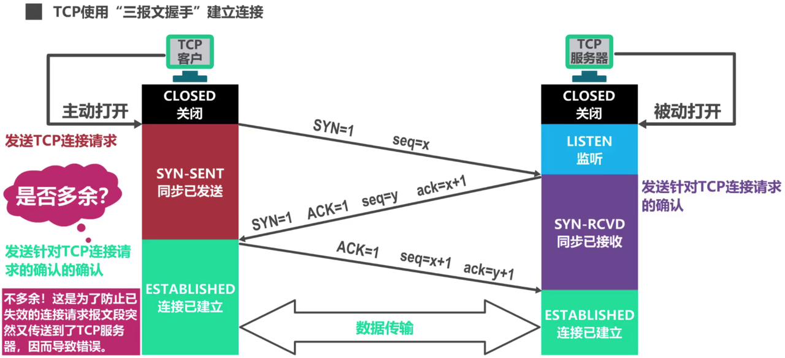
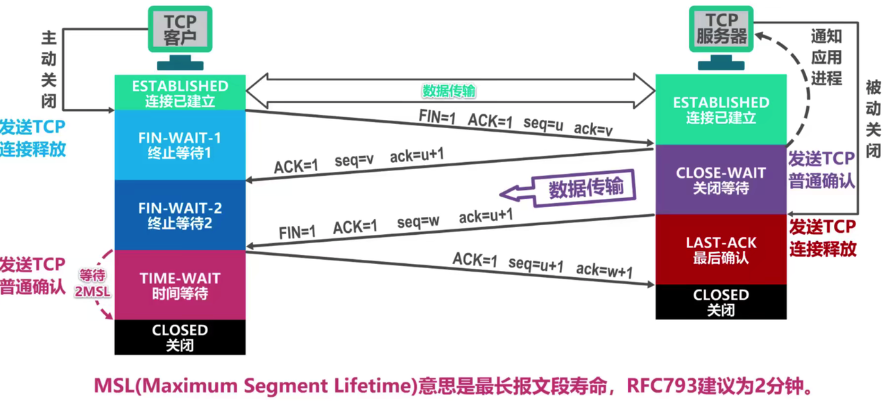

# 十五、计算机网络

## 📌 说一下服务器 TIME_WAIT？如何排查？如何处理？

### 原因

### 排查方式

### 处理方式

## 📌 说一下三次握手四次挥手

### 三次握手

TCP 三次握手是指 TCP 在建立连接时，需要发送三次报文来建立连接

1. 客户端向服务端发送 SYN 报文请求建立连接，客户端进入 SYN_SENT 状态
2. 服务端接收到客户端报文后，向客户端进行响应，发送 SYN 报文进行响应，服务端进入 SYN_RCVD 状态
3. 客户端收到服务端的响应报文后，向客户端发送 ACK 报文，表示收到了服务端的响应，进入 ESTABLISHED 状态（连接已建立状态），服务端收到响应后，也会进入该状态，此时连接已经建立完成，客户端和服务端可以开始传输数据了



### 四次挥手



### 为什么需要三次握手，两次不行吗？

需要简单分析下三次握手的目的

1. 第一次握手：客户端发送消息，服务端接收成功；服务端可以确认：客户端消息发送正常
2. 第二次握手：服务端发送消息，客户端接收成功；客户端可以确认：服务端消息发送正常，服务端消息接收正常
3. 第三次握手：客户端响应消息，服务端接收成功；服务端可以确认：客户端消息接收正常

两次握手存在的问题：客户端发送建立连接的请求之后，由于网络阻塞，服务端没有收到消息，客户端重新发送消息，服务端接收正常后，建立连接，传输数据，关闭连接；此时第一条由于网络阻塞的消息到达了服务端，服务端认为客户端又发起了一次建立连接的请求，会进行响应和等待，所以两次握手不可以

### 什么是半连接队列？

客户端第一次发送 SYN 报文，服务端接收到后，将其放入半连接队列；在接收到客户端第二次响应的报文后，会将其转移到全连接队列

### 什么是 SYN 攻击

SYN 攻击又称为 DDos 攻击，即拒绝服务攻击，客户端会伪造大量不存在的客户端 ip 对服务端进行请求建立连接，服务端半连接队列被客户端占满，服务端无法接收正常请求，出现拒绝服务的情况

排查方式

```java
netstat -np | grep SYN_RCVD
```

解决方式

- 增大半连接队列
- 增加网关过滤
- 缩短半连接队列超时时间（SYN_RCVD）

### 挥手为什么需要四次？

### 2MSL 的含义？

参考：

- [面试官，不要再问我三次握手和四次挥手 - 掘金](https://juejin.cn/post/6844903958624878606)

## 📌 Nginx 大量 502 如何排查

参考：

- [记一次生产环境 Nginx 间歇性 502 的事故分析过程](https://xiezefan.me/2017/09/27/nginx-502-bug-trace/)

## 📌 HTTP 和 HTTPS

### 为什么用了 HTTPS 就是安全的？

### HTTPS 为什么同时使用对称和非对称加密

### HTTPS 的底层原理如何实现？

### 用了 HTTPS 就一定安全吗？

###
